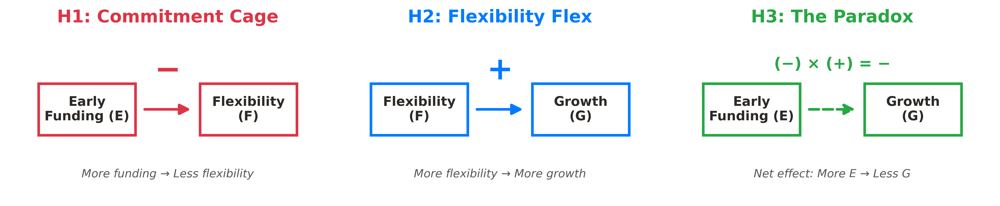
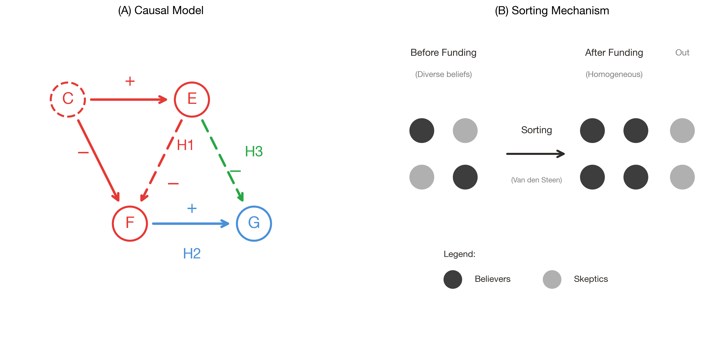
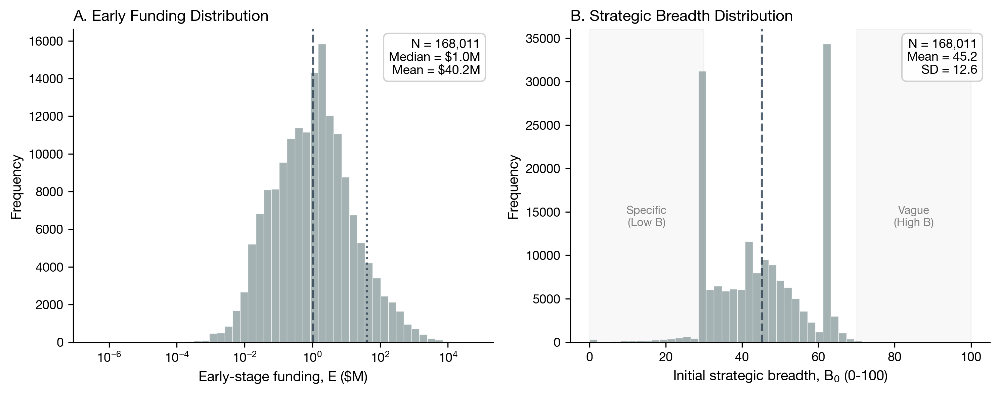
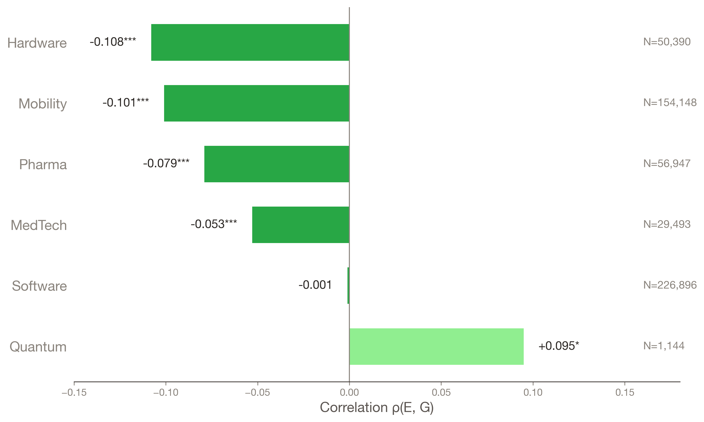
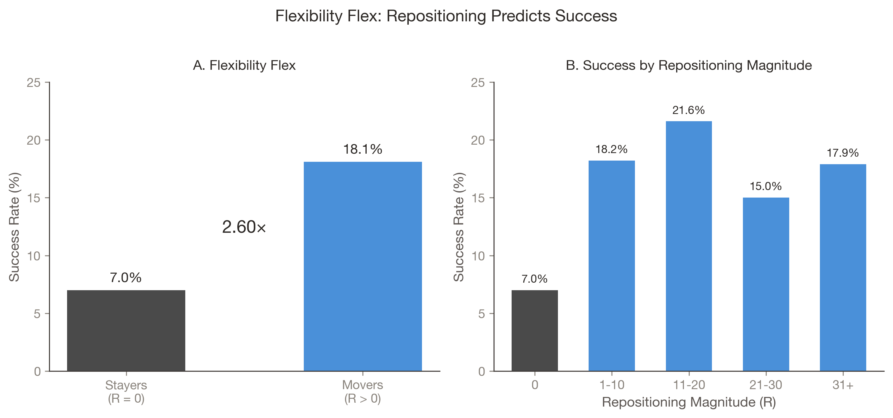
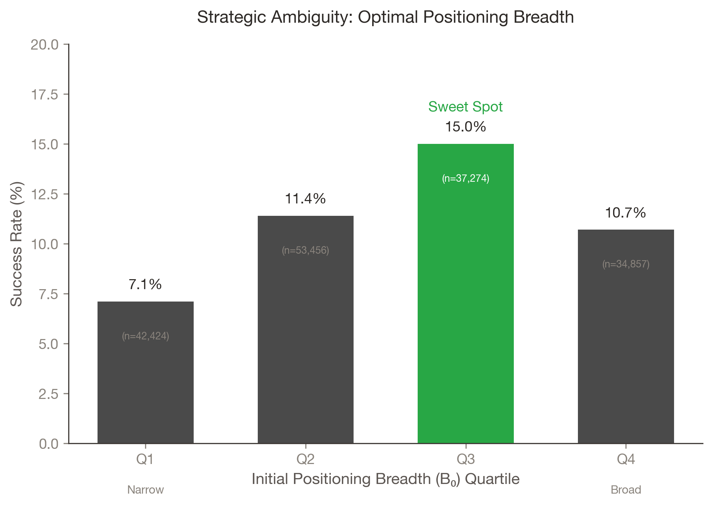

# The Golden Cage
### Why Early Funding Suppresses Strategic Repositioning — and How Founders Can Navigate It

S.M. thesis, MIT Civil and Environmental Engineering (Transportation Program), 2026
**Hyunji Moon** · Advisors: Charles Fine, Scott Stern
📄 [Full thesis (PDF)](Moon-978155856-Master-CEE-2026-thesis-signed.pdf)

---

## Abstract

Flexibility predicts startup growth, yet the funding that enables growth systematically suppresses flexibility. The mechanism is belief-based sorting. When founders commit to specific strategies, investors who share those beliefs fund; skeptics self-select out. The resulting board lacks cognitive diversity to advocate pivots. I formalize this phenomena as golden cage theory: founders cannot reposition because governance lacks advocates for alternatives.

Analyzing 168,011 U.S. ventures, I establish three empirical regularities. First, early funding predicts less repositioning. Second, repositioning predicts success. Third, the early funding and growth correlation varies systematically by industry: negative where dominant designs constrain exploration (e.g. Hardware and Mobility), neutral or positive where uncertainty releases the cage (Software and Quantum).

Three contributions emerge. Empirically, the funding-growth paradox holds as a robust regularity across 168,011 ventures. Theoretically, belief-based sorting in governance explains why commitment and flexibility trade off. Prescriptively, founders can balance commitment and flexibility with the 3S framework: Scope (commit to thesis, not architecture—moderate breadth outperforms both extremes), Sequencing (stage capital from non-dilutive to thesis-driven VC, delaying governance lock-in until market signals clarify), and Synchronization (match capability investment to market validation, avoiding the traps of over-building or over-promising).

---

## The identity the whole thesis rests on

$$\frac{dG}{dE} \;=\; \underbrace{\frac{dG}{dR}}_{\text{Flex }(+)} \times \underbrace{\frac{dR}{dE}}_{\text{Cage }(-)} \;=\; (-)$$

*E* = early funding · *R* = strategic repositioning · *G* = later-stage success.
The negative total effect is **not** a direct harm from capital. It is the product of two opposite-signed links, and repositioning is the mediator that carries it.

| Link | What it says | Estimate |
|:--|:--|:--|
| **Commitment Cage** (H1) | Funding suppresses repositioning | ρ(E, R) = **−0.133**\*\*\* |
| **Flexibility Flex** (H2) | Repositioning predicts success | Movers **17.6%** vs Stayers **6.7%** = **2.60×** |
| **Paradox heterogeneity** (H3) | The total effect flips sign across industries | Hardware **−0.108**\*\*\* · Software −0.001 ns · Quantum **+0.095**\* |

N = **168,011** U.S. ventures, PitchBook 2021–2025. Firm-level ρ(E, G) = −0.04: the signal is real but buried in variance, which is why the industry level carries the argument.

---

## Chapter by chapter — one claim, one figure

### 1 · Introduction — the paradox has two levels

> At the firm level the signal is buried in variance. At the **industry** level it is a structural pattern: the more capital a sector needs, the lower its success rate.



*Funding does not kill ventures directly. It blocks the path to adaptation.*

**Two ventures, two fates.** Tesla committed at the level of a **problem** ("accelerating sustainable transport") and kept the room to move from Roadster to Model 3. Better Place committed at the level of an **architecture** ("battery swapping"), raised $850M, and liquidated in 2013 — assets sold for under $1M.

---

### 2 · Commitment and Flexibility — belief sorting, and the point where learning stops

> Funding homogenizes the board not by silencing dissent but by **never recruiting it**. The sorting happens before the first board meeting.



Commitment buys credibility and costs cognitive diversity; strategic ambiguity buys diversity and costs credibility. **Theorem 1 (Caged Learning)** states the boundary: once the belief distribution on the board puts no mass on the alternative, no amount of contrary evidence produces an update. Learning does not slow down — it stops.

---

### 3 · Data and Identification — what counts as "repositioning"

> Strategic breadth (*B*) is read from a venture's **own self-description**; repositioning (*R*) is the change in that breadth between funding rounds — a firm-reported signal rather than an analyst's label.



PitchBook 2021–2025. Field list, the vagueness dictionary, and variable definitions are in Appendix A.

---

### 4 · Where the Cage Binds or Releases

> **The cage is a property of the industry, not a trait of the firm.** It binds hardest where switching costs are physical, and releases where no dominant design exists yet.



| Sector | ρ(E, G) | Success rate | Reading |
|:--|:--:|:--:|:--|
| Hardware | **−0.108**\*\*\* | 5.6% | Infrastructure locks the architecture in |
| Mobility / Transportation | −0.101\*\*\* | — | Same mechanism, same sign |
| Software | −0.001 ns | — | Cheap experiments offset governance rigidity |
| **Quantum** | **+0.095**\* | 12.3% | **Pre-paradigmatic: capital enables rather than constrains** |



*Movers outperform Stayers 2.60× (17.6% vs 6.7%, χ² = 5,322, p < 0.001).*

---

### 5 · Navigating the Cage — the 3S framework

> The question is not *whether* to commit but **at what level**. Thesis-level commitment preserves flexibility; architecture-level commitment forecloses it.



*Moderate positioning breadth survives best — 15.0%, above both narrow and maximally broad.*

| | Principle | Failure it prevents |
|:--|:--|:--|
| **Scope** | Commit to the thesis, not the architecture | Better Place — architecture-level commitment |
| **Sequencing** | Stage capital from non-dilutive to thesis-driven VC, so governance locks in late | Segway (path dependence) vs Fast Ion Battery (governance lock-in) |
| **Synchronization** | Match capability investment to market validation | NxStage (over-building) · SkinnyGirl (over-promising) |

Each S carries concrete guidance for **founders, investors, and boards** — syndicate composition, a reserved independent seat, and a decision rule requiring the strongest case *against* the current plan to be written down.

---

### 6 · Conclusion — and the wall this thesis does not clear

> **A founder who refuses to pivot and a founder who cannot pivot are indistinguishable in the data. Both stay put.**

Section 6.3 states it plainly. Board homogeneity is *inferred from behavior*, not measured from boards, so "will not" and "cannot" are observationally equivalent — and the prescriptions diverge completely: **monitoring** if it is refusal, **redesigning the funding structure** if it is incapacity. More samples do not separate them; the two stories are constructed to produce the same observations.

That is the open problem this thesis hands forward.

---

## Why this may interest technology-management and innovation-policy readers

- **The same wall stands in policy.** A high program success rate can be evidence of choosing well, or evidence of choosing only what is safe. Same number, opposite prescriptions — expand the budget, or change the selection criteria.
- **A measurable account of industry dynamics.** Chapter 4 treats capital intensity and technological maturity as the two axes that set how tightly commitment binds. Quantum is the identifying case, not an anomaly.
- **Prescriptions land in contracts and program design**, not in exhortation: staged capital, syndicate composition, board decision rules — governance instruments an agency or an investor can actually write.
- **Method is stated with its limits.** Observational data, a text-derived mediator, no direct measure of belief diversity. Appendix C runs the robustness battery; Chapter 6 names what would falsify the claims.

---

## Repository map

```
Moon-...-thesis-signed.pdf   Final submitted thesis (PDF)
chap1–7_appendix.md          Chapter sources, Markdown (readable on GitHub)
latex(thesis)_chap*.tex      Chapter sources, LaTeX (Overleaf build)
MIT Thesis.tex · abstract.tex · golden_cage.bib
img/                         Figures used in the thesis
table/                       Generated tables
code/                        Data pipeline and figure generation (Python)
docs/                        Advisor guide, validation notes, title decision
feedback/                    Advisor feedback (scans)
archive/                     Superseded Overleaf snapshots and audit logs
```

## Reproducing the figures

```bash
cd code
python 00_data_pipeline.py        # PitchBook → processed panel
python 01_raw_to_processed.py
python generate_thesis_figures.py # all img/*.png
python quick_validate.py          # sanity checks on reported numbers
```

Raw PitchBook extracts are licensed and not redistributed; the pipeline documents the fields used (Appendix A). Note that several figure scripts still carry a hard-coded absolute path to the author's local data directory — point `ventures_analyzed.csv` at your own copy before running them.

## Citation

```bibtex
@mastersthesis{moon2026goldencage,
  author  = {Moon, Hyunji},
  title   = {Golden Cage: Why Early Funding Suppresses Strategic Repositioning},
  school  = {Massachusetts Institute of Technology},
  year    = {2026},
  type    = {S.M. thesis},
  address = {Cambridge, MA}
}
```

## Contact

Hyunji Moon · [amoon@mit.edu](mailto:amoon@mit.edu) · [github.com/hyunjimoon](https://github.com/hyunjimoon)
