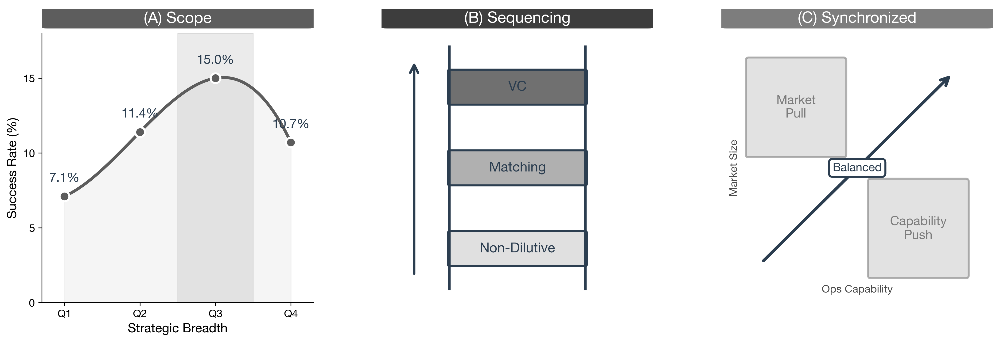

::: {#ch:design}
# Dancing with the Cage {#ch:design}
:::

## Introduction {#sec:ch5-introduction}

Chapter [\[ch:results\]](#ch:results){reference-type="ref"
reference="ch:results"} documented where the cage binds:
capital-intensive industries like Hardware ($\rho = -0.108$) and
Transportation ($\rho = -0.101$) face the tightest constraints, where
infrastructure investments and regulatory uncertainty multiply the cost
of wrong commitment. This creates a dilemma. To succeed, founders need
resources to experiment. Yet acquiring those resources often eliminates
the governance capacity to act on what experiments reveal.

Figure [1.1](#fig:three-solutions){reference-type="ref"
reference="fig:three-solutions"} previews the three solutions developed
in this chapter.

<figure id="fig:three-solutions" data-latex-placement="htbp">

<figcaption>Three Solutions to the Golden Cage. <strong>Left:</strong>
Strategic Ambiguity—the Q3 sweet spot where moderate positioning breadth
maximizes survival. <strong>Middle:</strong> Balanced Growth—avoiding
the Scale Trap (demand without delivery capacity) and the Operational
Trap (capability without market pull) by growing along the diagonal.
<strong>Right:</strong> The Funding Ladder—climbing from non-dilutive
grants through matching capital to thesis-driven VC, preserving
flexibility until market signals clarify.</figcaption>
</figure>

This chapter prescribes how to dance with the cage---not to escape it
entirely, but to work within its constraints while preserving adaptation
capacity. The solution is not to avoid funding, but to design commitment
structures that capture commitment's credibility benefits while
maintaining flexibility.

Dancing with the cage requires founders to address three distinct
decisions. The first decision is *what to commit to*. A founder must
choose how to describe the venture's direction. Commit too narrowly, and
the venture attracts only believers in one specific path. Commit too
broadly, and credibility collapses. Strategic Ambiguity
(§[1.2](#sec:strategic-ambiguity){reference-type="ref"
reference="sec:strategic-ambiguity"}) addresses this: commit to
direction, not destination.

The second decision is *how to grow*. A venture can have great
technology but no customers, or huge demand but no capacity to deliver.
Balanced Growth (§[1.3](#sec:balanced-growth){reference-type="ref"
reference="sec:balanced-growth"}) addresses this: diagnose whether the
bottleneck is market pull or operational capability, and fix it before
locking in the other dimension.

The third decision is *how to fund*. Different capital sources impose
different governance constraints. Thesis-driven VCs bring expertise but
also belief homogeneity. Government grants bring credibility but move
slowly. The Funding Ladder
(§[1.4](#sec:funding-ladder){reference-type="ref"
reference="sec:funding-ladder"}) addresses this: sequence funding
sources so that flexibility survives long enough for market signals to
clarify direction.

## Strategic Ambiguity {#sec:strategic-ambiguity}

The cage forms when a founder commits to a specific operational path so
convincingly that they attract a homogeneous coalition of believers in
that path. Strategic ambiguity solves this problem [@eisenberg1984ambiguity].
It does not mean being vague about the mission. It means being precise about
the *direction* while remaining flexible about the *destination*. This
approach carries risks: ambiguity can undermine credibility in the short
term even as it preserves flexibility for the long term [@abdallah2014double].
The key is finding the level of abstraction that maintains coalition
breadth without sacrificing the specificity needed to attract resources.

### The Sweet Spot

Figure [1.2](#fig:sweet-spot){reference-type="ref"
reference="fig:sweet-spot"} reveals the empirical pattern. Analyzing
survival rates across positioning breadth, ventures with moderate
breadth (Q3) achieve 15.0% survival ($n = 37{,}274$). This outperforms
both narrow positioning (Q1: 7.1%, Q2: 11.4%) and maximally broad
positioning (Q4: 10.7%).

<figure id="fig:sweet-spot" data-latex-placement="htbp">

<figcaption>The Strategic Ambiguity Sweet Spot. Q3 positioning achieves
15.0% survival, higher than both narrow (Q1: 7.1%, Q2: 11.4%) and
maximally broad (Q4: 10.7%) positioning.</figcaption>
</figure>

This finding aligns with the logic of Theorem 1
(Chapter [\[ch:theory\]](#ch:theory){reference-type="ref"
reference="ch:theory"}). When positioning is too narrow, it attracts a
highly concentrated set of believers. As belief homogeneity rises and
strategic breadth narrows, the conditions for organizational learning
collapse. Moderate breadth preserves enough coalition diversity to keep
alternative paths alive in the boardroom without sacrificing the
credibility required to raise capital.

### Vision-Level vs. Operational Commitment

The distinction between committing to a vision and committing to an
operation explains the divergent fates of two prominent electric vehicle
ventures.

**Tesla** committed at the vision level: "accelerating the world's
transition to sustainable transport." This formulation attracted
believers in electrification, believers in autonomy, and believers in
the energy transition. Each stakeholder projected their own thesis onto
the vision. When Tesla needed to pivot across market segments (Roadster
$\rightarrow$ Model S $\rightarrow$ Model 3) or change its retail model,
the governance board supported these adaptations because multiple
interpretations of "sustainable transport" remained valid. The vision
accommodated the pivot.

**Better Place** committed at the operational level: "building battery
swapping infrastructure." This formulation attracted only believers in
that specific mechanism. It built a narrow coalition united by
conviction in swapping rather than charging. When market feedback began
to favor fast charging over swapping, no voice in the governance room
advocated for a pivot. The skeptics of swapping had never invested.
Despite raising \$850 million, Better Place liquidated in 2013
[@bradshaw2013better] because its commitment structure left no room for
the market's evolution.

Both companies attracted true believers. Only Tesla attracted *diverse*
true believers.

### Practical Guidance

For founders, the prescription is to articulate the vision at the level
of the problem, not the solution. "Accelerating sustainable transport"
preserves options; "building battery swapping infrastructure" forecloses
them. Recruit board members who share your view on *why* the company
exists but hold diverse views on *how* to achieve it. Diversity of
implementation views is the fuel for future pivots.

For investors, the prescription is to fund platform capabilities rather
than product specificities. Platforms can pivot; products cannot.
Distinguish between alignment on vision and lock-in on operations. A
founder who shares your thesis about market direction can still disagree
about implementation details--and that disagreement is valuable.

## Balanced Growth {#sec:balanced-growth}

The cage often snaps shut when a venture scales one dimension of its
business before the other dimension catches up. @fine2022operations
offers a diagnostic framework: Growth $=$ Market $\times$ Ops. Ventures
must grow market size and operational capability in parallel. Growth
that occurs exclusively on one axis creates a bottleneck that traps the
venture.

### The Diagonal Principle

Founders must diagnose which bottleneck currently threatens the business
and direct commitment toward that specific constraint before locking in
the other dimension. Two archetypes illustrate the danger of
off-diagonal growth.

**NxStage** fell into the Operational Trap [@fine2022operations]. The
company developed breakthrough home hemodialysis technology and built
operational capability that far exceeded the market's readiness.
Nephrologists lacked incentives to prescribe home care. NxStage had
excellent operations serving insufficient demand. The bottleneck was
market pull, yet the company continued to commit to operational
perfection.

**SkinnyGirl Cocktails** fell into the opposite trap
[@fine2022operations]. The brand became the fastest-growing spirits
company with enormous consumer demand. But its fulfillment partner could
not scale the supply chain to match. SkinnyGirl had market traction
without the delivery foundation to capture it. The bottleneck was
operational capability.

### Application

The prescription is to apply the Diagonal Principle. If the bottleneck
is market pull (NxStage), commit to business development, partnerships,
and channel validation while keeping operations flexible. If the
bottleneck is operational capability (SkinnyGirl), commit to logistics,
manufacturing, and quality while throttling demand generation.

The cage binds when a venture commits to scaling operations while the
bottleneck remains the market. Commitment to one dimension while the
other lags creates the trap.

## The Funding Ladder {#sec:funding-ladder}

Capital is not just fuel; it is a governance contract. Different sources
of capital impose different constraints on flexibility. Escaping the
cage requires matching the rigidity of commitment to the certainty of
the market.

### The Symmetry Principle

Venture capitalists manage risk through staged financing: they commit
capital in tranches, releasing funds only when milestones are met,
preserving their option value. @rhodeskropf2024 advocate this "smart VC"
approach. Founders should apply the same logic---stage operational
commitments just as investors stage financial commitments. Yet founders
often abandon this optionality prematurely to signal conviction,
committing fully to a specific product roadmap to secure the first
tranche of capital. This creates an asymmetry: the investor retains the
option to leave, but the founder has sold the option to pivot.

### Case Contrast: Timing of Commitment

**Segway** illustrates premature commitment [@gans2021entrepreneurship].
The company raised over \$100 million committed to a specific gyroscopic
form factor before validating market demand. The vision was
appropriately broad---"revolutionize personal transportation"---but the
operational lock-in was premature. When feedback indicated the device
was ill-suited for sidewalks, the sunk costs forbade a pivot. Segway
committed operationally before the market committed financially.

**Tesla** illustrates the alternative. The vision---"accelerate the
world's transition to sustainable energy"---never changed. But
operational choices evolved as learning accumulated. The Roadster was
Phase 1: prove EVs can be desirable. Model S was Phase 2: scale to mass
market. Model 3 was Phase 3: democratize access. Each stage validated
before the next began. Tesla staged commitment to match staged learning.

### The Funding Ladder

One of the most effective ways to preserve flexibility is to sequence
non-dilutive capital before taking thesis-driven venture capital. The
first rung is federal grants from agencies like NSF, DARPA, and
DOE---these provide capital without board seats, and winning a
competitive government grant signals technical credibility to future
investors. The second rung is state and local matching grants that
compound the credibility signal and extend runway without adding
governance constraints. The third rung is private investors, who by this
point face reduced perceived risk because government recognition and
clarified market signals allow the venture to attract thesis-driven
capital from a position of strength rather than desperation. This
sequencing enables ventures to survive the "valley of death" while
building the track record that first-time founders lack. (See
Appendix [\[app:e\]](#app:e){reference-type="ref" reference="app:e"} for
a catalog of non-dilutive funding sources.)

### Case: Fast Ion Battery

Fast Ion Battery illustrates both the power and the limits of the
Funding Ladder---and why sequence matters [@nanda2015fastionbattery].
Fast Ion developed a breakthrough battery technology at MIT. In 2008,
three venture capital firms invested \$10 million in a Series A round,
all sharing the same investment thesis: cleantech was the next big
opportunity. This created a governance structure where everyone believed
in the same future. The company made slow progress and by late 2009 had
not met all its milestones. However, it won a \$2 million ARPA-E grant
from the Department of Energy. This government recognition changed the
investors' calculus---as one board member noted, the ARPA-E award
provided "certification" and would serve as "validation" for future
investors. The existing investors released the next tranche of funding.

The ARPA-E grant worked exactly as the Funding Ladder predicts:
government recognition reduced perceived risk and signaled technical
credibility. But there was a critical flaw in the sequence---Fast Ion
received the grant *after* the thesis-driven VCs had already populated
the board. When the cleantech investment climate shifted in 2011, all
three investors faced identical pressure to reduce exposure to the
sector. Because they shared a homogeneous thesis, they reacted
homogeneously: one investor withdrew entirely, and the board contained
no cognitive diversity to argue for alternatives. The lesson is about
sequence. If Fast Ion had climbed the Funding Ladder in
order---government grants first, then private capital---it could have
built credibility before thesis-driven investors shaped governance. The
ARPA-E grant was valuable, but it came too late to preserve flexibility.

### Preserving Skeptics in Governance

Even with dilutive funding, governance design can preserve signal
diversity. The cage crystallizes when governance lacks advocates for
alternative paths, so founders must actively design to preserve
skeptics. Syndicate composition matters: actively recruit at least one
investor with a distinct investment thesis, because a deep-tech investor
building a syndicate of fellow deep-tech funds creates belief lock-in
while adding a generalist introduces productive tension. Board structure
matters: reserve a seat for an independent director who holds no
financial stake in the current direction and brings domain expertise
that challenges rather than reinforces the current strategy. Decision
rules matter: institute requirements to document the strongest argument
against the current path before major capital deployments, and consider
a designated "red team" director whose role is to surface
counterarguments rather than build consensus.

::: {#tab:gov8}
+----------------------+----------------------+----------------------+
| ::: minipage         | ::: minipage         | ::: minipage         |
| Principle            | Implementation       | Rationale            |
| :::                  | :::                  | :::                  |
+:=====================+:=====================+:=====================+
| ::: minipage         | ::: minipage         | ::: minipage         |
| Principle            | Implementation       | Rationale            |
| :::                  | :::                  | :::                  |
+----------------------+----------------------+----------------------+
| **Preserve           | See Table 9 for      | Maintains signal     |
| Skeptics**           | operationalization   | diversity            |
+----------------------+----------------------+----------------------+
| **Vision             | Commit to direction, | Preserves pivot      |
| vs. Operations**     | not destination      | capacity             |
+----------------------+----------------------+----------------------+
| **Milestone          | Define outcomes, not | Allows learning from |
| Flexibility**        | methods              | experiments          |
+----------------------+----------------------+----------------------+
| **Information        | Share disconfirming  | Enables belief       |
| Rights**             | signals              | updating             |
+----------------------+----------------------+----------------------+
| **Exit Options**     | Build in pivot       | Creates licensed     |
|                      | triggers             | moments to reassess  |
+----------------------+----------------------+----------------------+

: Governance Design Recommendations
:::

::: {#tab:gov9}
+----------------------+----------------------+----------------------+
| ::: minipage         | ::: minipage         | ::: minipage         |
| Lever                | Mechanism            | Practical            |
| :::                  | :::                  | Implementation       |
|                      |                      | :::                  |
+:=====================+:=====================+:=====================+
| ::: minipage         | ::: minipage         | ::: minipage         |
| Lever                | Mechanism            | Practical            |
| :::                  | :::                  | Implementation       |
|                      |                      | :::                  |
+----------------------+----------------------+----------------------+
| **Syndicate          | Include investors    | Minimum one investor |
| Composition**        | with diverse thesis  | from different       |
|                      | views                | sector focus or      |
|                      |                      | stage preference;    |
|                      |                      | avoid syndicates     |
|                      |                      | where all investors  |
|                      |                      | share identical      |
|                      |                      | thesis               |
+----------------------+----------------------+----------------------+
| **Board Structure**  | Reserve seat for     | Appoint one board    |
|                      | independent          | member without       |
|                      | perspective          | financial stake in   |
|                      |                      | current direction;   |
|                      |                      | consider rotating    |
|                      |                      | "devil's advocate"   |
|                      |                      | role                 |
+----------------------+----------------------+----------------------+
| **Decision Rules**   | Require explicit     | Before major         |
|                      | dissent              | pivots/commitments:  |
|                      | consideration        | (1) Document         |
|                      |                      | strongest argument   |
|                      |                      | against current      |
|                      |                      | path, (2) Assign     |
|                      |                      | board member to      |
|                      |                      | defend alternative,  |
|                      |                      | (3) Vote only after  |
|                      |                      | hearing              |
|                      |                      | counterarguments     |
+----------------------+----------------------+----------------------+

: Governance Levers for Signal Diversity
:::

## Conclusion {#sec:ch5-conclusion}

This chapter developed three design principles for dancing with the
cage. Each addresses a different decision that founders face, as
previewed in Figure [1.1](#fig:three-solutions){reference-type="ref"
reference="fig:three-solutions"}.

Strategic Ambiguity answers *what to commit to*. The Tesla-Better Place
contrast shows that vision-level commitment creates a coalition broad
enough to support adaptation, while operational commitment creates a
coalition so narrow that it collapses when the specific mechanism fails.
The prescription: commit to direction, not destination. The Q3 sweet
spot in the data confirms that moderate breadth outperforms both narrow
and maximally broad positioning.

Balanced Growth answers *how to grow*. NxStage had great technology but
insufficient market pull. SkinnyGirl had enormous demand but couldn't
deliver. The prescription: diagnose which bottleneck threatens and fix
it before locking in the other dimension. Growth requires balance
between market and operations.

The Funding Ladder answers *how to fund*. Fast Ion Battery shows that
government recognition works as a credibility signal, but sequence
matters. The ARPA-E grant came after thesis-driven VCs had already
populated governance. The prescription: climb the Funding Ladder in
order, so that market signals clarify before thesis-driven capital
shapes governance.

**Boundary Conditions.** These principles are not universal. They matter
most when capital intensity is high, uncertainty is high, founders lack
track records, and investors are thesis-driven [@tushman1986technological;
@henderson1990architectural]. These are precisely the conditions where
the cage binds tightest—and where the principles are hardest to implement.
In mature markets or low-capital software sectors, the cost of the cage
is lower and the efficiency of operational commitment may outweigh the
benefits of flexibility [@porter1996what]. But for ventures navigating
deep tech and new markets, designing for flexibility is not a luxury.
It is a condition of survival.

Chapter [\[ch:conclusion\]](#ch:conclusion){reference-type="ref"
reference="ch:conclusion"} concludes with the thesis's contributions and
implications for theory and practice.
