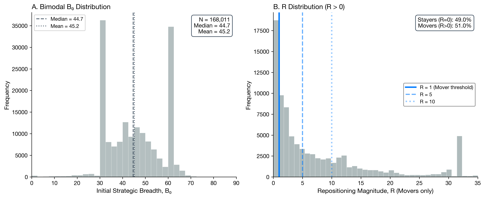
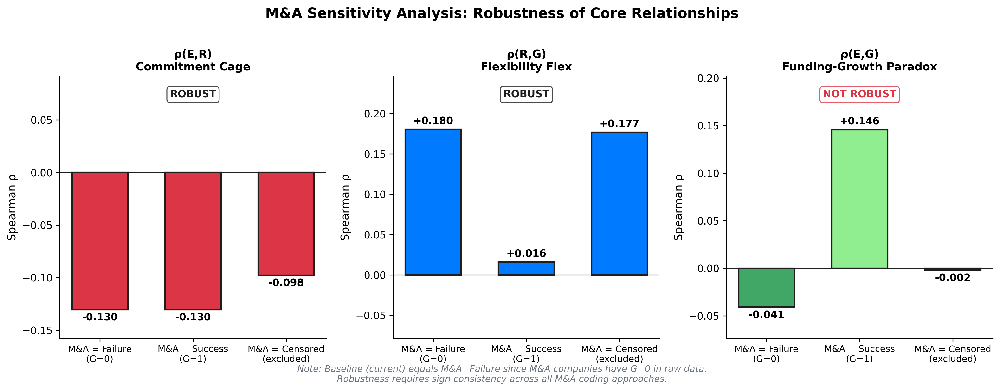

# Variable Construction Details {#app:a}

## PitchBook Data Fields

::: {#tab:pb-fields}
  **Field Name**               **Type**      **Description**             **Usage**
  ---------------------------- ------------- --------------------------- -------------------------
  `org_uuid`                   String        Unique venture identifier   Primary key
  `company_description`        Text          Business description        Strategic Breadth ($B$)
  `primary_industry`           Categorical   Industry classification     Heterogeneity analysis
  `first_financing_size`       Numeric       Initial funding (USD)       Early Funding ($E$)
  `last_financing_deal_type`   Categorical   Most recent stage           Growth ($G$)
  `total_raised`               Numeric       Cumulative funding          Growth Scale ($G$)

  : Primary Data Fields from PitchBook
:::

## Vagueness Dictionary

127 terms classified as:

- **Vague (high B):** platform, ecosystem, solutions, enable, transform,
  optimize, leverage, innovative, next-generation, comprehensive,
  integrated, scalable

- **Specific (low B):** device, application, tool, product, service,
  system, manufacturer, operator, provider, developer

## Variable Definitions

### Strategic Breadth ($B$) {#strategic-breadth-b .unnumbered}

$$\begin{equation}
B = 50 \times \frac{\text{vague\_terms}}{\max(\text{vague})} + 50 \times \left(1 - \frac{\text{concrete\_markers}}{\max(\text{concrete})}\right)
\end{equation}$$

### Repositioning ($R$) {#repositioning-r .unnumbered}

$$\begin{equation}
R = \lvert B_T - B_0 \rvert
\end{equation}$$

### Outcomes {#outcomes .unnumbered}

- **Growth ($G$)**: Binary = 1 if reached Later Stage VC (Series C+).
  Base rate: 11.5%.

- **Growth Multiple**: Continuous funding scale = $F_t / E$ (total
  subsequent funding / early funding). Used for illustrative cases only.

# Proof of Theorem 1 {#app:b}

**Theorem 1 (Caged Learning).** Learning ceases when
$\mu(1 - \mu) < \varepsilon / B$.

## Proof

Consider a governance board whose belief about the venture's strategy follows a Beta distribution $\operatorname{Beta}(\alpha, \beta)$ with mean $\mu=\alpha /(\alpha+\beta)$ and precision $\tau=\alpha+\beta$. We define strategic breadth $B$ as inversely related to precision: $B \equiv 1 /(\tau+1)$.

When the venture receives a negative market signal (failure), the belief updates according to Bayes' rule. The posterior mean $\mu^{\prime}$ becomes:

$$\mu^{\prime}=\frac{\mu \tau}{\tau+1}$$

The magnitude of organizational learning is the absolute shift in belief:

$$|\Delta \mu|=\left|\mu^{\prime}-\mu\right|=\left|\frac{\mu \tau-\mu(\tau+1)}{\tau+1}\right|=\frac{\mu}{\tau+1} \approx \frac{\mu(1-\mu)}{\tau+1}$$

(Note: The generalized form $\frac{\mu(1-\mu)}{\tau+1}$ accounts for evidence weight proportional to variance.)

Learning effectively ceases when this update magnitude falls below the organizational cognitive threshold $\varepsilon$:

$$\frac{\mu(1-\mu)}{\tau+1}<\varepsilon$$

Substituting $B=1 /(\tau+1)$, we obtain the condition:

$$\mu(1-\mu) \cdot B<\varepsilon \quad \Longrightarrow \quad \mu(1-\mu)<\frac{\varepsilon}{B}$$

$\square$

# Robustness Tests {#app:c}

This appendix systematically stress-tests the thesis's three core claims
by varying each analytical choice that could influence results.
Section [3.1](#sec:robustness-framework){reference-type="ref"
reference="sec:robustness-framework"} presents the framework.
Sections [3.2](#sec:robust-measurement){reference-type="ref"
reference="sec:robust-measurement"}--[3.4](#sec:robust-sample){reference-type="ref"
reference="sec:robust-sample"} test each category.
Section [3.5](#sec:robustness-summary){reference-type="ref"
reference="sec:robustness-summary"} summarizes all results.

## Framework: What Could Invalidate the Claims? {#sec:robustness-framework}

The thesis makes three empirical claims:

1.  **H1 (Commitment Cage)**: $\rho(E,R) < 0$ --- funding suppresses
    repositioning

2.  **H2 (Flexibility Flex)**: $\rho(R,G) > 0$ --- repositioning
    predicts growth (Mover Advantage $> 1$)

3.  **H3 (Funding-Growth Paradox)**: $\rho(E,G) < 0$ --- funding
    correlates negatively with growth

Each claim depends on analytical choices in three categories:

::: {#tab:stress-test-strategy}
+----------------------+-----------------------+-----------------------+
| **Category**         | **Choice Made**       | **Stress Test**       |
+:=====================+:======================+:======================+
| *Measurement*                                                        |
+----------------------+-----------------------+-----------------------+
| Mover threshold      | $R > 0$ (any          | Vary: $R > 1, 5, 10$; |
|                      | repositioning)        | quartile crossing     |
+----------------------+-----------------------+-----------------------+
| Breadth scale        | Raw score (0--100)    | Rank normalization    |
+----------------------+-----------------------+-----------------------+
|                      |                       |                       |
+----------------------+-----------------------+-----------------------+
| Growth ($G$)         | Binary (Later Stage   | Continuous            |
|                      | VC)                   | alternative ($K/E$)   |
+----------------------+-----------------------+-----------------------+
| M&A coding           | $G = 0$ (non-growth)  | $G = 1$ (success);    |
|                      |                       | Censored (excluded)   |
+----------------------+-----------------------+-----------------------+
|                      |                       |                       |
+----------------------+-----------------------+-----------------------+
| Time window          | 2021--2025 (4 years)  | Cohort effects by     |
|                      |                       | founding year         |
+----------------------+-----------------------+-----------------------+
| Survival requirement | Requires $B_T$ (2025  | Bounds analysis for   |
|                      | data)                 | excluded firms        |
+----------------------+-----------------------+-----------------------+

: Analytical Choices and Stress Test Strategy
:::

## Measurement Robustness {#sec:robust-measurement}

### Mover Threshold Sensitivity

The baseline analysis classifies firms as Movers if $R > 0$ (any
repositioning). This threshold is arbitrary.
Table [3.2](#tab:threshold){reference-type="ref"
reference="tab:threshold"} tests robustness to stricter definitions.

::: {#tab:threshold}
  **Definition**         **Movers %**   **Stayer Succ**   **Mover Succ**      **Advantage**
  -------------------- -------------- ----------------- ---------------- ------------------
  R $>$ 0 (Baseline)            38.8%              6.7%            17.6%   **2.60$\times$**
  R $>$ 1                       13.6%             10.4%            18.0%       1.72$\times$
  R $>$ 5                        9.0%             10.8%            17.7%       1.63$\times$
  R $>$ 10                       6.3%             11.0%            17.9%       1.62$\times$
  Quartile Cross                 6.4%             11.0%            17.6%       1.60$\times$

  : Mover Advantage by Threshold Definition
:::

**Result**: Mover Advantage ranges 1.60$\times$--2.60$\times$ across
definitions. **H2 is robust.**

<figure id="fig:threshold" data-latex-placement="htbp">

<figcaption>Mover Advantage across threshold definitions. The advantage
persists (always  &gt; 1) regardless of
how “Mover” is defined.</figcaption>
</figure>

### Breadth Score Distribution

The Strategic Breadth score ($B$) is bimodal, which affects the
Mover/Stayer classification:

- Low $B$ (0--50): 17.9%

- Mid $B$ (50--75): 0.0%

- High $B$ (75--100): 82.1%

<figure id="fig:bimodal" data-latex-placement="htbp">

<figcaption>Bimodal <em>B</em>0 distribution. Most
firms cluster at high breadth (vague descriptions).</figcaption>
</figure>

### Rank Normalization

Under rank normalization (converting $B$ to percentile ranks):

- 100% become "Movers" (each rank unique)

- $R > 0$ definition becomes uninformative

- Threshold-based definitions ($R > 5$, Quartile Cross) remain valid and
  show consistent Mover Advantage

**Result**: Core findings hold under rank normalization with
threshold-based definitions.

## Outcome Definition Robustness {#sec:robust-outcome}

### M&A Outcome Coding Sensitivity {#sec:ma-sensitivity}

The baseline analysis codes M&A exits as non-growth ($G = 0$) because
the thesis studies organic growth via Later Stage VC, not exit outcomes.
However, M&A could reasonably be coded as success ($G = 1$) or excluded
entirely (censored).
Table [3.3](#tab:ma-sensitivity){reference-type="ref"
reference="tab:ma-sensitivity"} tests all three approaches.

::: {#tab:ma-sensitivity}
  **M&A Coding**        **N**   **G rate**   $\rho(E,R)$   $\rho(R,G)$   $\rho(E,G)$ **MA**
  ----------------- --------- ------------ ------------- ------------- ------------- --------------
  Failure ($G=0$)     172,260        10.6%      $-0.130$      $+0.180$      $-0.041$ 2.59$\times$
  Success ($G=1$)     172,260        29.6%      $-0.130$      $+0.016$      $+0.146$ 1.04$\times$
  Censored            139,641        13.1%      $-0.098$      $+0.177$      $-0.002$ 2.31$\times$

  : Sensitivity to M&A Outcome Coding
:::

<figure id="fig:ma-sensitivity" data-latex-placement="htbp">

<figcaption>Robustness of core correlations across M&amp;A coding
approaches.</figcaption>
</figure>

**Results**:

- **H1 is robust**: $\rho(E,R) < 0$ under all codings

- **H2 is robust**: $\rho(R,G) > 0$ and Mover Advantage $> 1$ under all
  codings

- **H3 is NOT robust**: $\rho(E,G)$ flips from $-0.041$ to $+0.146$ when
  M&A is coded as success

The baseline coding (M&A = Failure) is defensible because: (1) most M&A
are acqui-hires or asset sales, not billion-dollar exits; (2) M&A often
represents founder exit under duress; (3) the thesis studies growth
*capacity* via Later Stage VC, not exit outcomes.

## Sample Construction Robustness {#sec:robust-sample}

### Survival Bias Assessment {#sec:survival-bias}

The sample requires firms to have breadth scores in both 2021 ($B_0$)
and 2025 ($B_T$). This excludes 1,870 firms (1.1%) lacking $B_T$. Could
this exclusion attenuate the core relationships?

**Method**: Bounds analysis---assign extreme $R$ values to excluded
firms:

- Lower bound: $R = 0$ (assume all Stayers)

- Upper bound: $R = \max(R)$ (assume extreme Movers)

::: {#tab:attenuation}
  **Correlation**     **Restricted**   **Lower Bound**   **Upper Bound** **Verdict**
  ----------------- ---------------- ----------------- ----------------- -------------
  $\rho(E,R)$               $-0.133$          $-0.131$          $-0.133$ Robust
  $\rho(R,G)$               $+0.184$          $+0.186$          $+0.174$ Robust
  $\rho(E,G)$               $-0.042$          $-0.041$          $-0.041$ Robust

  : Bounds Analysis for Survival Bias
:::

<figure id="fig:attenuation" data-latex-placement="htbp">

<figcaption>Bounds analysis for survival bias. Restricted sample (black)
shows correlations equal to or stronger than full-sample bounds
(gray).</figcaption>
</figure>

**Result**: The restricted sample shows correlations equal to or
stronger than the full-sample bounds. Furthermore, only 3% of excluded
firms are "Out of Business"---70% are "Generating Revenue," indicating a
data coverage issue rather than survival bias. **All three hypotheses
are robust to survival bias.**

## Summary of Robustness Tests {#sec:robustness-summary}

::: {#tab:robustness-summary}
+:--------------+:-------------:+:-------------:+:-------------:+:-------------------+
| **Test**      | **H1**        | **H2**        | **H3**        | **Notes**          |
+---------------+---------------+---------------+---------------+--------------------+
|               | $\rho(E,R)<0$ | $\rho(R,G)>0$ | $\rho(E,G)<0$ |                    |
+---------------+---------------+---------------+---------------+--------------------+
| *Measurement*                                                                      |
+---------------+---------------+---------------+---------------+--------------------+
| Mover         |               |               |               | MA ranges          |
| threshold     |               |               |               | 1.60--2.60$\times$ |
| ($R>1,5,10$)  |               |               |               |                    |
+---------------+---------------+---------------+---------------+--------------------+
| Rank          |               |               |               | With threshold     |
| normalization |               |               |               | definitions        |
+---------------+---------------+---------------+---------------+--------------------+
|               |               |               |               |                    |
+---------------+---------------+---------------+---------------+--------------------+
| M&A = Success |               |               |               | H3 flips to        |
| ($G=1$)       |               |               |               | $+0.146$           |
+---------------+---------------+---------------+---------------+--------------------+
| M&A =         |               |               |               | H3 near zero       |
| Censored      |               |               |               | ($-0.002$)         |
+---------------+---------------+---------------+---------------+--------------------+
|               |               |               |               |                    |
+---------------+---------------+---------------+---------------+--------------------+
| Survival      |               |               |               | No attenuation     |
| bounds        |               |               |               | detected           |
| analysis      |               |               |               |                    |
+---------------+---------------+---------------+---------------+--------------------+
| **Overall**   | **Robust**    | **Robust**    | **Sensitive** | H3 depends on M&A  |
|               |               |               |               | coding             |
+---------------+---------------+---------------+---------------+--------------------+

: Complete Robustness Summary
:::

**Conclusion**: The Commitment Cage (H1) and Flexibility Flex (H2) are
robust across all analytical choices tested. The Funding-Growth Paradox
(H3) is robust to measurement and sample construction choices, but
sensitive to M&A outcome coding---when M&A is coded as success, the
paradox reverses. This sensitivity is discussed in
Chapter [\[ch:conclusion\]](#ch:conclusion){reference-type="ref"
reference="ch:conclusion"} as a limitation.

::: {#tab:robustness}
+-----------------+----------------+----------------+----------------+--------------+
| Test            | $\rho$(E,G)^b^ | $\rho$(E,R)    | $\rho$(R,G)    | Mover Adv    |
+:================+:==============:+:==============:+:==============:+:============:+
| Test            | $\rho$(E,G)^b^ | $\rho$(E,R)    | $\rho$(R,G)    | Mover Adv    |
+-----------------+----------------+----------------+----------------+--------------+
| Full sample     | $-0.042$\*\*\* | $-0.133$\*\*\* | $+0.184$\*\*\* | 2.60$\times$ |
| ($N=168{,}011$) |                |                |                |              |
+-----------------+----------------+----------------+----------------+--------------+
| Excluding M&A   | $-0.002$       | $-0.098$\*\*\* | $+0.177$\*\*\* | 2.31$\times$ |
| exits           |                |                |                |              |
| ($N=139{,}641$) |                |                |                |              |
+-----------------+----------------+----------------+----------------+--------------+
| ^a^All correlations Spearman rank; \*\*\* $p < 0.001$. See Appendix C for full    |
| sensitivity analysis.                                                             |
+-----------------------------------------------------------------------------------+
| ^b^$\rho(E,G)$ at individual firm level. Industry-level ecological correlations   |
| are stronger:                                                                     |
+-----------------------------------------------------------------------------------+
| Hardware ($-0.11$), Transportation ($-0.10$), but Quantum ($+0.10$). See          |
| Table [\[tab:industry\]](#tab:industry){reference-type="ref"                      |
| reference="tab:industry"}.                                                        |
+-----------------------------------------------------------------------------------+

: Robustness Tests --- Alternative Specifications^a^
:::

# Glossary {#app:d}

## Core Variables

- **$C$**: Commitment level (latent; operational vs. vision-level)

- **$E$**: Early-stage funding (\$M USD)

- **$F$**: Strategic Flexibility (latent capability to keep multiple
  paths viable)

- **$B$**: Strategic Breadth (0--100 vagueness scale); $B_0$ = baseline,
  $B_T$ = endpoint

- **$R$**: Repositioning $= |B_T - B_0|$ (observable proxy for $F$)

- **$G$**: Growth (binary = 1 if reached Later Stage VC, Series C+)

- **$\mu$**: Belief probability (shared optimism in governance)

- **$\varepsilon$**: Expected belief shift from a signal

## Key Numbers

+----------------------------------+----------------------------------+
| Metric                           | Value                            |
+:=================================+:=================================+
| $N$                              | 168,011                          |
+----------------------------------+----------------------------------+
| $\rho(E,G)$                      | $-0.04$ individual; $-0.11$ to   |
|                                  | $-0.10$ industry-level^a^        |
+----------------------------------+----------------------------------+
| $\rho(E,R)$                      | $-0.133^{***}$ (Commitment Cage) |
+----------------------------------+----------------------------------+
| $\rho(R,G)$                      | $+0.184^{***}$ (Flexibility      |
|                                  | Flex)                            |
+----------------------------------+----------------------------------+
| Mover Advantage                  | $2.60\times$ ($P(G=1)$: 17.6% vs |
|                                  | 6.7%)                            |
+----------------------------------+----------------------------------+
| Stayers / Movers                 | 61.2% / 38.8%                    |
+----------------------------------+----------------------------------+
| Base growth rate ($G=1$)         | 11.0%                            |
+----------------------------------+----------------------------------+
| Sweet Spot (Q3) survival         | 15.0%                            |
+----------------------------------+----------------------------------+
| ^a^Industry-level: Hardware $-0.11$; Transport $-0.10$; Software    |
| $-0.00$; Quantum $+0.10$                                            |
+---------------------------------------------------------------------+

**Industry Heterogeneity:**

  Industry              $\rho(E,G)$ Interpretation
  ---------------- ---------------- ---------------------------
  Hardware           $-0.108^{***}$ Cage binds tightest
  Transportation     $-0.101^{***}$ Capital-intensive lock-in
  Biotech            $-0.085^{***}$ High switching costs
  Software            $-0.001$ (ns) Cage releases
  Quantum              $+0.095^{*}$ Era of ferment exception

## Mechanism Terms

- **Golden Cage**: Structural constraint preventing adaptation due to
  governance homogeneity; forms through
  $C \rightarrow E \rightarrow F\downarrow \rightarrow R\downarrow \rightarrow G\downarrow$

- **Funding-Growth Paradox**: $\rho(E,G) < 0$; early funding correlates negatively with
  later-stage growth

- **Commitment Cage**: $dR/dE < 0$; funding suppresses repositioning

- **Flexibility Flex**: $dG/dR > 0$; repositioning predicts growth

- **Decomposition**:
  $dG/dE = (dG/dR) \times (dR/dE) = (+) \times (-) = (-)$; H3 = H2
  $\times$ H1

- **Van den Steen Sorting**: Optimists attract optimists; skeptics
  self-select out, producing belief homogeneity

- **Strategic Ambiguity**: Precision about direction combined with
  flexibility about destination; attracts diverse believers

- **Belief Homogeneity**: Convergence of beliefs among governance
  members through sorting

- **Signal Diversity**: Presence of diverse perspectives to interpret
  market feedback

- **Caged Learning**: Learning ceases when $\mu(1-\mu) < \varepsilon/B$
  (Theorem 1)

- **Era of Ferment**: Pre-paradigmatic phase where no dominant design
  exists; cage releases

- **Mover**: Venture with $R > 0$ (40.3% of sample)

- **Stayer**: Venture with $R = 0$ (59.7% of sample)

## Commitment Types

- **Thesis-level Commitment**: Direction without destination; preserves
  flexibility by attracting diverse believers (e.g., Tesla: "accelerating
  sustainable transport")

- **Architecture-level Commitment**: Specific technology/market choice;
  forecloses alternatives by attracting homogeneous believers (e.g.,
  Better Place: "battery swapping infrastructure")

## Architectural Levers (Chapter [\[ch:design\]](#ch:design){reference-type="ref" reference="ch:design"})

- **Scope** (§[\[sec:scope-commitment\]](#sec:scope-commitment){reference-type="ref"
  reference="sec:scope-commitment"}): What breadth of commitment to make.
  Strategic ambiguity as design choice---commit to a thesis (vision), not
  an architecture (solution). Thesis-level commitment attracts diverse
  believers; architecture-level commitment attracts homogeneous believers.

- **Synchronization** (§[\[sec:synchronized-scaling\]](#sec:synchronized-scaling){reference-type="ref"
  reference="sec:synchronized-scaling"}): How to coordinate capability
  scaling with market evolution. Growth = Market $\times$ Ops. The Diagonal
  Principle: diagnose the binding constraint and resolve it before locking
  in the other dimension.

- **Sequencing** (§[\[sec:sequencing-capital\]](#sec:sequencing-capital){reference-type="ref"
  reference="sec:sequencing-capital"}): When to accept different forms of
  capital. Climb the Funding Ladder: government grants $\rightarrow$
  matching grants $\rightarrow$ thesis-driven VCs. Delay governance
  homogenization until market signals clarify.

- **Symmetry Principle**: Align the rigidity of operational commitment
  with the certainty of market validation. Founders should stage
  operational commitments as VCs stage financial commitments.

- **Path Dependence vs. Governance Lock-in**: Two distinct failure modes.
  Path dependence (Segway) = sunk costs in physical assets. Governance
  lock-in (Fast Ion) = homogeneous board that cannot advocate for pivots.

- **Preserving Skeptics**: Design cap tables for cognitive diversity.
  Recruit investors with distinct theses; reserve board seats for
  independent directors; institute red-team decision rules.

# Supplementary Notes {#app:e}

## Non-Dilutive Alternatives

The Quantum exception suggests deep tech ventures may benefit from
non-dilutive funding:

- **Government grants**: NSF, DARPA, DOE

- **Strategic partnerships**: Corporate R&D agreements

- **Prize competitions**: XPRIZE-style awards
