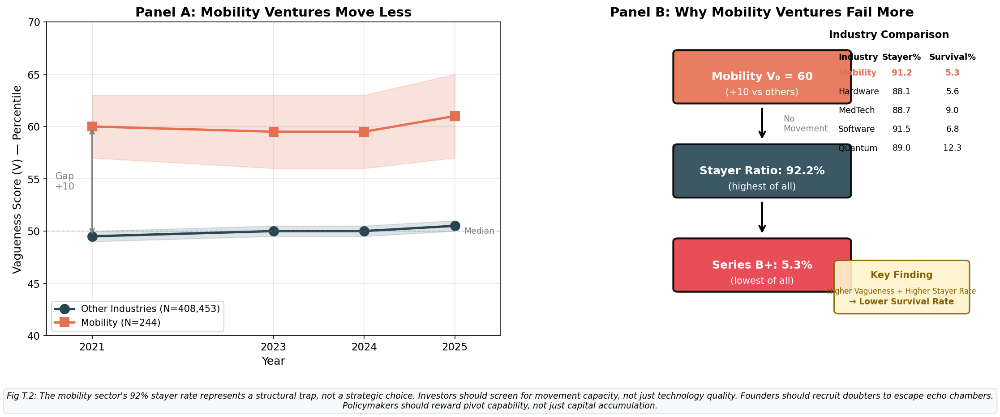

# 🪤 Trap Module - Table of Contents

## Module T (Lines 81-104) = 24 paragraphs

*Musical Tempo: Tempo I (Return) — SONATA RECAPITULATION*

---

## 🎼 T as Sonata Recapitulation

T is not simply another ITED paper. **T recapitulates M** in sonata form:

```
┌─────────────────────────────────────────────────────────────┐
│           SONATA FORM: M → C → T                            │
│                                                             │
│  M (EXPOSITION)        C (DEVELOPMENT)    T (RECAPITULATION)│
│  ───────────────       ───────────────    ──────────────────│
│  Movement Principle    4 Variations       Returns to M's    │
│  Fund2Cage            E×E Matrix          themes with       │
│  dG/dE = (+)(−)       Type heterogeneity  deeper meaning    │
│                                                             │
│  Same equation, new lens: Commit2Trap generalizes Fund2Cage │
└─────────────────────────────────────────────────────────────┘
```

### Structure: 5+7+8+4 = 24

```
┌────────────────────────────────────────────────────────────┐
│  🎵 TEMPO (81-85)           │  5 paragraphs  │ Recapitulate│
├────────────────────────────────────────────────────────────┤
│  📖 THEORY (86-92)          │  7 paragraphs  │ Gospel→Lens │
├────────────────────────────────────────────────────────────┤
│  🔬 EMPIRICS (93-100)       │  8 paragraphs  │ Q3 Analysis │
├────────────────────────────────────────────────────────────┤
│  💬 DISCUSSION (101-104)    │  4 paragraphs  │ Conclude    │
└────────────────────────────────────────────────────────────┘
```

---

## 🎵 Tempo/Recapitulation (Lines 81-85) — 5 paragraphs

| Line | ¶ | Content |
|:----:|:-:|:--------|
| 81 | 1 | **Tempo**: Return to Funding Paradox (recap M) |
| 82 | 2 | M established: dG/dA > 0 (Movement Principle) |
| 83 | 3 | C elaborated: 4 mover types with E×E matrix |
| 84 | 4 | Remaining puzzle: **Why Q3 > Q4?** |
| 85 | 5 | Bridge: Expand from funding → **commitment** |

---

## 📖 Theory/Gospel-Puzzle-Lens (Lines 86-92) — 7 paragraphs

| Line | ¶ | Section | Content |
|:----:|:-:|:--------|:--------|
| 86 | 1 | **Broadening** | Articulate Commit2Trap (funding is ONE example) |
| 87 | 2 | **Gospel** | Commitment + Tech company + Signaling |
| 88 | 3 | **Puzzle** | Tech companies with advanced tech FAIL |
| 89 | 4 | **Lens** | Learning trap as explanatory mechanism |
| 90 | 5 | **Org** | Section structure |
| 91 | 6 | **Theory** | Learning trap equation development |
| 92 | 7 | **Equation** | **μ(1−μ) < ε/(V+1)** |

---

## 🔬 Empirics: Q3 Analysis (Lines 93-100) — 8 paragraphs

**Critical**: T Empirics = Q3 Analysis, NOT simulation. Simulation → D(112).

T Empirics answers: **Why is Q3 success rate unexpectedly high?**

```
┌─────────────────────────────────────────────────────────────┐
│  Q3 PEAK EXPLANATION (Lines 93-100)                         │
│                                                             │
│  PART A (93-96): 😊 BENEFIT OF VAGUE PROMISE                │
│  ────────────────────────────────────────────               │
│  From Module C: Indirect proof via movement composition     │
│                                                             │
│  PART B (97-100): 😭 COST OF PRECISE PROMISE                │
│  ────────────────────────────────────────────               │
│  Optimist's Echo Chamber → Learning blocked                 │
└─────────────────────────────────────────────────────────────┘
```

### Part A (Lines 93-96): 😊 Benefit of Vague Promise

| Line | ¶ | Content |
|:----:|:-:|:--------|
| 93 | 1 | **Q3 has highest success** (16.0%) |
| 94 | 2 | **Q3 has highest movement rate** (68%) |
| 95 | 3 | **Movement → Success** (from M, 1.6× advantage) |
| 96 | 4 | **Therefore**: Q3 success explained by movement |

### Part B (Lines 97-100): 😭 Cost of Precise Promise

| Line | ¶ | Content |
|:----:|:-:|:--------|
| 97 | 1 | **Precise promise attracts believers** |
| 98 | 2 | **Optimistic founder (high μ) → like-minded gather** |
| 99 | 3 | **Lower variance in stakeholder beliefs** |
| 100 | 4 | **Hard to update prior** → Learning blocked |

### The Optimist's Echo Chamber (Corrected Framing)

```
┌─────────────────────────────────────────────────────────────┐
│  THE PROBLEM: OPTIMIST'S ECHO CHAMBER                       │
│  ────────────────────────────────────                       │
│  High-μ optimist (founder who believes strongly)            │
│       ↓                                                     │
│  Precise promise signals confidence                         │
│       ↓                                                     │
│  Attracts like-minded BELIEVERS (also high μ)               │
│       ↓                                                     │
│  Echo chamber forms: LOW VARIANCE in beliefs                │
│       ↓                                                     │
│  No one challenges assumptions                              │
│       ↓                                                     │
│  μ(1−μ) is SMALL → Trap condition satisfied                 │
│       ↓                                                     │
│  CANNOT LEARN even when evidence demands change             │
│                                                             │
│  THE SOLUTION: DOUBTER PRESCRIPTION                         │
│  ─────────────────────────────────                          │
│  Deliberately include DOUBTERS (low μ stakeholders)         │
│       ↓                                                     │
│  Increases belief variance                                  │
│       ↓                                                     │
│  Creates productive conflict                                │
│       ↓                                                     │
│  Enables belief updating → Escape trap                      │
└─────────────────────────────────────────────────────────────┘
```

### The μ-Paradox

> **The more optimistic you are (high μ), the more you NEED doubters.**

| Founder μ | μ(1−μ) | Trap Risk | Doubter Prescription |
|:---------:|:------:|:---------:|:--------------------:|
| 0.5 | 0.25 | LOW | Optional |
| 0.7 | 0.21 | Medium | Recommended |
| 0.9 | 0.09 | **HIGH** | **Critical** |

**Why?**
- High μ → μ(1−μ) is SMALL
- Small μ(1−μ) → Trap condition EASIER to satisfy
- Doubters increase variance → escape trap

---

## 💬 Discussion (Lines 101-104) — 4 paragraphs

| Line | ¶ | Content |
|:----:|:-:|:--------|
| 101 | 1 | **Implication**: Commit to adaptation, Bayesian hygiene |
| 102 | 2 | **Limitation**: Observational, not experimental |
| 103 | 3 | **Future todo**: Experimental tests of learning trap |
| 104 | 4 | **Conclude**: Precision is trap dressed as virtue |

---

## 📊 Q Pattern Explanation

| Quartile | V Range | Success | Movement | Explanation |
|:---------|:-------:|:-------:|:--------:|:------------|
| Q1 | 0-25 | 12.3% | 42% | Learning trap (😭) |
| Q2 | 25-50 | 8.9% | 35% | Mixed |
| **Q3** | 50-75 | **16.0%** | **68%** | **😊 + avoid 😭** |
| Q4 | 75-100 | 12.9% | 55% | Destructive ambiguity |

---

## 📈 Key Figures

### Fig T.2: Mobility Ventures Move Less



| Panel | Title | Key Finding |
|:------|:------|:------------|
| **A** | Mobility Ventures Move Less | Flat trajectory (V₀=60 → V_T≈60) despite starting vague |
| **B** | Why Mobility Ventures Fail More | 92.2% Stayer ratio (highest) → 5.3% survival (lowest) |

**Interpretation**: Mobility ventures exemplify the learning trap. Despite high initial vagueness (V₀=60, +10 vs others), they fail to move—92% remain Stayers. This combination of "high vagueness + no movement" leads to the lowest survival rate across all industries.

**Prescriptive Caption** (Stakeholder Call to Action):
> *"The mobility sector's 92% stayer rate represents a structural trap, not a strategic choice. Investors should screen for movement capacity, not just technology quality. Founders should recruit doubters to escape echo chambers. Policymakers should reward pivot capability, not just capital accumulation."*

**Generator**: `plot_mobility_vs_other.py`

---

## Navigation

| Module | Lines | Link |
|--------|-------|------|
| I Introduction | 1-11 | [toc(i).md](../1_I_introduction/toc(i).md) |
| M Movement | 12-48 | [toc(m).md](../2_M_movement/toc(m).md) |
| C Fund2Growth | 49-80 | [toc(c).md](../3_C_cash2growth/toc(c).md) |
| **T Commit2Trap** | 81-104 | *You are here* |
| D Discussion | 105-113 | [toc(d).md](../5_D_discussion/toc(d).md) |

---
