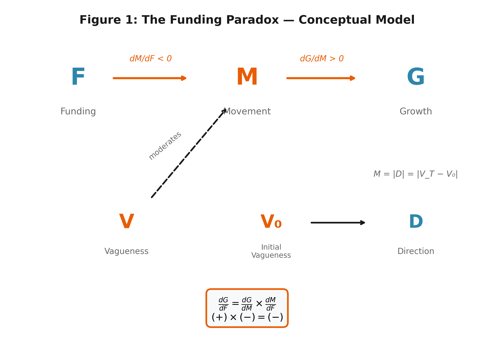

# I1: The Funding Paradox

**¶1-9 | Keystone | Locks: F, R, A, G, B, core equation, LTE**

> **Reference**: See `table_vars_def.md` for complete variable definitions (🗄️Table 1)

---

**¶01** The strategy literature has long debated the relative merits of commitment versus flexibility. One tradition emphasizes commitment: Van den Steen (2017) formalizes why strategy creates value precisely because commitment is costly—irreversibility signals credibility. Ghemawat (1991) concurs: "commitment, far from being inflexibility, is the very essence of strategy." Another tradition emphasizes flexibility: Porter (1996) argues that strategic choice precedes commitment, Mintzberg (1987) shows that strategy often emerges rather than being planned, and Teece et al. (1997) demonstrate that dynamic capabilities—the ability to reconfigure resources—drive competitive advantage. Even Ghemawat (1991) himself discusses the limits of commitment and conditions under which flexibility becomes valuable. This dissertation asks: when does each matter most? The answer has practical stakes: $330 billion in U.S. venture capital in 2021 alone funded committed founders. But what if early-stage capital is not rocket fuel but an anchor? What if the very commitment that attracts funding weighs down the repositioning that drives growth?

**¶02** The empirical evidence is consistent with this suspicion. Ventures that raise more early-stage funding show *lower* subsequent growth. The correlation is robustly negative: ρ(G,F) = −0.196 (p < 0.001, N = 180,994). I call this the **Funding Paradox**: growth is negatively correlated with early-stage funding. The finding contradicts three theoretical frameworks. **Signaling theory** (Spence, 1973) assumes commitment reveals ability—but ignores that commitment constrains subsequent repositioning; the signal succeeds, yet the pressure to maintain it prevents adaptation. **Bayesian entrepreneurship** (Gans et al., 2019) models learning as belief updating—but overlooks that funding selects for specific beliefs that become difficult to revise. **Entrepreneurial finance** (Agrawal et al., 2021) prescribes that capital enables experimentation—but omits that obtaining capital requires commitments that foreclose the very experiments capital was meant to fund.

**¶03** This dissertation explains why. The answer lies in **repositioning**—the strategic change a venture undertakes over its lifecycle. I conceptualize repositioning as a *realized option*: the actual exercise of strategic flexibility. This differs from flexibility itself, which represents *potential* options—the capacity to reposition. Sky Engine repositioned: from "AI for autonomous vehicles" to "synthetic data cloud for vision AI"—and grew 216×. Surestar stayed: "LiDAR for cities, transportation, surveying" in 2021 and 2025—and grew 27×. Firms that reposition outperform stayers by 1.82× (18.0% vs. 9.9% survival to Later Stage VC). Repositioning predicts growth (dG/dA > 0), but funding suppresses repositioning (dA/dF < 0). I argue that the mechanism operates through stakeholder lock-in: funding creates constituencies who resist strategic change.

**¶04** Five variables structure the analysis (Figure 1). **Funding (F)** is the log-transformed early-stage capital raised. **Growth (G)** is operationalized as total funding raised relative to early-stage VC—a continuous measure of scaling success. **Breadth (B)** captures the scope of strategic positioning on a 0–100 percentile scale, where higher values indicate broader, less specific market definitions (e.g., "mobility solutions" vs. "e-scooter sharing in Boston"). **Repositioning (R)** is the signed change in breadth (B_T − B₀): negative values indicate zoom-in (increasing precision), positive values indicate zoom-out (increasing flexibility). **Absolute Repositioning (A)** measures the magnitude of strategic change: A = |R| = |B_T − B₀|. Table 1 provides complete operationalizations.



**¶05** The Funding Paradox—that growth is negatively correlated with early-stage funding—resolves through decomposition. The total effect of funding on growth, dG/dF, can be expressed as the product of two partial effects: dG/dF = (dG/dA) × (dA/dF). The first term, dG/dA, captures how repositioning relates to growth—this association is positive because strategic change allows ventures to escape failing hypotheses and discover viable ones. The second term, dA/dF, captures how funding relates to repositioning—this association is negative. I argue that capital creates stakeholder constituencies whose interests become tied to the funded strategy, making repositioning costly. The product of a positive and a negative is negative: the funding that was meant to accelerate growth becomes an anchor that impedes it.

**¶06** This dissertation offers one reconceptualization: commitment is a liability in nascent environments. The prescription is to *nail it with flexibility, then scale it with commitment*. Van den Steen's (2017) commitment-creates-value mechanism requires a scope condition—when uncertainty is high, the object of commitment must shift from fixed position to repositioning capability. The capital-enables-learning framework (Agrawal et al., 2021) omits a selection stage: the commitment required to obtain capital constrains the experimentation capital was meant to enable. For practitioners, I provide a diagnostic framework—**PAE** (Platformize → Acculturate → Evaluate)—for identifying and escaping funding traps.

**¶07** This dissertation proceeds in five chapters. Following this introduction, **Chapter 2 (Paper M)** establishes the Repositioning Principle: firms that reposition outperform stayers, but funding suppresses repositioning. **Chapter 3 (Paper B)** explains heterogeneous outcomes through the learning trap mechanism: μ(1−μ) < ε/(B+1). **Chapter 4 (Paper E)** demonstrates escape strategies via the PAE framework (Platformize → Acculturate → Evaluate). **Chapter 5** synthesizes findings and articulates implications. The dissertation employs the Layer-Theory-Evidence (LTE) structure (Cronin, 2025): Paper M establishes empirical patterns (Layer 1), Paper B provides causal mechanisms (Layers 2-3), and Paper E demonstrates intervention effectiveness.

**¶08** Three repositioning archetypes emerge from the data: **stayers** (A≈0, 9.9% survival), **zoom-in** movers who increase precision (R<0, 17.5% survival), and **zoom-out** movers who increase flexibility (R>0, 18.4% survival). Direction matters less than magnitude—both mover types outperform stayers by similar margins. Traps occur at both extremes of initial breadth (B₀). **High-B₀ trap**: ventures start too broad, unable to focus despite needing precision—the mobility sector exemplifies this pattern (B₀=78, 91% stayer ratio, 5% survival). **Low-B₀ trap**: ventures start too narrow, unable to expand despite needing flexibility. Funding reinforces both traps through stakeholder selection.

**¶09** The implications extend to entrepreneurs, investors, and scholars alike. For entrepreneurs, the prescription is counterintuitive: commit to repositioning capability, not to the specific positions that attract funding. This means designing organizational structures, investor relationships, and stakeholder communications that preserve strategic flexibility even as capital flows in. For investors, the implication is equally challenging: the ventures most likely to succeed may be those that reposition away from the pitch that won your commitment. Selecting for conviction may inadvertently select against adaptation. For strategy scholars, the Funding Paradox reveals a boundary condition on commitment-based theories: in nascent environments where the right strategy cannot be known ex ante, the object of commitment must shift from position to process. If these patterns reflect causal mechanisms, the prescription is this: nail it with flexibility, then scale it with commitment.

---

## Dissertation Structure

This dissertation presents three papers that progressively decompose and explain the Funding Paradox:

1. **Paper M** (Chapter 2): Establishes the Repositioning Principle (dG/dA > 0) and the Funding Anchor (dA/dF < 0). The *what* of the paradox decomposition.

2. **Paper B** (Chapter 3): Explains the heterogeneous traps by initial breadth (B₀). The *why* through learning trap mechanism: μ(1−μ) < ε/(B+1).

3. **Paper E** (Chapter 4): Documents escape strategies through the PAE framework (Platformize → Acculturate → Evaluate). The *how to escape*.

The Conclusion (Chapter 5) synthesizes findings and articulates implications for entrepreneurs, investors, and researchers.

---

## Token Table

| Field | Value |
|:------|:------|
| Claim IDs used | CLAIM.PARADOX.v2, CLAIM.REPOSITIONING.v1, CLAIM.TRAP_DEF.v3 |
| Version check | Yes |
| Shift Alert | V→B, M→R, D→R(signed), new A |

## I1 Output Interface

```yaml
I1_OUTPUT:
  locks:
    - F: "early-stage funding (log $)"
    - G: "growth (total funding / early VC)"
    - B: "breadth (0-100 percentile)"
    - R: "repositioning (B_T - B_0), signed"
    - A: "|R| = |B_T - B_0|, magnitude"
  core_equation: "dG/dF = (dG/dA)(dA/dF) < 0"
  types: [stayer, zoom_in, zoom_out]
  key_stats:
    - "ρ(G,F) = -0.196 (p < 0.001, N = 180,994)"
    - "Repositioners: 18.0% survival, Stayers: 9.9% survival"
    - "Repositioning advantage: 1.82×"
  concepts:
    - "Repositioning = realized option"
    - "Flexibility = potential option (repositioning capacity)"
    - "Prescription: nail it with flexibility, scale it with commitment"
```

---

## References

Agrawal, A., Gans, J. S., & Stern, S. (2021). Experimentation, entrepreneurship, and the scientific method. In *The economics of creative destruction* (pp. 265-296). Harvard University Press.

Cronin, M. A. (2025). Layer-theory-evidence: A structure for building and presenting research. *Management Science* (forthcoming).

Gans, J. S., Stern, S., & Wu, J. (2019). Foundations of entrepreneurial strategy. *Strategic Management Journal*, *40*(5), 736-756. https://doi.org/10.1002/smj.3010

Ghemawat, P. (1991). *Commitment: The dynamic of strategy*. Free Press.

Mintzberg, H. (1987). The strategy concept I: Five Ps for strategy. *California Management Review*, *30*(1), 11-24. https://doi.org/10.2307/41165263

Porter, M. E. (1996). What is strategy? *Harvard Business Review*, *74*(6), 61-78.

Spence, M. (1973). Job market signaling. *Quarterly Journal of Economics*, *87*(3), 355-374. https://doi.org/10.2307/1882010

Teece, D. J., Pisano, G., & Shuen, A. (1997). Dynamic capabilities and strategic management. *Strategic Management Journal*, *18*(7), 509-533. https://doi.org/10.1002/(SICI)1097-0266(199708)18:7<509::AID-SMJ882>3.0.CO;2-Z

Van den Steen, E. (2017). A formal theory of strategy. *Management Science*, *63*(8), 2616-2636. https://doi.org/10.1287/mnsc.2016.2468
