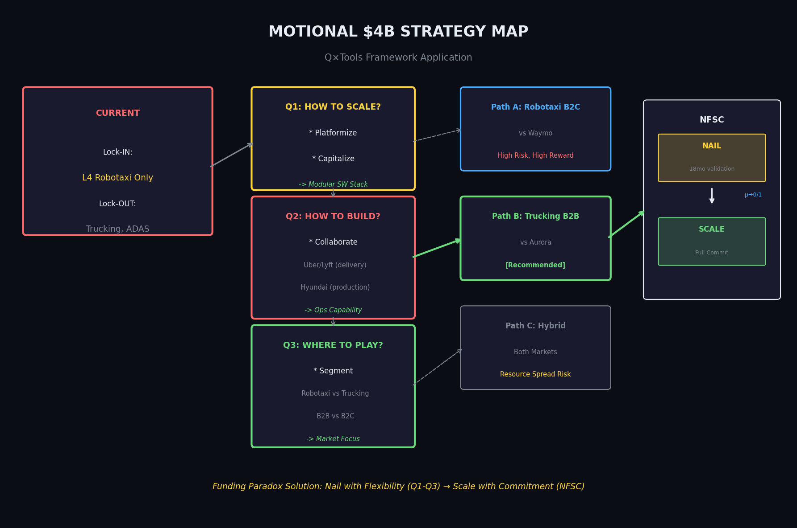

# The Funding Paradox: Strategic Repositioning Under Capital Lock-in

**Author**: Angie Moon
**Advisors**: Charlie Fine, Scott Stern
**Date**: January 2025

---

## Abstract

Ventures that raise more early-stage funding show lower subsequent growth (ρ = −0.196, p < 0.001, N = 408,697). This dissertation explains why. Decomposing the Funding Paradox: **dG/dF = (dG/dA) × (dA/dF) < 0**. Repositioning predicts growth (dG/dA > 0), but funding suppresses repositioning (dA/dF < 0). The capital intended to enable learning instead locks trajectories through stakeholder commitment. Two trap mechanisms emerge at breadth extremes: High-B₀ ventures stay too vague to learn; Low-B₀ ventures stay too specific to pivot. The learning trap condition μ(1−μ) < ε×B formalizes when belief updating halts.

**Prescription**: Nail it with flexibility, then scale it with commitment.

---

# I. Introduction

**¶01** The strategy literature debates commitment versus flexibility. Van den Steen (2017): commitment creates coordination value. Ghemawat (1991): "commitment is the essence of strategy." Another tradition emphasizes flexibility: Mintzberg, Teece. This dissertation asks: when does each matter most?

**¶02** The empirical answer surprises: ventures raising more early-stage funding show *lower* subsequent growth. ρ(G,F) = −0.196 (p < 0.001, N = 408,697). I call this the **Funding Paradox**.

**¶03** Resolution through decomposition:

```
dG/dF = (dG/dA) × (dA/dF) < 0
         (+)        (−)
```

**Five Variables**:

| Variable | Definition |
|:---------|:-----------|
| F | Funding (log early-stage capital) |
| G | Growth (total funding / early VC) |
| B | Breadth (0-100 percentile, positioning scope) |
| R | Repositioning = B_T − B₀ (signed) |
| A | Absolute Repositioning = |R| |


---

# A. Adaptation

## A1. Repositioning Principle (dG/dA > 0)

**¶12** Van den Steen: commitment coordinates downstream decisions. If so, stayers should outperform movers.

**¶23** **Empirical finding**: Repositioners outperform stayers **1.82×** (18.0% vs 9.9% survival).

| Type | Survival |
|:-----|:---------|
| Zoom-in (R < 0) | 17.5% |
| Zoom-out (R > 0) | 18.4% |
| Stayer (R = 0) | 9.9% |

**¶15** Resolution: Commitment remains the essence of strategy; the *object* shifts. Van den Steen's mechanism remains valid. In nascent environments, commitment should target *repositioning capability* rather than static position.

---

## A2. Funding Anchor (dA/dF < 0)

**¶31** Camuffo-Nanda's experimentation logic holds. I identify *when* the mechanism breaks: **Funding suppresses repositioning: dA/dF < 0.** Early-stage capital triggers stakeholder lock-in that suppresses the very experimentation it was meant to enable.

**¶42** **Empirical finding**: 1-SD increase in funding → **0.4 SD less repositioning** (p < 0.001).

**Two-Stage Mechanism**:
1. **Selection**: Commitment → Capital (precise visions attract funding)
2. **Lock-in**: Capital → Reinforcement (stakeholder expectations constrain)

---

# B. Breadth

## B1. Learning Trap Condition

**¶49** The Funding Anchor operates through belief variance collapse. Traps occur when:

```
μ(1−μ) < ε × B
```

Where:
- μ(1−μ) = belief variance (capacity to update)
- ε = learning threshold
- B = breadth (inversely related to precision τ)

**Two Trap Types**:

| Trap | Mechanism | Example |
|:-----|:----------|:--------|
| **High-B₀** | Too vague → can't falsify | Mobility (B₀=78, 5% survival) |
| **Low-B₀** | Too specific → echo chamber | Motional ($4B, stayer) |

**¶65** Low-B₀ trap mechanism:
- Stage 1 (Selection): Precise promises attract believers
- Stage 2 (Lock-in): Homogeneous stakeholders silence dissent
- Result: μ(1−μ) → 0, unanimous prior blocks updates



---

# C. Conclusion

## C1. Practitioner Implications


**For Entrepreneurs**:
- Track whether you're repositioning (|R| > 0) or stuck
- Frame strategy as provisional: "We believe X, here's how we'll test it"
- Repositioners outperform stayers 1.82×

**For Investors**:
- Conviction alignment may be risk factor, not strength
- Seek co-investors who challenge your thesis
- Fund repositioning capacity, not fixed positions

---

## C2. Limitations

| Limitation | Implication |
|:-----------|:------------|
| Selection bias | Successful movers exit dataset early; 1.82× understated |
| Generalizability | Mobility-specific; needs replication in biotech, cleantech |
| Trap detection | Early warning system needed |

---

## C3. Contributions

**Layer 1 (What)**: Two relationships established
- dG/dA > 0 (repositioners outperform 1.82×)
- dA/dF < 0 (capital suppresses repositioning)

**Layer 2 (How)**: Funding Paradox decomposed
- dG/dF = (dG/dA)(dA/dF) < 0

**Layer 3 (Why)**: Learning Trap derived
- μ(1−μ) < ε × B

**Prescription**: Commit to movement, not to the promises that fund it.

---

# Appendix: Key Equations Summary

| Equation | Meaning |
|:---------|:--------|
| dG/dF = (dG/dA)(dA/dF) < 0 | Funding Paradox |
| dG/dA > 0 | Repositioning Principle |
| dA/dF < 0 | Funding Anchor |
| μ(1−μ) < ε × B | Learning Trap |

---

# Appendix: Technical Details (Moved from Main Text)

## OIL Framework Mapping (Charlie Fine)

| OIL Variable | Thesis Variable |
|:-------------|:----------------|
| τ (precision) | 1/B (inverse breadth) |
| V (value) | G (growth potential) |
| i (integration) | |dA/dF| (funding anchor) |

## Sell × Deliver Framework

```
P(Success | B) = P(Sell | B) × P(Deliver | B)
```

Marketing (Segment) and Operations (Collaborate) advance in **parallel**, not sequence.

## Optimal Breadth (Theoretical)

```
B* = f(V, |dA/dF|)
```
- High V, Low cost → Low B* (narrow, commit early)
- Low V, High cost → High B* (broad, stay flexible)

---

*Draft v5 (Pruned) | January 2025 | Figures: 3*
