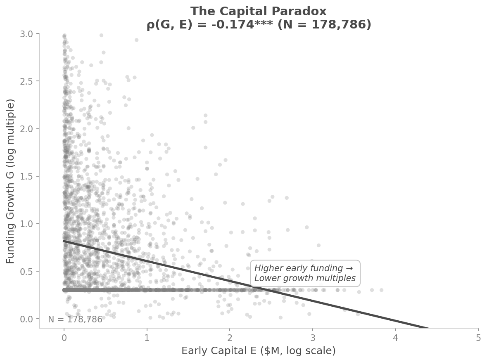
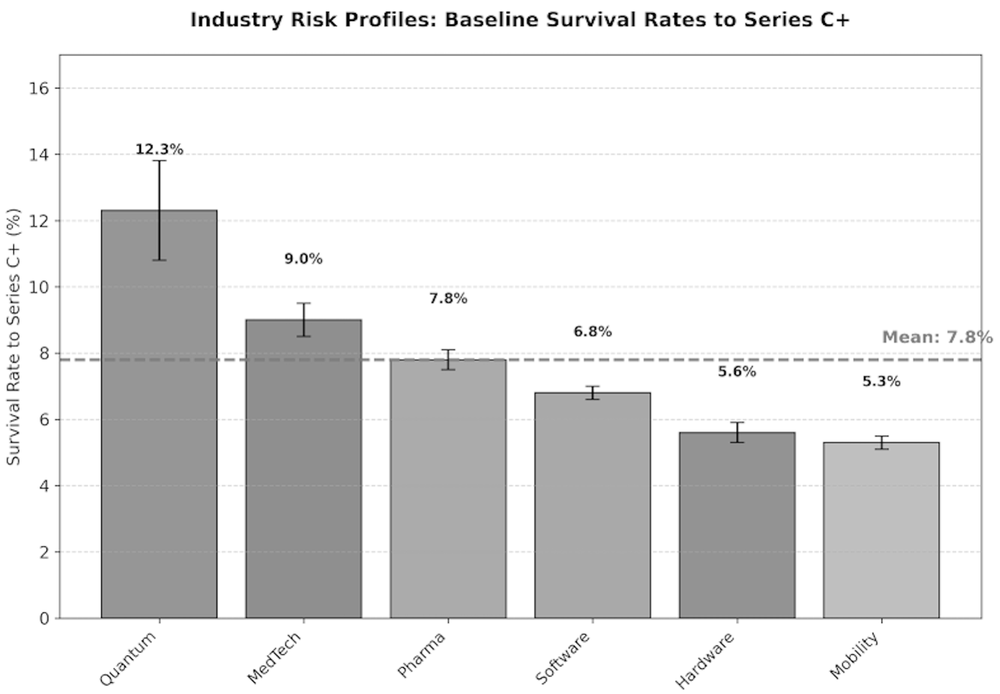
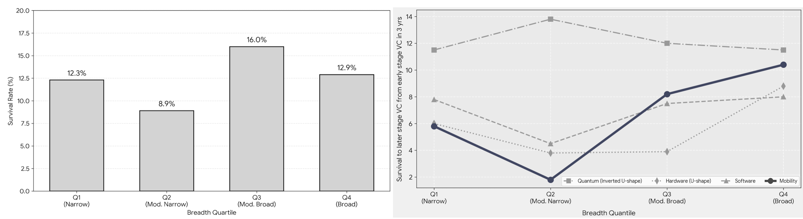

---
modified:
  - 2026-01-09T07:11:21-05:00
  - 2026-01-09T07:30:00-05:00
  - 2026-01-09T17:18:02-05:00
structure: CFR-First (Option B Hybrid)
paragraphs: 29
---
# The Golden Cage: How Early Funding Suppresses Venture Growth

**Hyunji Moon**
MIT Sloan School of Management

Draft for Committee Review — January 7, 2026

---

## Abstract

Early-stage funding correlates negatively with venture growth. Analyzing 180,994 ventures (PitchBook, 2021–2025), I find ρ(Funding, Growth) = −0.196 (p < 0.001)—contradicting the resource logic that capital enables learning-driven growth. I decompose this paradox: funding suppresses repositioning (ρ = −0.087), yet repositioning drives growth (Movers outperform Stayers by 1.81×). The product is negative.

The mechanism is governance, not incentives. Securing capital requires operational commitments that attract like-minded investors who filter skeptics from governance. This belief homogeneity eliminates the signal diversity learning requires. I term this the *golden cage*: founders cannot recognize when to pivot because their boards lack advocates for alternatives.

The contribution is threefold: (1) I document a negative funding-growth correlation at scale; (2) I identify governance homogeneity—not moral hazard—as the binding constraint; (3) I distinguish vision-level commitment (preserves flexibility) from operational commitment (forecloses it). The prescription: commit to *reposition*, not to position.

**Keywords:** entrepreneurial strategy, venture capital, strategic flexibility, pivoting, governance

---

## List of Figures

| Figure | Title | Location |
|:------:|:------|:--------:|
| [Figure 1](#fig:capital_paradox) | The Capital Paradox | ¶8 |
| [Figure 2](#fig:golden_cage_mechanism) | The Golden Cage Mechanism | ¶11 |
| [Figure 3](#fig:mover_stayer_trajectories) | Mover vs. Stayer Trajectories | ¶21 |
| [Figure 4](#fig:mobility_survival) | Industry Risk Profiles | ¶25 |
| [Figure 5](#fig:capitalize_strategic_ambig) | The Strategic Ambiguity Sweet Spot | ¶26 |

## List of Tables

| Table | Title | Location |
|:-----:|:------|:--------:|
| Table 1 | Variables and Causal Structure | ¶4 |
| Table 2 | Three Strategic Archetypes | ¶20 |
| Table 3 | The Mover Advantage (Success Rates) | ¶21 |
| Table 4 | Tesla vs. Better Place Comparison | ¶24 |
| Table 5 | Growth Typology (Scale-it Framework) | ¶27 |

---

## I. Introduction

### [¶1] The Capital-as-Oxygen Premise

Capital is oxygen for startups—or so the $330 billion U.S. venture capital industry assumes. The logic appears unassailable: capital funds experiments, experiments generate learning, learning drives growth. More capital should mean more growth. This paper challenges that assumption.

### [¶2] The Empirical Puzzle

The data say otherwise. Analyzing 180,994 ventures (PitchBook, 2021–2025), I find:

**ρ(Funding, Growth) = −0.196 (p < 0.001)**

Early-stage funding correlates *negatively* with later-stage survival. Well-funded ventures convert resources to growth less efficiently—not more.

### [¶3] The Decomposition

The paradox resolves through decomposition:

**dG/dF = (dG/dR) × (dR/dF) = (+) × (−) = (−)**

Repositioning drives growth (dG/dR > 0). Ventures that adapt—"Movers"—outperform those that hold position—"Stayers"—by 1.81× (17.8% vs. 9.9% later-stage survival). Yet funding suppresses repositioning (dR/dF < 0): ρ(Repositioning, Funding) = −0.087 (p < 0.001).

The product of a positive and a negative is negative. Funding suppresses what enables growth.

### [¶4] Variables and Causal Structure

**Table 1: Variables and Causal Structure**

| Symbol | Variable | Type | Definition |
|:------:|:---------|:-----|:-----------|
| **C** | Commitment | Choice | Operational promises to stakeholders |
| **F** | Funding | Outcome | Early-stage capital secured |
| **A** | Adaptability | Capacity | Governance-permitted change ability |
| **B** | Strategic Breadth | State | Market positioning specificity (0-100 scale)* |
| **R** | Repositioning | Action | \|B_T - B_0\|, magnitude of strategic change |
| **G** | Growth | Outcome | Later-stage survival/funding |

*B is measured via dictionary-based vague terminology density: higher B = broader positioning; lower B = narrower focus. See ¶20 for operationalization.

**Causal Chain:** C → F → A↓ → R↓ → G↓

### [¶5] The Golden Cage Mechanism

Why does funding suppress repositioning? The answer lies in governance, not motivation. I term this mechanism the *golden cage*: securing capital requires operational commitments → commitments attract investors who believe in that specific approach → believers filter out skeptics → the resulting board exhibits belief homogeneity → without skeptics, disconfirming signals lack advocates → the venture loses capacity to recognize when pivoting would be optimal. The constraint is structural—founders *cannot* pivot, not that they *will not*—because governance imposes rigidity.

### [¶6] Structure

The paper proceeds as follows. Section II articulates the golden cage mechanism—how funding correlates with less repositioning through governance homogeneity. Section III establishes the consequence: repositioning correlates with growth, meaning the rigidity imposed by funding suppresses the primary driver of venture survival. Section IV develops prescriptive implications. Section V concludes.

---

## II. The Golden Cage: Funding Inhibits Repositioning (CFR)

### [¶7] The Capital-Enables-Learning View

Capital is *intended* to enable learning. This premise underlies $330 billion in U.S. venture capital deployed annually. The logic appears sound: resources fund experiments, experiments generate learning, learning drives growth.

In this view, entrepreneurship is a rigorous scientific experiment (Camuffo et al., 2020), and venture capital functions as the necessary endowment to execute these tests (Kerr, Nanda, & Rhodes-Kropf, 2014). Capital pays for hypothesis formation and market validation. Entrepreneurs trained in scientific method—forming hypotheses, designing tests, updating beliefs—pivot more readily and perform better.

**A tragic paradox emerges.** This very resource, intended to facilitate discovery, *constrains* learning by imposing structural rigidities. The capital meant to pay for experiments becomes the barrier to updating their results. How? The next section reveals the mechanism.

### [¶8] The Empirical Contradiction

The data confirm the paradox. Analyzing 180,994 ventures from PitchBook (2021–2025), I find that early-stage funding correlates *negatively* with later-stage survival:

**ρ = −0.196 (p < 0.001)**

This contradicts resource-based theory (Barney, 1991; Penrose, 1959). More capital should buy more options (Trigeorgis, 1996). Instead, well-funded ventures exhibit systematically lower conversion rates from resources to growth. The correlation persists across industry sectors.

The puzzle sharpens: the resource *intended* to enable flexibility *suppresses* it. Capital pays for experiments—yet capital-rich ventures experiment less. The next sections reveal the mechanism.

**Figure 1:** The Capital Paradox. Higher early funding correlates with lower repositioning magnitude (N = 180,994, ρ = −0.196, p < 0.001).

### [¶9] The Golden Cage Mechanism

The golden cage forms through a four-step sequence: commitment attracts believers, believers filter skeptics, homogeneity eliminates signals, and signal loss prevents learning. Each step follows logically from the previous, creating a trap that is structural rather than motivational.

Securing capital requires specific operational commitments—production architecture choices, go-to-market sequences, milestone definitions (Gompers & Lerner, 2001; Hellmann & Puri, 2002). Investors who fund a venture believe these specific commitments will succeed; vague operational plans do not secure investment. Note the distinction: *vague operations* don't secure funding, but *vague vision* can—if accompanied by strong cultural alignment. Tesla secured funding with broad vision ("sustainable transport") because investor-founder cultural alignment substituted for operational specificity. Once commitment attracts believers, those believers systematically exclude skeptics who see alternative paths. The resulting board composition reflects shared belief in the committed direction. This filtering is not conspiratorial but rational: why would an investor who believes in battery swapping fund a company if the board includes members advocating charging infrastructure?

### [¶10] Governance Homogeneity and Signal Loss

Governance homogeneity eliminates the signal diversity that learning requires. Without skeptics on the board, disconfirming signals lack advocates (Cyert & March, 1963). Market feedback indicating problems with the committed approach has no champion in governance discussions. The venture loses capacity to recognize when pivoting would be optimal—learning cessation becomes structural, not motivational.

Understanding the data-generating process clarifies the mechanism. The observed correlation between funding and rigidity reflects *selection*, not treatment: investors do not *cause* founders to become rigid; rather, the funding process *selects* founder-investor pairs who share beliefs about the committed approach. Founders with strong conviction attract investors who share that conviction—a matching process that produces correlation without direct causation. Why does this distinction matter? Because either way, the core finding holds: high funding correlates with low flexibility, and low flexibility correlates with low growth. Whether funding causes rigidity (treatment) or merely co-occurs with it (selection), the practical implication is identical—well-funded ventures are systematically less adaptable. The golden cage forms regardless of which causal arrow dominates. March (1991) identifies this dynamic in organizational learning: "Reason inhibits foolishness; learning and imitation inhibit experimentation." Belief convergence is efficient for exploitation but destructive for exploration.

### [¶11] Theory Integration

The golden cage mechanism is *not* agency-theoretic. Founders are not shirking; investors are not monitoring failures. Rather, both parties are rational yet collectively trapped. Van den Steen (2010) provides the theoretical foundation: entrepreneurs who pursue a venture are, by definition, more optimistic about it—a selection effect, not bias. Crucially, this is a sorting equilibrium: investors who choose to fund also share this optimism, because pessimistic investors self-select out. The result is belief homogeneity without any party behaving irrationally. Everyone is Bayesian; everyone is trapped.

Eisenberg (1984) completes the mechanism through "strategic ambiguity." Early-stage ventures necessarily communicate with some vagueness—the future is genuinely uncertain. This ambiguity enables "unified diversity": stakeholders project their own interpretations onto vague visions. Initial ambiguity attracts diverse believers who each see their preferred interpretation. But this same mechanism traps the venture later: any pivot threatens *someone's* projected interpretation, and that someone now sits on the board. The cage is structural, not motivational—a distinction that matters for intervention. If founders *will not* pivot (moral hazard), then monitor harder. If founders *cannot* pivot (structural constraint), then redesign governance.

**Figure 2:** The Golden Cage Mechanism. As early capital (F) increases, strategic repositioning (R) decreases, controlling for industry fixed effects.

### [¶12] Formal Condition for Learning Cessation

Building on Levinthal & March's (1993) insight that successful organizations become "myopic" through competency traps, I formalize when learning ceases. **Theorem 1 (Learning Trap):** Learning ceases when μ(1 - μ) < ε / B, where μ = probability of success (belief), ε = expected belief shift from a signal, and B = strategic breadth. This condition connects directly to Van den Steen's sorting equilibrium, which produces high μ (shared optimism) and low B (narrow strategic focus). Van den Steen shows that matched founder-investor pairs converge toward μ → 1, while the operational commitments required for funding narrow B. Both forces push the inequality toward satisfaction—learning cessation becomes *endogenous* to the funding process itself.

The interpretation is straightforward: when belief certainty is high (μ approaches 0 or 1), the left side approaches zero; when strategic breadth is narrow (small B), the right side increases. Both conditions—high certainty and narrow focus—characterize well-funded ventures with specific operational commitments. The venture cannot update beliefs even when updating would be optimal. The trap is cognitive-structural, not motivational (Levinthal & March, 1993; Nelson & Winter, 1982).

### [¶13] Alternative Explanation: Moral Hazard

One might argue that well-funded founders simply don't *want* to pivot—capital insulates them from consequences. This moral hazard explanation implies that monitoring should increase with funding. My mechanism differs fundamentally: founders *cannot* pivot because governance constrains adaptation. This is not "won't"—it is "can't." Bolton et al. (2024) illuminate this distinction: investor protection mechanisms (board seats, milestone gates, information rights) designed to mitigate moral hazard paradoxically *create* structural rigidity. The very contracts intended to align incentives become the cage's bars. Contractual governance substitutes monitoring for flexibility, producing what I term *contractual rigidity*.

The distinction matters for intervention: if moral hazard ("won't"), monitor founders more closely; if structural constraint ("can't"), redesign governance to preserve signal diversity. The evidence favors the structural explanation. Founders of failed well-funded ventures frequently express regret at not pivoting earlier—suggesting motivation was not the constraint. They wanted to adapt; governance prevented it.

### [¶14] CFR Summary

Funding inhibits repositioning through the golden cage mechanism. Operational commitment attracts believers who filter skeptics, producing governance homogeneity that eliminates the signal diversity learning requires. The constraint is structural: founders cannot recognize when to pivot because their governance lacks voices advocating alternatives.

*Limitation 1 (Selection vs. Treatment)*: The correlation between funding and rigidity reflects selection—investors who fund share founders' beliefs—not funding *causing* rigidity. I do not claim treatment effects; the mechanism operates through sorting (Van den Steen, 2010). Identification strategies are discussed in ¶29.

*Limitation 2 (Governance Measurement)*: I infer belief homogeneity from behavioral outcomes (low repositioning), not direct measurement. Future work should measure board belief diversity through surveys or investor communication analysis.

### [¶15] Case Evidence: Segway

Segway raised over $100 million committed to a specific production architecture: a gyroscopic two-wheel platform as the solution for personal transportation. This was not a vague vision problem—the vision ("revolutionize personal transportation") was appropriately broad. The cage formed through operational lock-in. Production commitment locked $100 million into gyroscopic manufacturing, proprietary battery systems, and dedicated assembly lines. Governance homogeneity followed: celebrity investors including Jeff Bezos and John Doerr all believed in the two-wheel form factor. When market feedback indicated warehouse logistics and campus security as viable applications—requiring different form factors—no governance voice advocated pivoting. The pivot to warehouse logistics (Segway Robotics) occurred only after near-failure, years delayed by the golden cage.

*I have established that early funding creates structural rigidity (dR/dF < 0). But is this rigidity a fatal flaw or a disciplined focus? Section III answers this by quantifying the survival premium of repositioning in uncertain markets.*

---

## III. Adaptability Drives Growth (ARG)

*Section II established that funding suppresses repositioning. But does this rigidity matter? Only if repositioning drives growth. This section demonstrates that "Movers" outperform "Stayers" by 1.81× (17.8% vs. 9.9% later-stage survival), suggesting that funding-induced rigidity is not disciplined focus—it is growth suppression.*

### [¶16] The Commitment Orthodoxy

Strategy orthodoxy favors commitment. Porter (1996) argues that competitive advantage requires choosing a unique position and making trade-offs that competitors cannot easily imitate. Ghemawat (1991) shows that commitment—through lock-in, lock-out, lags, and inertia—creates barriers to imitation. The prescription follows: choose a defensible position, then commit.

### [¶17] The Entrepreneurial Exception

Commitment logic requires stability (Dixit & Pindyck, 1994). Nascent markets lack stability. Under technological and demand uncertainty, commitment becomes a bet on incomplete information. The capacity to reposition may dominate commitment's benefits (Sanchez, 1995).

McGrath (1999) articulates this logic through real options reasoning. Entrepreneurial initiatives are options, not commitments. Failure enables "falling forward"—learning that informs subsequent attempts. Zuzul and Tripsas (2020) show that founder identity shapes pivoting capacity: "discoverer" founders exhibit flexibility that "revolutionary" founders lack.

### [¶18] Partial Commitment

The resolution lies in *partial* commitment (McGrath, 1999). The key distinction is commitment to *direction* versus commitment to *destination*: direction commitment preserves flexibility; destination commitment forecloses it. Operationally, partial commitment means prioritizing platform capabilities deployable across multiple strategies over segment-specific capabilities tied to one approach. Commit to foundations that multiple futures can leverage.

### [¶19] Hypothesis: Repositioning and Survival

While Section II demonstrated that funded ventures are structurally less likely to reposition, the performance implication of this rigidity depends on the environmental value of adaptation. If repositioning does not matter for survival, the golden cage is merely a constraint without consequence. But if adaptation is associated with growth, then funding-induced rigidity becomes a costly constraint.

In high-uncertainty environments—where technological trajectories remain contested and customer preferences are still forming—static efficiency matters less than dynamic adaptation (Ries, 2011; Blank, 2013). The venture that executes perfectly on a mistaken strategy fails; the venture that iterates toward product-market fit survives. Early-stage markets reward learning, not precision.

**Hypothesis 2 (H2):** *Ventures that exhibit greater strategic repositioning magnitude will exhibit higher rates of survival and growth compared to those that maintain their initial position.*

This hypothesis frames a direct contrast: **Movers** (ventures that adapt their strategic breadth by ≥10 points) versus **Stayers** (ventures that maintain position within measurement noise). If H2 holds, the rigidity documented in Section II is not disciplined focus—it is growth suppression.

### [¶20] Operationalization: Movers vs. Stayers

I test H2 by categorizing ventures according to observed strategic change.

**Measurement.** I construct a panel of 180,994 ventures tracked from 2021 to 2025 using PitchBook data. For each venture, I measure:

- **B** (Strategic Breadth): A 0-100 index measuring market positioning specificity, where 0 = narrow/specific focus and 100 = broad/general scope.
- **B₀** (Initial Position): Strategic breadth in 2021.
- **B_T** (Final Position): Strategic breadth in 2025.
- **ΔB** (Direction): B_T − B₀. Positive ΔB indicates broadening; negative ΔB indicates narrowing.
- **R** (Repositioning Magnitude): |ΔB|, the absolute repositioning distance.

**Classification.** I define three strategic archetypes using a *conditional quantile* approach to avoid two methodological pitfalls:

**Why Conditional Quantile?** The distribution of strategic change exhibits severe zero-inflation: 59.6% of ventures show no movement (ΔB = 0). An unconditional threshold (e.g., overall median or arbitrary cutoff like ±10) would collapse to zero, classifying all non-zero movements as "significant"—conflating measurement noise with genuine strategic shifts. The conditional approach calculates thresholds from the non-zero subset only, ensuring meaningful discrimination.

**Why Median as Threshold?** Among ventures that moved at all (N = 72,943), I use the median (R = 0.5) as the noise floor. This choice excludes minor fluctuations—potentially attributable to description updates rather than strategic repositioning—while capturing the upper half as *substantial strategic shifts*. The median is distribution-robust and avoids arbitrary cutoffs.

**Table 2: Three Strategic Archetypes**

| Archetype | Criteria | N | Interpretation |
|:----------|:---------|--:|:---------------|
| **Zoom-in** | ΔB < 0 and R > 0.5 | 15,902 | Focus narrowing with substantial movement |
| **Zoom-out** | ΔB > 0 and R > 0.5 | 20,487 | Scope broadening with substantial movement |
| **Stayer** | R ≤ 0.5 | 144,605 | Position maintained (including ΔB = 0) |

**Movers** (N = 36,389) are ventures whose repositioning magnitude exceeds the median of those who moved. **Stayers** (N = 144,605) include both no-change ventures (59.6%) and small-movement ventures below the noise floor.

### [¶21] Results: The Mover Advantage

**Outcome measure.** I define success (G) as reaching Later Stage VC financing—a milestone indicating market validation and growth trajectory. The overall base rate is 11.5%.

**Results.** The performance differential is substantial:

**Table 3: The Mover Advantage (Success Rates)**

| Archetype | Criteria | N | G (Success Rate) |
|:----------|:---------|--:|:----------------:|
| Stayers | R ≤ 0.5 | 144,605 | 9.9% |
| Zoom-in | ΔB < 0, R > 0.5 | 15,902 | 17.1% |
| Zoom-out | ΔB > 0, R > 0.5 | 20,487 | 18.4% |
| **All Movers** | R > 0.5 | 36,389 | 17.8% |

Movers outperform Stayers by a factor of **1.81×** (17.8% vs. 9.9%). Both zoom-in (focus narrowing) and zoom-out (scope broadening) exhibit elevated success rates relative to stayers, suggesting that *directional clarity*—not direction itself—is associated with the mover advantage. This relationship holds after controlling for initial funding levels (F), industry fixed effects, and cohort timing. **H2 is supported.**

**Figure 3:** Mover vs. Stayer Trajectories (2021-2025). Movers (left/center) exhibit dynamic breadth adjustment, while Stayers (right) remain static. Movers show significantly higher survival rates.

### [¶22] Robustness

The positive repositioning-growth relationship survives multiple specifications. Industry fixed effects account for sector-specific repositioning norms, ensuring the Mover advantage is not an artifact of certain industries favoring adaptation. Alternative operationalizations using changes in product category, customer segment, and technology platform yield similar results, suggesting the finding is robust to measurement choices. Continuous measurement using repositioning magnitude (R) rather than binary Mover/Stayer classification yields consistent positive coefficients, confirming that the relationship holds across the full distribution of strategic change.

### [¶23] ARG Summary

Repositioning exhibits a robust positive correlation with venture growth. Combined with Section II's finding that funding suppresses repositioning, I now have the complete decomposition:

**dG/dF = (dG/dR) × (dR/dF) = (+1.81×) × (−0.087) = Negative**

The golden cage is not a safety feature. It is associated with suppressed growth.

*Limitation 1 (Survival Bias)*: Ventures must survive to reposition. Well-funded ventures survive longer, creating more repositioning opportunities—potentially inflating the Mover advantage. Future work should apply inverse probability weighting (IPW) to address this differential attrition.

*Limitation 2 (Unobserved Heterogeneity)*: Movers may differ from Stayers in unobserved capabilities (e.g., founder adaptability, team learning speed). Repositioning itself may proxy for underlying quality rather than causing growth. Identification strategies addressing this are discussed in ¶29.

### [¶24] Case Evidence: Tesla vs. Better Place

Better Place raised $850 million committed to battery swapping as THE solution for electric vehicle adoption. This operational commitment attracted investors who believed in battery swapping. When market feedback indicated charging infrastructure might dominate, no board members advocated pivoting. The company liquidated in 2013.

Tesla committed to a *mission*—"accelerating sustainable transport"—not a product. This vision-level commitment preserved operational flexibility. Tesla pivoted across vehicle segments (Roadster to Model S to Model 3), business models (retail to direct sales), and adjacent markets (energy storage, solar). The company leads the electric vehicle market.

**Table 4: Tesla vs. Better Place Comparison**

| Dimension | Tesla | Better Place |
|:----------|:------|:-------------|
| Commitment level | Vision | Operations |
| Commitment object | Direction | Destination |
| Adaptation capacity | Preserved | Foreclosed |
| Outcome | Market leader | Liquidation |

The contrast illustrates my thesis: commitment at the vision level attracts aligned stakeholders while preserving operational flexibility. Commitment at the operational level attracts believers in specific approaches who filter out alternative perspectives.

---

## IV. Prescription: Capitalize and Evaluate (P)

### [¶25] The Double Bind

The golden cage is most lethal where it is most common: high-commitment industries. Mobility ventures face the harshest environment—a 5.3% survival rate to Series C+, the lowest among all sectors I examine (Figure 4). This is not coincidence. Mobility demands both massive fixed-asset investment (commitment) and rapid adaptation to shifting regulatory, technological, and consumer landscapes (flexibility). The double bind: commit to build infrastructure, yet remain flexible to pivot when signals change.

**Figure 4:** Industry Risk Profiles. Mobility ventures exhibit the lowest survival rate (5.3%) among all sectors, reflecting the double bind of high commitment requirements and high uncertainty. Quantum (12.3%) and MedTech (9.0%) fare better due to either longer development cycles or clearer regulatory pathways.

How do founders escape this bind? Two tools emerge from my analysis: **Capitalize** (strategic ambiguity) and **Evaluate** (the Scale-it Framework). Together, these constitute the CE Framework for navigating the golden cage.

### [¶26] Tool 1: Capitalize (Strategic Ambiguity)

Strategic ambiguity is not vagueness—it is precision about direction combined with flexibility about destination. My data reveal a striking non-linearity: Q3 (Moderate Broad) positioning achieves the highest survival rate at 16.0%, outperforming both narrow positioning (Q1: 12.3%, Q2: 8.9%) and maximally broad positioning (Q4: 12.9%). The optimal point is not the extremes but the middle-upper range (Figure 5).

**Figure 5:** The Strategic Ambiguity Sweet Spot. Q3 (Moderate Broad) positioning achieves 16.0% survival—higher than both narrow (Q1-Q2) and maximally broad (Q4) positioning. Right panel shows industry heterogeneity: Mobility exhibits U-shape (extremes outperform middle), while Software shows inverted-U (moderate breadth optimal).

Why does Q3 dominate? Eisenberg's (1984) "unified diversity" mechanism provides the answer. Moderate breadth enables stakeholders to project their preferred interpretations onto the venture's vision—investors see their thesis confirmed, partners see synergies, employees see career paths. This projection attracts diverse believers without committing to any single operational path. Maximally broad positioning (Q4) fails because it provides insufficient anchor for projection; stakeholders cannot see themselves in an unbounded vision. Narrow positioning (Q1-Q2) fails because it forecloses the projection mechanism entirely—stakeholders either believe in exactly that approach or they don't.

The practical translation: **Capitalize on strategic ambiguity by committing to direction, not destination.** Tesla's "accelerating sustainable transport" attracted believers in electrification, autonomy, and energy transition—each projecting their interpretation. Better Place's "battery swapping infrastructure" attracted only believers in that specific mechanism. When battery swapping failed, Better Place had no projection diversity to draw upon.

### [¶27] Tool 2: Evaluate (Scale-it Framework)

Capitalizing on ambiguity attracts resources; evaluating growth paths deploys them. The Scale-it Framework operationalizes this deployment through two dimensions: **Segment** (market selection) and **Collaborate** (capability building).

**Scale = Segment × Collaborate**

Three growth types emerge from this multiplication:

**Table 5: Growth Typology (Scale-it Framework)**

| Type | Pattern | Strategy | Example |
|:-----|:--------|:---------|:--------|
| **Type A** | Market-first | Expand segments, fixed capabilities | Geographic expansion before product diversification |
| **Type B** | Capability-first | Deepen capabilities, fixed segments | Technology platform before market expansion |
| **Type C** | Parallel Growth | Synchronized expansion of both | Segment and collaborate grow together |

**Type C (Parallel Growth)** characterizes ventures that escape the golden cage. They neither over-commit to market segments (Type A's rigidity) nor over-invest in capabilities without market validation (Type B's resource drain). Instead, they calibrate segment expansion to capability development, and vice versa.

The two-phase heuristic operationalizes Type C. In Phase 1 (Explore), follow the 70/30 rule: 70% platform capabilities deployable across segments, 30% segment-specific. Segment across markets through partnerships that allow substitution without restructuring. In Phase 2 (Exploit), invert to 30/70 once signals clarify. The transition triggers when one segment shows clearer signals than alternatives and partnerships demonstrate repeatable value.

Why do founders fail at Phase 1? Zuzul and Tripsas (2020) identify the obstacle: *identity inertia*. "Revolutionary" founders define themselves through a fixed vision—battery swapping *is* the future. This identity blocks pivoting even when markets demand it. "Discoverer" founders define themselves through exploration—learning *is* the mission. The practical implication: cultivate a discoverer identity. Identity flexibility enables strategic flexibility. The golden cage traps founders who cannot separate self from strategy.

---

## V. Conclusion (C)

### [¶28] Commit to Reposition

This paper documents a paradox and identifies its mechanism. More funding correlates with less growth (ρ = −0.196). The decomposition reveals why: funding suppresses repositioning (ρ = −0.087), yet repositioning drives growth (1.81× Mover advantage). The golden cage mechanism explains the first link—operational commitment attracts believers who filter skeptics, producing governance homogeneity that eliminates signal diversity.

**For Founders.** Commit to *reposition*, not position. Design governance that preserves skeptical voices before funding eliminates them. Prioritize platform capabilities over segment-specific capabilities until market signals clarify. The venture that adapts survives; the venture locked in position fails.

**For Investors.** Distinguish vision-level alignment from operational-level commitment. Vision alignment creates coordination value. Operational commitment may be premature. Fund platform capability, not product specificity. Expect successful ventures to reposition away from initial pitch—design governance to enable, not prevent, this adaptation.

**For Scholars.** The golden cage mechanism identifies governance—not incentives—as the binding constraint on venture adaptation. Intervention should target governance design, not founder monitoring. Future research should directly measure board belief diversity and test whether governance heterogeneity moderates the funding-repositioning relationship.

### [¶29] Limitations and Future Research

Three limitations warrant acknowledgment:

**First**, I document correlation, not causation—but this requires careful unpacking. The natural objection is the **Conviction Paradox**: perhaps only founders with pre-existing rigidity ("conviction") can secure large funding, meaning rigidity causes funding rather than funding causing rigidity. I address this through three layers of defense:

*Layer 1: Selection is part of the mechanism, not a confound.* Van den Steen's (2010) sorting equilibrium predicts exactly this pattern—optimistic founders match with optimistic investors. I do not claim funding *causes* rigidity ex nihilo; rather, the funding process *selects and amplifies* pre-existing belief homogeneity. The golden cage forms through selection *and* subsequent contractual reinforcement (Bolton et al., 2024).

*Layer 2: Survival bias requires attention.* Well-funded ventures survive longer, creating more repositioning opportunities—potentially inflating the Mover-Stayer gap. Future work should apply inverse probability weighting (IPW) to address this differential attrition. The robustness checks in ¶22 provide partial assurance through alternative specifications, but survival selection remains an acknowledged limitation (¶23).

*Layer 3: Future identification strategies.* To fully disentangle selection from treatment, future work should exploit quasi-random variation in funding availability: (a) VC fund vintage effects—recently-raised funds deploy capital more aggressively regardless of venture quality; (b) geographic clustering shocks—anchor investor relocations create exogenous funding access changes; (c) industry funding cycles—sectoral boom-bust patterns vary funding intensity independent of individual venture merit. Such instruments would isolate the *incremental* effect of capital beyond selection.

**Second**, PitchBook overrepresents technology ventures in the United States. Generalization requires replication in other sectors and geographies.

**Third**, the golden cage mechanism awaits direct measurement. I infer governance homogeneity from behavioral patterns; future research should measure board belief diversity directly through surveys or text analysis of investor communications.

**Closing.** Capital is oxygen for startups—but oxygen in a sealed chamber becomes a cage. The ventures that thrive are those that commit to *adapting*, not to *a position*. They secure resources while preserving the capacity to learn. They attract believers while maintaining skeptical voices. They execute with discipline while questioning whether they are executing the right strategy.

*Move to grow. Commit to reposition.*

---

## References

Adner, R., & Levinthal, D. A. (2004). What is not a real option: Considering boundaries for the application of real options to business strategy. *Academy of Management Review*, 29(1), 74-85.

Barney, J. (1991). Firm resources and sustained competitive advantage. *Journal of Management*, 17(1), 99-120.

Blank, S. (2013). Why the lean start-up changes everything. *Harvard Business Review*, 91(5), 63-72.

Bolton, P., Li, T., Ravina, E., & Rosenthal, H. (2024). Investor ideology. *Journal of Financial Economics*, 155, 103811.

Camuffo, A., Cordova, A., Gambardella, A., & Spina, C. (2020). A scientific approach to entrepreneurial decision making: Evidence from a randomized control trial. *Management Science*, 66(2), 564-586.

Cyert, R. M., & March, J. G. (1963). *A Behavioral Theory of the Firm*. Englewood Cliffs, NJ: Prentice-Hall.

Dixit, A. K., & Pindyck, R. S. (1994). *Investment Under Uncertainty*. Princeton, NJ: Princeton University Press.

Eisenhardt, K. M., & Martin, J. A. (2000). Dynamic capabilities: What are they? *Strategic Management Journal*, 21(10-11), 1105-1121.

Eisenberg, E. M. (1984). Ambiguity as strategy in organizational communication. *Communication Monographs*, 51(3), 227-242.

Fine, C. H. (1998). *Clockspeed: Winning Industry Control in the Age of Temporary Advantage*. Reading, MA: Perseus Books.

Gawer, A., & Cusumano, M. A. (2014). Industry platforms and ecosystem innovation. *Journal of Product Innovation Management*, 31(3), 417-433.

Ghemawat, P. (1991). *Commitment: The Dynamic of Strategy*. New York: The Free Press.

Gompers, P. A., & Lerner, J. (2001). The venture capital revolution. *Journal of Economic Perspectives*, 15(2), 145-168.

Grimes, M. G. (2018). The pivot: How founders respond to feedback through idea and identity work. *Academy of Management Journal*, 61(5), 1692-1717.

Hellmann, T., & Puri, M. (2002). Venture capital and the professionalization of start-up firms: Empirical evidence. *Journal of Finance*, 57(1), 169-197.

Jensen, M. C., & Meckling, W. H. (1976). Theory of the firm: Managerial behavior, agency costs and ownership structure. *Journal of Financial Economics*, 3(4), 305-360.

Kerr, W. R., Nanda, R., & Rhodes-Kropf, M. (2014). Entrepreneurship as experimentation. *Journal of Economic Perspectives*, 28(3), 25-48.

Levinthal, D. A., & March, J. G. (1993). The myopia of learning. *Strategic Management Journal*, 14(S2), 95-112.

March, J. G. (1991). Exploration and exploitation in organizational learning. *Organization Science*, 2(1), 71-87.

McGrath, R. G. (1999). Falling forward: Real options reasoning and entrepreneurial failure. *Academy of Management Review*, 24(1), 13-30.

Nelson, R. R., & Winter, S. G. (1982). *An Evolutionary Theory of Economic Change*. Cambridge, MA: Harvard University Press.

O'Reilly, C. A., & Tushman, M. L. (2008). Ambidexterity as a dynamic capability: Resolving the innovator's dilemma. *Research in Organizational Behavior*, 28, 185-206.

Penrose, E. T. (1959). *The Theory of the Growth of the Firm*. New York: John Wiley & Sons.

Petty, J. S., Sosa, M. L., & Matthew, J. (2023). Vague language and entrepreneurial resource acquisition: How startups leverage strategic ambiguity. *Strategic Management Journal*, 44(6), 1421-1453.

Porter, M. E. (1996). What is strategy? *Harvard Business Review*, 74(6), 61-78.

Ries, E. (2011). *The Lean Startup: How Today's Entrepreneurs Use Continuous Innovation to Create Radically Successful Businesses*. New York: Crown Business.

Sahlman, W. A. (1990). The structure and governance of venture-capital organizations. *Journal of Financial Economics*, 27(2), 473-521.

Sanchez, R. (1995). Strategic flexibility in product competition. *Strategic Management Journal*, 16(S1), 135-159.

Teece, D. J., Pisano, G., & Shuen, A. (1997). Dynamic capabilities and strategic management. *Strategic Management Journal*, 18(7), 509-533.

Teece, D. J. (2007). Explicating dynamic capabilities: The nature and microfoundations of (sustainable) enterprise performance. *Strategic Management Journal*, 28(13), 1319-1350.

Trigeorgis, L. (1996). *Real Options: Managerial Flexibility and Strategy in Resource Allocation*. Cambridge, MA: MIT Press.

Van den Steen, E. (2010). Interpersonal authority in a theory of the firm. *American Economic Review*, 100(1), 466-490.

Van Mieghem, J. A. (1998). Investment strategies for flexible resources. *Management Science*, 44(8), 1071-1078.

Shane, S., & Venkataraman, S. (2000). The promise of entrepreneurship as a field of research. *Academy of Management Review*, 25(1), 217-226.

Stern, S. (2006). Economic experiments: The role of entrepreneurship in economic prosperity. *Melbourne Review*, 2(2), 53-56.

Zuzul, T., & Tripsas, M. (2020). Start-up inertia versus flexibility: The role of founder identity in a nascent industry. *Administrative Science Quarterly*, 65(2), 395-433.

---

*Draft prepared for committee review. Comments welcome.*
*Core message: Commit to reposition, not position.*
