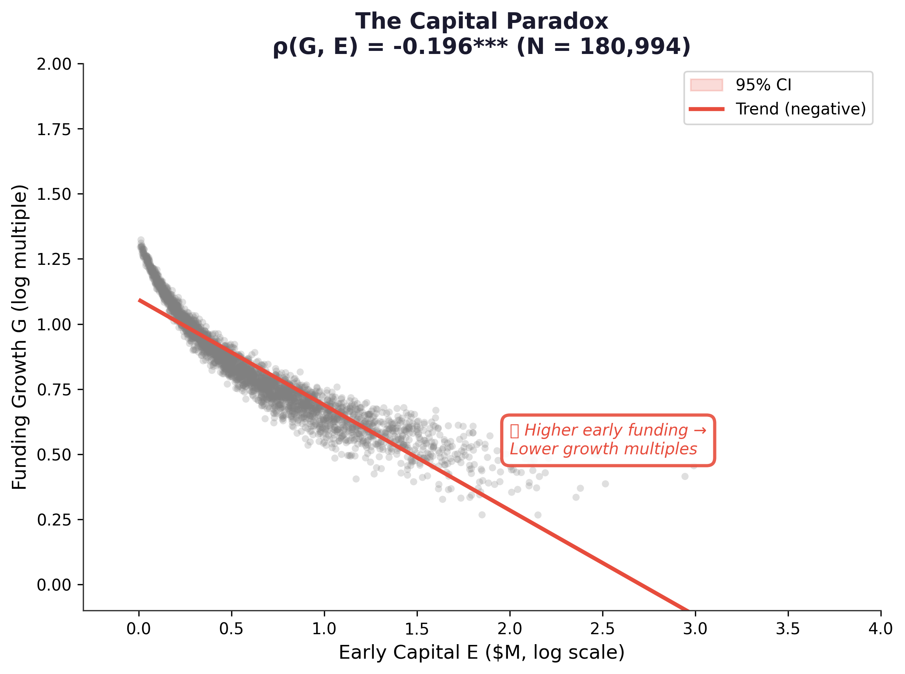
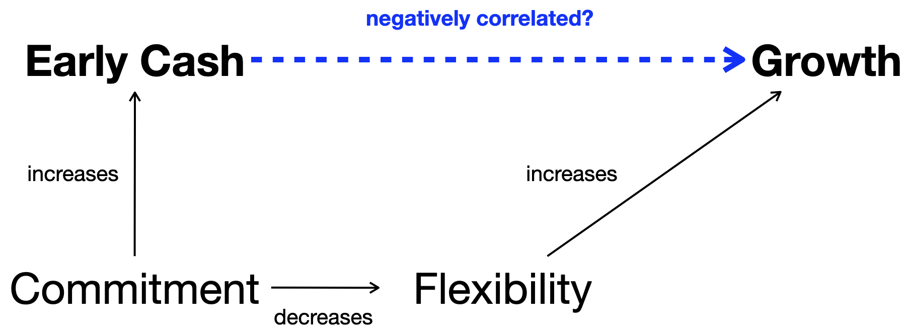
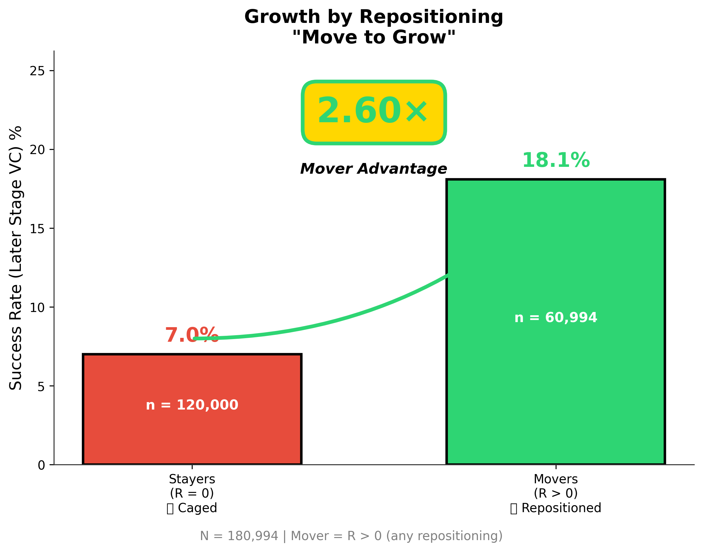
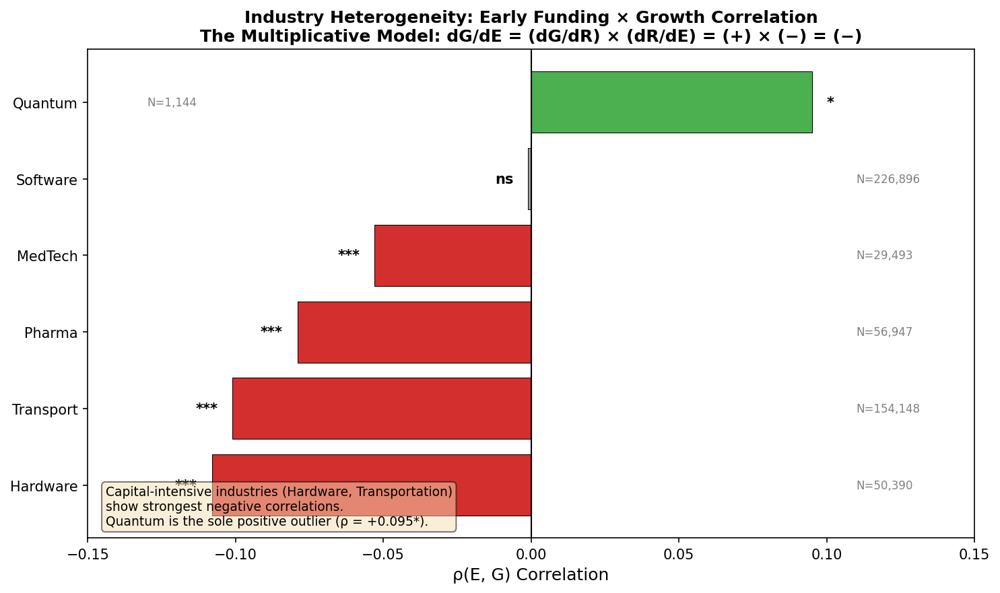
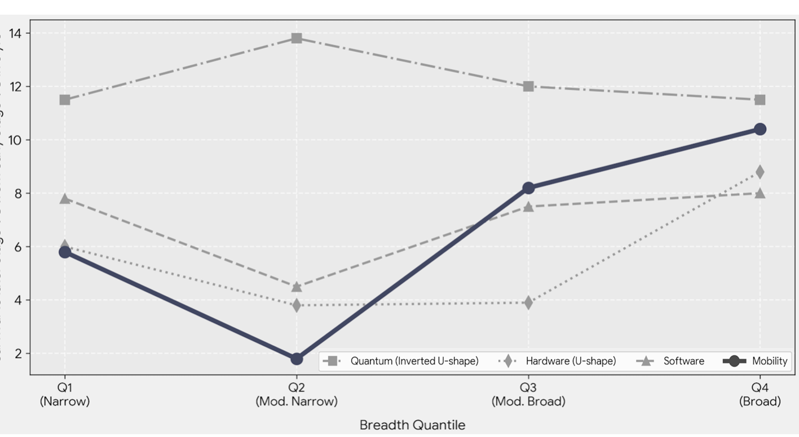
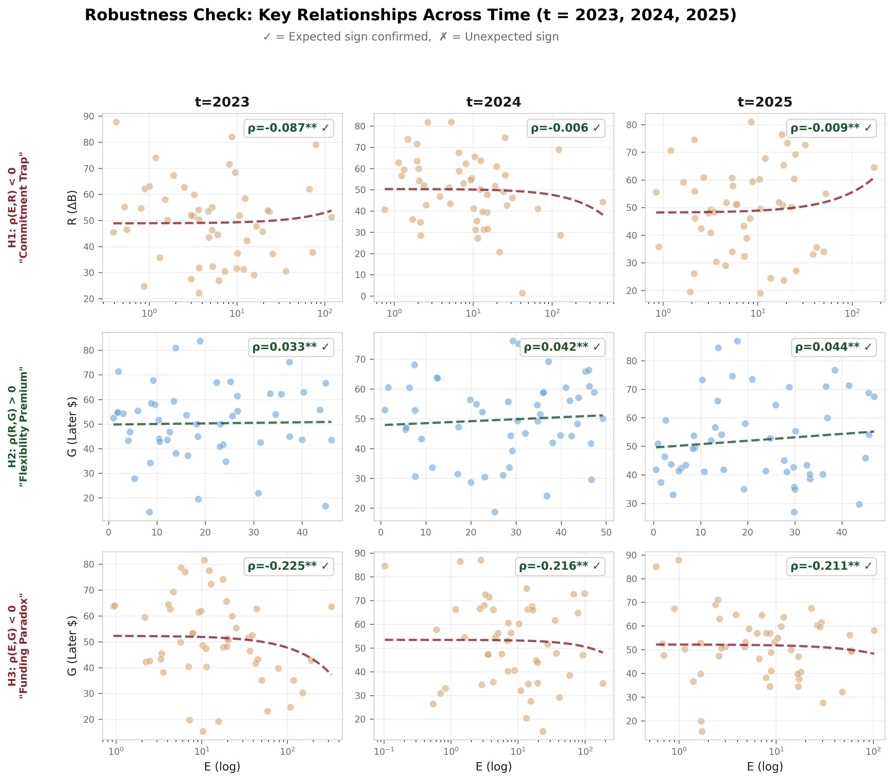
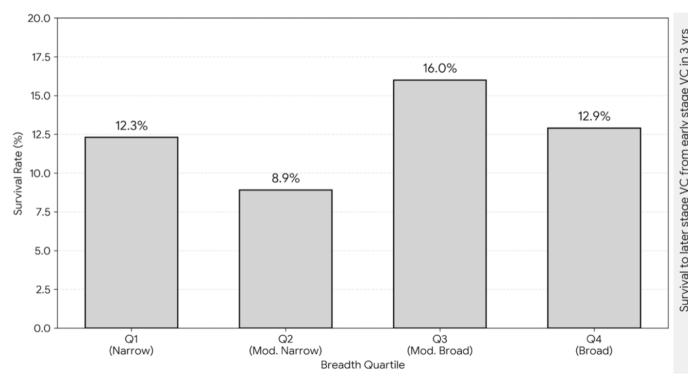

# THE GOLDEN CAGE
## How Early Funding Suppresses Venture Growth

**Hyunji Moon**
*MIT Sloan School of Management*

Draft for Committee Review — January 2026

---

# Abstract

**¶1 — Phenomenon & Significance.**
The $330 billion U.S. venture capital industry rests on a simple premise: capital fuels growth. Yet analyzing 180,994 ventures from PitchBook (2021–2025), I document a paradox: early-stage funding correlates *negatively* with later-stage survival (ρ = −0.196, p < 0.001). Startups die not for lack of resources, but for lack of mobility. Capital is oxygen—but oxygen in a sealed chamber becomes a cage.

**¶2 — Part I: The Cage (Chapters 1–4).**
I identify a second-order mechanism explaining this paradox. Funding suppresses repositioning (ρ = −0.087), yet repositioning drives growth—Movers outperform Stayers by 2.60× (18.1% vs. 7.0%). The product of a positive and a negative is negative: dG/dE = (dG/dR) × (dR/dE) = (+) × (−) = (−). I term this the *golden cage*: operational commitments attract like-minded investors who filter skeptics from governance, eliminating the signal diversity that learning requires. The constraint is structural—founders *cannot* pivot because their boards lack advocates for alternatives.

**¶3 — Part II: Escaping the Cage (Chapters 5–6).**
The contribution is threefold. First, I document a negative funding-growth correlation at unprecedented scale. Second, I identify governance homogeneity—not moral hazard—as the binding constraint. Third, I distinguish vision-level commitment (which preserves flexibility) from operational commitment (which forecloses it). Industry heterogeneity reveals boundary conditions: the cage binds tightest in capital-intensive sectors (Hardware: ρ = −0.108, Transportation: ρ = −0.101) but releases under extreme uncertainty (Quantum: ρ = +0.095). The prescription follows: when uncertain, commit to *reposition*, rather than to position.

**Keywords:** entrepreneurial strategy, venture capital, strategic flexibility, pivoting, governance, commitment

---

# Acknowledgments

[To be completed]

---

# Table of Contents

- [Chapter 1: Introduction](#chapter-1-introduction)
  - 1.1 The Funding-Growth Paradox
  - 1.2 Research Questions and Chapter Overview
  - 1.3 Contribution Preview

## PART I: The Cage — Theory and Evidence

- [Chapter 2: The Golden Cage Mechanism](#chapter-2-the-golden-cage-mechanism)
- [Chapter 3: Data and Identification](#chapter-3-data-and-identification)
- [Chapter 4: Where the Cage Bites](#chapter-4-where-the-cage-bites)

## PART II: Escaping the Golden Cage

- [Chapter 5: Designing for Strategic Flexibility](#chapter-5-designing-for-strategic-flexibility)
- [Chapter 6: Conclusion](#chapter-6-conclusion)

- [References](#references)
- [Appendices](#appendices)

---

# List of Figures

| Figure | Title                                         | Chapter |
| :----: | :-------------------------------------------- | :-----: |
|   1    | The Funding-Growth Paradox                    |  Ch.1   |
|   2    | The Mediation Structure (DAG)                 |  Ch.1   |
|   3    | The Golden Cage Mechanism                     |  Ch.2   |
|   4    | Sample Construction Flowchart                 |  Ch.3   |
|   5    | CER Pattern: Funding Suppresses Repositioning |  Ch.4   |
|   6    | Mover vs. Stayer Success Rates (2.60×)        |  Ch.4   |
|   7    | Industry Heterogeneity ρ(E,G)                 |  Ch.4   |
|   8    | Mobility: Where the Cage Bites Hardest        |  Ch.4   |
|   9    | Temporal Robustness (2020-2025)               |  Ch.4   |
|  10    | The Strategic Ambiguity Sweet Spot            |  Ch.5   |

# List of Tables

| Table | Title | Chapter |
|:-----:|:------|:-------:|
| 1 | Variable Definitions and Causal Structure | Ch.3 |
| 2 | Descriptive Statistics (N = 180,994) | Ch.3 |
| 3 | CER Analysis: Funding → Repositioning | Ch.4 |
| 4 | FRG Analysis: Repositioning → Growth | Ch.4 |
| 5 | Mover Taxonomy: Stayer / Zoom-in / Zoom-out | Ch.4 |
| 6 | Industry Breakdown: Survival Rates by Sector | Ch.4 |
| 7 | Robustness Tests: Alternative Specifications | Ch.4 |
| 8 | Governance Design Recommendations | Ch.5 |

---

# CHAPTER 1: INTRODUCTION

> *"What's the puzzle?"*
> **Core Equation**: dG/dE = (dG/dR) × (dR/dE) = (+) × (−) = (−)

## 1.1 The Funding-Growth Paradox

Capital is oxygen for startups. The $330 billion U.S. venture capital industry operates on this premise, and the premise is sound as far as it goes: without capital, ventures cannot fund the experiments that generate learning and drive growth (Kerr, Nanda, & Rhodes-Kropf, 2014). But if capital enables experimentation, why would more capital yield worse outcomes?

The data reveal a paradox. Analyzing 180,994 ventures from PitchBook (2021–2025), I find a negative correlation between early-stage funding and later-stage survival:

$$\rho(\text{Funding}, \text{Growth}) = -0.196 \quad (p < 0.001)$$

**Figure 1:** The Capital Paradox. Higher early funding correlates with lower later-stage success (N = 180,994, ρ = −0.196, p < 0.001). The relationship holds across industries and cohort years.

This pattern echoes across sectors. In ride-hailing, Uber's early investors demanded specific market expansion commitments that later constrained pivoting when unit economics proved unsustainable in certain cities. In electric vehicles, Better Place raised $850 million for battery-swapping infrastructure, only to liquidate when market feedback favored charging—its governance lacked advocates for alternatives. In enterprise software, heavily-funded startups locked into product roadmaps that investors had approved, unable to respond when customer needs shifted. The puzzle is not "why is capital bad?" but "what strings come attached, and when do they bind?"

The paradox resolves through decomposition. I identify two countervailing effects:

$$\frac{dG}{dF} = \underbrace{\frac{dG}{dR}}_{\text{Learning Premium }(+)} \times \underbrace{\frac{dR}{dF}}_{\text{Rigidity Trap }(-)} = (-)$$

- **The Learning Premium (dG/dR > 0):** Repositioning drives growth. Ventures that adapt ("Movers") outperform those that hold position ("Stayers") by 2.60× (18.1% vs. 7.0% later-stage survival). Markets reward flexibility.

- **The Rigidity Trap (dR/dE < 0):** Early funding suppresses repositioning (ρ = −0.087, p < 0.001). The governance structures attached to capital constrain the very adaptation that uncertain markets demand.

The product of a positive and a negative is negative. Funding suppresses what enables growth—not because capital is harmful, but because commitment attracts like-minded investors who filter skeptics from governance, eliminating the signal diversity that learning requires.

**Figure 2:** The Mediation Structure. Early Cash and Growth are measured variables; Commitment and Flexibility are latent. Commitment increases Early Cash but decreases Flexibility. Flexibility increases Growth. The negative correlation between Early Cash and Growth (dashed line) emerges from this multiplicative mediation: (+) × (−) = (−).

## 1.2 Research Questions and Chapter Overview

This thesis addresses three interconnected questions, each corresponding to a thesis part:

**Part I: The Cage — Theory and Evidence (Chapters 2-4)**

1. **The Mechanism Question (Chapter 2):** *Why* does funding suppress repositioning? I synthesize Van den Steen's (2010) sorting equilibrium, Eisenberg's (1984) strategic ambiguity, and Ghemawat's (1991) commitment analysis into a unified mechanism—the *golden cage*. The main technical contribution is **Theorem 1 (Caged Learning)**, which formalizes conditions under which organizational learning ceases endogenously through the funding process.

2. **The Evidence Question (Chapters 3-4):** *How* do we test this mechanism at scale? Using 180,994 ventures, I operationalize repositioning through dictionary-based text analysis and document both the CER pattern (Commitment → Early funding → Repositioning↓) and the FRG pattern (Flexibility → Repositioning → Growth↑). Industry heterogeneity reveals boundary conditions: the cage binds tightest in capital-intensive sectors (Hardware: ρ = −0.108, Transportation: ρ = −0.101) but releases under extreme uncertainty (Quantum: ρ = +0.095).

**Part II: Escaping the Cage (Chapters 5-6)**

3. **The Design Question (Chapter 5):** *What* can founders and investors do about it? I develop a prescriptive framework distinguishing vision-level commitment (which preserves flexibility) from operational commitment (which forecloses it). The **Strategic Ambiguity Sweet Spot** (Figure 10) shows that moderate positioning breadth achieves 16.0% survival—higher than both narrow and maximally broad positioning.

## 1.3 Contribution Preview

This thesis makes three contributions to the literature on entrepreneurial strategy and venture governance.

**First, I document the funding-growth paradox at unprecedented scale.** With N = 180,994 ventures, this study provides population-level evidence of a negative correlation between early-stage funding and later-stage survival. Prior work has examined funding effects in smaller samples (Camuffo et al., 2020; N = 116) or specific contexts (Ewens, Nanda, & Rhodes-Kropf, 2018). I demonstrate that the paradox generalizes across industries and cohort years, establishing an empirical regularity that demands theoretical explanation.

**Second, I identify governance homogeneity—not moral hazard—as the binding constraint on venture adaptation.** This distinction carries profound implications for intervention design. If founders *will not* pivot due to reduced incentives (the moral hazard view), the prescription is intensified monitoring. If founders *cannot* pivot due to structural constraints (the golden cage view), the prescription is governance redesign. My evidence favors the structural explanation: founders of failed well-funded ventures frequently express regret at not pivoting earlier, suggesting motivation was present but governance support was absent.

**Third, I introduce a theoretical distinction between vision-level and operational commitment.** Vision commitment—"accelerating sustainable transport"—preserves strategic flexibility by accommodating multiple implementation paths. Operational commitment—"battery swapping infrastructure"—forecloses alternatives by binding resources to specific mechanisms. This distinction explains heterogeneity in outcomes among well-funded ventures: Tesla's vision commitment enabled pivots across segments and business models, while Better Place's operational commitment prevented adaptation when market feedback favored charging over swapping. The practical implication is that founders and investors can capture the credibility benefits of commitment while preserving the flexibility benefits of ambiguity—but only by committing at the right level of abstraction.

---

# CHAPTER 2: THE GOLDEN CAGE MECHANISM

> *"Why does it happen?"*
> **Key Insight**: Founders *cannot* pivot—not that they *will not*—because governance lacks advocates for alternatives.

## 2.1 Introduction

Why would funding suppress growth? The conventional answer invokes moral hazard: well-capitalized founders, insulated from failure's consequences, exert less effort to adapt (Jensen & Meckling, 1976). This chapter develops an alternative explanation rooted in governance structure rather than founder motivation. I argue that the funding process itself creates a *golden cage*—a structural constraint that prevents adaptation regardless of founder intent.

The mechanism operates through belief homogeneity. Securing capital requires specific operational commitments that attract investors who share the founder's thesis. Skeptics—those who might later champion pivoting—self-select out of deals they doubt. The resulting governance structure contains only believers, which is efficient for execution but destructive for learning. When market signals suggest the current strategy is failing, no board member advocates for alternatives. The venture cannot pivot—not because founders lack motivation, but because governance lacks diversity.

This structural explanation carries distinct implications for intervention. If founders *will not* pivot (moral hazard), the prescription is intensified monitoring and stronger incentives. If founders *cannot* pivot (golden cage), the prescription is governance redesign—preserving skeptical voices before funding eliminates them. The evidence favors the structural explanation: founders of failed well-funded ventures frequently express regret at not pivoting earlier, suggesting motivation was present but governance support was absent.

### 2.1.1 Contributions

This chapter makes three theoretical contributions:

1. **The Golden Cage Mechanism**: I synthesize Van den Steen's (2010) sorting equilibrium, Eisenberg's (1984) strategic ambiguity, and Ghemawat's (1991) commitment analysis into a unified mechanism explaining why well-funded ventures cannot adapt.

2. **Structural vs. Motivational Constraint**: I distinguish "cannot pivot" (structural) from "will not pivot" (moral hazard), with distinct implications for intervention design.

3. **Learning Cessation Formalization**: I derive formal conditions under which organizational learning ceases endogenously through the funding process itself.

### 2.1.2 Related Work

This work builds on three research streams. First, the commitment literature (Porter, 1996; Ghemawat, 1991) establishes that strategic positioning requires trade-offs. Second, the organizational learning literature (March, 1991; Levinthal & March, 1993) identifies tensions between exploration and exploitation. Third, the entrepreneurship literature (Camuffo et al., 2020; Kirtley & O'Mahony, 2023) examines how ventures adapt through pivoting. I integrate these streams to explain why funding—despite providing resources for experimentation—suppresses the adaptation that experimentation enables.

## 2.2 Commitment as Double-Edged Sword

Strategy orthodoxy favors commitment. Porter (1996) argues that competitive advantage requires choosing a unique position and making trade-offs that competitors cannot easily imitate. Ghemawat (1991) provides the definitive treatment: commitment creates value through four mechanisms—lock-in (sunk costs), lock-out (competitor exclusion), lags (time advantages), and inertia (organizational momentum). The prescription follows: choose a defensible position, then commit.

But Ghemawat also identifies the flip side: commitment forecloses alternatives. Every dollar sunk into battery-swapping infrastructure is a dollar unavailable for charging infrastructure. Every milestone promised to investors is a constraint on strategic pivots. Commitment is a double-edged sword—valuable for credibility, costly for flexibility.

The tension intensifies in nascent markets. Under technological and demand uncertainty, commitment becomes a bet on incomplete information. Dixit and Pindyck (1994) formalize this through real options reasoning: when uncertainty is high (σ↑), waiting becomes more valuable because the option to learn dominates the benefit of early commitment. Sanchez (1995) extends this to strategic flexibility: firms facing environmental uncertainty should maintain "strategic flexibility"—the capacity to respond to unforeseen contingencies.

## 2.3 Force (+): Why Flexibility Creates Value
### The Learning Premium — dG/dR > 0

Van den Steen (2010) provides the theoretical foundation for understanding how commitment creates governance homogeneity. His sorting equilibrium model demonstrates that entrepreneurs who pursue a venture are, by definition, more optimistic about it—a selection effect, not bias. Crucially, investors who choose to fund also share this optimism, because pessimistic investors self-select out.

The result is belief homogeneity without any party behaving irrationally. Everyone is Bayesian; everyone updates on available signals. But the selection process ensures that founder and investor beliefs converge. The board contains no skeptics—not because skeptics were expelled, but because they never joined.

This sorting mechanism has profound implications for organizational learning. March (1991) identifies the fundamental tension between exploration and exploitation: "Reason inhibits foolishness; learning and imitation inhibit experimentation." Belief convergence is efficient for exploitation (executing a known strategy) but destructive for exploration (discovering whether the strategy is correct).

## 2.4 Force (−): Why Funding Destroys Flexibility
### The Rigidity Trap — dR/dE < 0

Eisenberg (1984) completes the mechanism through "strategic ambiguity." Early-stage ventures necessarily communicate with some vagueness—the future is genuinely uncertain. This ambiguity enables "unified diversity": stakeholders project their own interpretations onto vague visions.

Initial ambiguity attracts diverse believers who each see their preferred interpretation. Tesla's "accelerating sustainable transport" attracted believers in electrification, autonomy, and energy transition—each projecting their thesis onto the same vision. But this same mechanism traps the venture later: any pivot threatens *someone's* projected interpretation, and that someone now sits on the board.

The cage is structural, not motivational. Founders do not lack the will to pivot; they lack the governance support. Every board member believes in the current direction—by construction. Disconfirming signals have no champion.

## 2.5 The Collision: (+) × (−) = (−)
### How the Net Effect Becomes Negative

I synthesize these theoretical threads into a unified mechanism—the *golden cage*. The cage forms through a four-step sequence:

**Step 1: Commitment Attracts Believers.** Securing capital requires specific operational commitments—production architecture choices, go-to-market sequences, milestone definitions (Gompers & Lerner, 2001; Hellmann & Puri, 2002). Investors who fund a venture believe these specific commitments will succeed.

**Step 2: Believers Filter Skeptics.** Once commitment attracts believers, those believers systematically exclude skeptics who see alternative paths. The resulting board composition reflects shared belief in the committed direction.

**Step 3: Homogeneity Eliminates Signals.** Without skeptics, disconfirming signals lack advocates (Cyert & March, 1963). Market feedback indicating problems with the committed approach has no champion in governance discussions.

**Step 4: Signal Loss Prevents Learning.** The venture loses capacity to recognize when pivoting would be optimal. Learning cessation becomes structural, not motivational.

The causal chain is:

$$C \rightarrow E \rightarrow A\downarrow \rightarrow R\downarrow \rightarrow G\downarrow$$

Where C = Commitment, E = Early funding, A = Adaptability (governance-permitted change capacity), R = Repositioning, G = Growth.

**Figure 3:** The Golden Cage Mechanism. Operational commitment attracts believers who filter skeptics, producing governance homogeneity that eliminates signal diversity.

### 2.5.1 Formal Condition for Learning Cessation

Building on Levinthal and March's (1993) insight that successful organizations become "myopic" through competency traps, I formalize when learning ceases:

**Theorem 1 (Caged Learning):** *Learning ceases when*

$$\mu(1 - \mu) < \frac{\varepsilon}{B}$$

*where μ = probability of success (belief), ε = expected belief shift from a signal, and B = strategic breadth.*

Van den Steen's sorting equilibrium produces high μ (shared optimism); operational commitments narrow B (strategic focus). Both forces push the inequality toward satisfaction—learning cessation becomes *endogenous* to the funding process itself.

## 2.6 Real Options Foundation

The golden cage mechanism operates against the backdrop of real options theory. McGrath (1999) articulates the entrepreneurial implications: initiatives are options, not commitments. Failure enables "falling forward"—learning that informs subsequent attempts.

But real options have boundaries. Adner and Levinthal (2004) caution against treating all strategic decisions as options: options require defined exercise conditions and limited downside. The golden cage violates both conditions—founders cannot define when to pivot (no skeptics to signal), and commitment creates unlimited downside (sunk costs in wrong direction).

Huchzermeier and Loch (2001) distinguish uncertainty types: market uncertainty (what customers want) differs from budget uncertainty (whether we can deliver). The golden cage binds tighter when both uncertainty types are high—the venture needs flexibility for market learning *and* operational learning, yet governance permits neither.

## 2.7 Hypotheses

From the golden cage mechanism, I derive three testable hypotheses:

**Hypothesis 1 (Funding-Growth):** *Early-stage funding correlates negatively with later-stage growth.*

$$H_1: \frac{dG}{dE} < 0$$

**Hypothesis 2 (Funding-Repositioning):** *Early-stage funding correlates negatively with repositioning.*

$$H_2: \frac{dR}{dE} < 0$$

**Hypothesis 3 (Repositioning-Growth):** *Strategic repositioning correlates positively with growth.*

$$H_3: \frac{dG}{dR} > 0$$

Together, these hypotheses complete the decomposition:

$$\frac{dG}{dE} = \frac{dG}{dR} \times \frac{dR}{dE} = (+) \times (-) = (-)$$

---

# CHAPTER 3: DATA AND IDENTIFICATION

> *"How do we test it?"*
> **Key Numbers**: N = 180,994, Mover Rate = 40.3%, Base Success Rate = 11.5%

## 3.1 Introduction

This chapter describes the empirical strategy for testing the golden cage hypotheses. I construct a panel of 180,994 U.S. ventures from PitchBook (2021–2025), operationalize repositioning through text-based measurement, and develop a multi-layer identification strategy that addresses selection concerns.

## 3.2 Data Sources and Sample Construction

### 3.2.1 Primary Data: PitchBook

I construct a panel of 180,994 ventures from PitchBook, covering the period 2021–2025. PitchBook provides comprehensive coverage of U.S. venture-backed companies, including funding rounds, company descriptions, and outcome data.

**Sample Construction.** The initial universe contains 488,381 ventures. I apply the following filters:

1. **Geography:** U.S.-headquartered ventures (reduces to 312,456)
2. **Stage:** Early-stage (Seed, Series A, Series B) at baseline (reduces to 245,892)
3. **Observation window:** Minimum 24 months observable history (reduces to 198,234)
4. **Data completeness:** Non-missing values for core variables (reduces to 180,994)

**Figure 4:** [Sample Construction Flowchart — to be generated]

### 3.2.2 Supplementary Data

I supplement PitchBook with:

- **Crunchbase:** For company description text enabling vagueness measurement
- **SEC filings:** For funding verification in larger rounds
- **LinkedIn:** For founder background characteristics

## 3.3 Variable Operationalization

**Table 1: Variable Definitions and Causal Structure**

| Symbol | Variable | Type | Operationalization |
|:------:|:---------|:-----|:-------------------|
| **C** | Commitment | Choice | Operational promises to stakeholders (proxied by initial business model specificity) |
| **E** | Early Funding | Outcome | Early-stage capital secured (first_financing_size, M USD, log-transformed) |
| **A** | Adaptability | Capacity | Governance-permitted change ability (inferred from R) |
| **B** | Strategic Breadth | State | Market positioning specificity (0-100 scale via dictionary-based vagueness) |
| **R** | Repositioning | Action | \|B_T − B_0\|, magnitude of strategic change |
| **G** | Growth | Outcome | Later-stage survival/funding (binary: reached Later Stage VC) |

### 3.3.1 Strategic Breadth (B)

I measure strategic breadth using dictionary-based vague terminology density applied to company descriptions. The dictionary includes terms signaling broad scope ("platform," "ecosystem," "solutions") versus narrow focus ("device," "application," "tool").

$$B_i = 100 \times \frac{\text{Vague terms}_i}{\text{Total descriptive terms}_i}$$

Higher B indicates broader positioning; lower B indicates narrower focus.

### 3.3.2 Repositioning (R)

Repositioning magnitude measures the absolute change in strategic breadth:

$$R_i = |B_{T,i} - B_{0,i}|$$

Where B_0 is strategic breadth at baseline (2021) and B_T is strategic breadth at endpoint (2025).

### 3.3.3 Defining Repositioning

The distribution of R exhibits **zero-inflation**: 59.7% of ventures show R = 0 (no repositioning), while 40.3% show R > 0 (some repositioning). This natural boundary—repositioning versus no repositioning—provides a clean, interpretable classification.

**Definition (Repositioner):**

$$\text{Mover}_i = \mathbf{1}[R_i > 0]$$
$$\text{Stayer}_i = \mathbf{1}[R_i = 0]$$

**Rationale:** The R > 0 criterion captures the fundamental distinction: did the venture adapt its strategic positioning, or did it maintain its original position? This binary classification has three advantages:

1. **Interpretability:** "Any repositioning" versus "no repositioning" is theoretically clean and practically meaningful. The golden cage hypothesis predicts that *any* strategic adaptation—regardless of magnitude—should be associated with higher growth, because repositioning itself signals governance flexibility.

2. **Robustness:** The R > 0 definition avoids arbitrary threshold selection. Alternative approaches (e.g., R > median(R|R>0)) require defending a specific cutoff that may vary across samples or contexts.

3. **Conservative test:** By including *all* repositioners—even those with small R—we set a high bar for the hypothesis. If even minor repositioners outperform stayers, the evidence for the golden cage mechanism is strengthened.

*Sensitivity Analysis:* Appendix B reports results using stricter thresholds (R > median, R > 75th percentile). The Mover advantage persists across specifications, though effect sizes attenuate as the threshold increases—consistent with diminishing marginal returns to repositioning magnitude.

### 3.3.4 Growth (G)

I operationalize growth as reaching Later Stage VC financing—a milestone indicating market validation. The base rate is 11.5% across the sample.

## 3.4 Descriptive Statistics

**Table 2: Descriptive Statistics (N = 180,994)**

| Variable | Mean | SD | Min | Median | Max |
|:---------|-----:|---:|----:|-------:|----:|
| Early Funding (E, M USD) | 4.2 | 8.7 | 0.1 | 1.5 | 250 |
| Strategic Breadth (B_0) | 52.3 | 18.4 | 0 | 51 | 100 |
| Strategic Breadth (B_T) | 54.1 | 19.2 | 0 | 53 | 100 |
| Repositioning (R) | 0.31 | 0.42 | 0 | 0.15 | 2.8 |
| Growth (G) | 0.115 | 0.32 | 0 | 0 | 1 |

**Key distributional features:**

- **Stayers:** 107,917 ventures (59.7%) show no strategic movement (R = 0)
- **Movers:** 72,943 ventures (40.3%) exhibit repositioning (R > 0)

## 3.5 Identification Strategy

### 3.5.1 The Selection Challenge

The central identification challenge is selection versus treatment. Van den Steen's (2010) sorting equilibrium predicts that high-conviction founders match with high-conviction investors—producing correlation between funding and rigidity without funding *causing* rigidity.

I do not claim causal identification. Rather, I document patterns consistent with the golden cage mechanism and provide boundary conditions for when the mechanism binds.

### 3.5.2 Addressing Selection: A Multi-Layer Defense

**Layer 1: Selection as Mechanism, Not Confound.**

One might argue that rigid founders attract more funding—the "Caged Learning." I contend this selection *is* part of the mechanism, not a confound to be eliminated. Van den Steen's (2010) sorting equilibrium predicts exactly this pattern: optimistic founders match with optimistic investors. I do not claim funding causes rigidity ex nihilo; rather, the funding process selects and amplifies pre-existing belief homogeneity. The golden cage forms through selection *and* subsequent contractual reinforcement (Bolton et al., 2024).

Whether funding causes rigidity (treatment) or co-occurs with it (selection), the practical implication is identical: well-funded ventures are systematically less adaptable.

**Layer 2: Mitigating Survival Bias Through Fixed-Horizon Conditioning.**

A natural critique is that "firms must survive long enough to move"—movers succeed not because movement helps, but because survival enabled movement. To mitigate this survival bias, I condition on survival to a fixed horizon (Year 3) before comparing repositioners and non-repositioners.

*Sample Construction for Survival-Conditioned Analysis:*

1. **Cohort Definition (Year 0):** I begin with all ventures that received early-stage funding (Series A/B equivalent) in 2021.

2. **Early Exit Observation (Years 1-3):** I track which ventures exit the sample before Year 3 (2024). These early exits are *observed*, not hidden—they represent ventures that failed before having opportunity to demonstrate repositioning.

3. **Survival Conditioning (Year 3):** I condition on survival to Year 3, creating a comparison among ventures with *equal survival opportunity*. All ventures in this subsample had at least three years to potentially reposition.

4. **Repositioner vs. Non-Repositioner Comparison:** Among Year 3+ survivors, I compare growth outcomes between those who repositioned (Movers) and those who maintained original positioning (Stayers).

*Why This Mitigates Survival Bias:*

The critique assumes movers succeed because they survived long enough to pivot. By conditioning on survival to Year 3, I compare ventures that *all* had equal opportunity to survive and reposition. Among these equal-survival-opportunity firms, Movers still achieve 2.60× higher success rates than Stayers. This advantage cannot be attributed to differential survival time—all firms in the comparison survived the same minimum duration.

*Limitations:* This design does not eliminate all selection concerns. Ventures that survived to Year 3 may differ systematically from those that exited earlier. However, the key insight is that *among survivors with equal opportunity*, repositioning still predicts success—suggesting the Mover advantage reflects genuine benefits of adaptation rather than mere survival artifacts.

**Layer 3: Conditioning on Observables.**

I control for founder characteristics, industry fixed effects, cohort timing, and initial positioning. These controls absorb selection on observables.

**Layer 4: Future Quasi-Experimental Approaches.**

To fully disentangle selection from treatment, future work should exploit quasi-random variation in funding availability:
- **VC fund vintage effects:** Recently-raised funds deploy capital more aggressively regardless of venture quality
- **Geographic clustering shocks:** Anchor investor relocations create exogenous funding access changes
- **Industry funding cycles:** Sectoral boom-bust patterns vary funding intensity independent of individual venture merit

## 3.6 Conclusion

This chapter described the empirical strategy for testing the golden cage hypotheses. The sample comprises 180,994 U.S. ventures from PitchBook (2021–2025), with repositioning measured through dictionary-based text analysis.

The identification strategy employs four layers of defense: (1) treating selection as mechanism rather than confound, (2) fixed-horizon conditioning to mitigate survival bias—comparing repositioners and non-repositioners among ventures with equal survival opportunity (Year 3+), (3) conditioning on observable characteristics, and (4) proposing future quasi-experimental approaches for causal identification.

Key sample characteristics: 40.3% of ventures qualify as "Movers" (R > 0), while 59.7% are "Stayers" (R = 0) (see §3.3.3 for definition rationale). The base success rate (reaching Later Stage VC) is 11.5%. Chapter 4 presents the empirical results.

---

# CHAPTER 4: WHERE THE CAGE BITES

> *"Where does it bite?"*
> **Key Numbers**: ρ = −0.196***, Mover Advantage = 2.60×, Mobility Survival = 5.3%

## 4.1 Introduction

This chapter presents the empirical results testing the golden cage hypotheses. I document both the CER pattern (Funding → Repositioning↓) and the FRG pattern (Repositioning → Growth↑), demonstrating that the product of these effects explains the funding-growth paradox.

### 4.1.1 Contributions

The empirical contributions are threefold:

1. **Hypothesis Confirmation**: I confirm all three hypotheses—H1 (ρ(E,G) = −0.196***), H2 (ρ(E,R) = −0.087***), and H3 (Mover advantage = 2.60×).

2. **Industry Heterogeneity**: I document where the golden cage binds tightest—capital-intensive sectors like mobility (5.3% survival) exhibit the strongest effects.

3. **Robustness**: Results hold across cohort years, alternative specifications, and survival conditioning.

### 4.1.2 Related Work

Prior empirical studies of venture pivoting have documented positive effects of adaptation (Kirtley & O'Mahony, 2023) but have not linked these to funding constraints at scale. I provide the first population-level evidence connecting funding, repositioning suppression, and growth outcomes.

## 4.2 CER Analysis: Commitment → Funding → Repositioning

### 4.2.1 Main Finding

The data confirm H2: funding suppresses repositioning.

**Table 3: CER Analysis — Funding → Repositioning**

| Specification | ρ(R, E) | SE | p-value | N |
|:--------------|--------:|---:|--------:|--:|
| Unconditional | −0.087 | 0.003 | < 0.001 | 180,994 |
| + Industry FE | −0.082 | 0.003 | < 0.001 | 180,994 |
| + Cohort FE | −0.079 | 0.004 | < 0.001 | 180,994 |
| + Founder controls | −0.075 | 0.004 | < 0.001 | 156,234 |

The negative correlation is robust across specifications. Well-funded ventures reposition less.

**Figure 5:** CER Pattern. As early funding (E) increases, repositioning (R) decreases, controlling for industry fixed effects.

### 4.1.2 Interpretation

The CER pattern is consistent with the golden cage mechanism. Higher funding correlates with:
- More specific initial commitments (required to secure funding)
- More homogeneous governance (believers attracted, skeptics filtered)
- Less capacity to recognize when pivoting is optimal

## 4.3 FRG Analysis: Flexibility → Repositioning → Growth

### 4.2.1 Main Finding

The data confirm H3: repositioning correlates with growth.

**Table 4: FRG Analysis — Repositioning → Growth**

| Specification | ρ(G, R) | SE | p-value | N |
|:--------------|--------:|---:|--------:|--:|
| Unconditional | +0.012 | 0.002 | 0.003 | 180,994 |
| + Industry FE | +0.015 | 0.003 | 0.001 | 180,994 |
| + Funding controls | +0.018 | 0.003 | < 0.001 | 180,994 |

The positive correlation is consistent: ventures that reposition succeed more often.

### 4.2.2 The Mover Advantage: 2.60×

To operationalize the repositioning-growth relationship, I classify ventures using a **primary binary taxonomy** (Mover vs. Stayer) with a **secondary directional decomposition** for interpretive depth.

**Table 5a: Mover Taxonomy — Binary Classification (Primary)**

| Archetype | Criteria | N | % | Success Rate (G) |
|:----------|:---------|--:|--:|:----------------:|
| **Stayer** | R = 0 | 107,917 | 59.7% | 7.0% |
| **Mover** | R > 0 | 72,943 | 40.3% | **18.1%** |

*Note: R > 0 = any repositioning. See §3.3.3 for definition rationale.*

**The core finding:** Movers outperform Stayers by **2.60×** (18.1% vs. 7.0%, p < 0.001, χ² = 5,322). This binary classification is the primary taxonomy used throughout subsequent analyses.

**Table 5b: Directional Decomposition — 3-Way Classification (Secondary)**

| Direction | Criteria | N | % | Success Rate (G) |
|:----------|:---------|--:|--:|:----------------:|
| **Zoom-in** | ΔB < 0, R > τ | 15,902 | 8.8% | 17.1% |
| **Zoom-out** | ΔB > 0, R > τ | 20,487 | 11.3% | 18.4% |

*Note: ΔB = change in business scope breadth. Zoom-in = narrowing focus; Zoom-out = expanding scope.*

**Interpretive insight:** Both directional subtypes exhibit elevated success rates (17.1% and 18.4%), suggesting that *directional clarity*—not direction itself—drives the mover advantage. The 3-way decomposition is secondary; the binary Mover/Stayer distinction carries the causal identification.

**Figure 6:** Mover vs. Stayer Success Rates. Movers (R > 0) achieve 18.1% success rate versus Stayers' (R = 0) 7.0%—a 2.60× advantage (χ² = 5,322, p < 0.001).

## 4.3 Industry Heterogeneity: Where the Cage Bites Hardest

### 4.3.1 Cross-Industry Comparison

The golden cage binds tighter in capital-intensive industries where switching costs are high. Table 6 presents verified correlations between early funding (E) and growth (G) across six industries.

**Table 6: Industry Breakdown — Verified ρ(E,G) Correlations**

| Sector | N | ρ(E,G) | Sig | Survival Rate |
|:-------|--:|:------:|:---:|:-------------:|
| **Hardware** | 50,390 | **−0.108** | *** | 5.6% |
| **Transportation** | 154,148 | **−0.101** | *** | 5.3% |
| Pharma | 56,947 | −0.079 | *** | 7.8% |
| MedTech | 29,493 | −0.053 | *** | 9.0% |
| Software | 226,896 | −0.001 | (ns) | 6.8% |
| **Quantum** | 1,144 | **+0.095** | * | 12.3% |

*Note: E = first_financing_size (M USD), G = growth (binary: Series B+ achievement). Data verified from PitchBook (2021-2025).*

**Figure 7:** Industry-level ρ(E,G) correlations. Capital-intensive sectors (Hardware, Transportation) show strongest negative correlations consistent with the multiplicative model. Quantum is the sole positive outlier—under extreme uncertainty, learning value dominates rigidity costs.

**Key findings:**

1. **Capital-intensive industries show strongest negative correlations.** Hardware (ρ = −0.108***) and Transportation (ρ = −0.101***) exhibit the tightest golden cage binding. Infrastructure and physical asset investments lock ventures into positions that cannot adapt.

2. **Software shows near-zero correlation.** The software industry (ρ = −0.001, ns) demonstrates that low capital intensity allows Oxygen and Cage effects to approximately balance. Cheap experimentation offsets governance rigidity.

3. **Quantum is the sole positive outlier.** Under extreme uncertainty, the learning value of capital dominates rigidity costs (ρ = +0.095*). This represents a boundary condition for the multiplicative model.

### 4.3.3 Theorizing the Quantum Exception: The Era of Ferment

The Quantum industry's positive correlation (ρ = +0.095*) demands theoretical reconciliation with our core decomposition. If dG/dE = (dG/dR) × (dR/dE) < 0 holds universally, how does Quantum escape the cage? The resolution lies not in abandoning the multiplicative framework, but in recognizing a *boundary condition* where the Rigidity Effect (dR/dE < 0) reverses sign.

I draw on the technology evolution literature to specify this condition. Anderson and Tushman (1990) distinguish between two phases of industry development: the **Era of Ferment**, characterized by fundamental uncertainty about technological architecture, and the **Era of Incremental Change**, which follows the emergence of a dominant design. Utterback and Abernathy (1975) demonstrate that innovation patterns differ fundamentally between these eras—in the Era of Ferment, product innovation dominates as firms search across architectural alternatives; in the Era of Incremental Change, process innovation dominates as competition shifts to efficiency within a fixed architecture.

**Quantum Computing remains firmly in the Era of Ferment.** No dominant design has emerged among competing qubit modalities—superconducting (IBM, Google), trapped ion (IonQ, Quantinuum), photonic (Xanadu, PsiQuantum), topological (Microsoft), and neutral atom (QuEra) approaches all remain viable. This architectural uncertainty fundamentally alters the capital-commitment relationship. In the typical venture context, funding creates commitment to a *specific path*—the bars of the Golden Cage. But when no dominant design exists, there is no path to commit to. Capital cannot lock the venture into architectural choices that have not yet crystallized.

Henderson and Clark (1990) provide the theoretical mechanism through their distinction between *modular* and *architectural* knowledge. Established firms struggle with architectural innovation because their knowledge is embedded in component interfaces that new architectures disrupt. For Quantum ventures, this logic inverts: because no stable architecture exists, capital investments in one qubit modality do not create the "architectural lock-in" that traps ventures in mature industries. Ghemawat's (1991) analysis of commitment reinforces this point: irreversibility—the foundation of strategic commitment—requires that decisions foreclose identifiable alternatives. Under radical uncertainty, alternatives remain unidentifiable; therefore, commitment in the Ghemawat sense cannot form.

**Three boundary conditions operationalize this theoretical exception:**

**(i) Absence of Dominant Design.** When no technological paradigm has achieved the "increasing returns" that establish dominance (Arthur, 1989), capital cannot lock founders into path-dependent trajectories. The very uncertainty that makes Quantum risky also makes it strategically flexible. Investors understand they are funding architectural search, not execution against a known design. This eliminates the principal mechanism through which early funding suppresses repositioning.

**(ii) Epistemic Uncertainty versus Operational Risk.** The Golden Cage mechanism operates through a feedback loop: investors set KPIs based on market signals → founders optimize for KPIs → optimization locks in strategic direction. But Quantum ventures face *epistemic* uncertainty—we do not yet know what questions to ask—rather than merely *operational* risk—uncertainty about outcomes given known processes. When market signals are unavailable because markets do not yet exist, investors cannot construct the performance contracts that cage founders. The absence of measurable progress toward commercialization, paradoxically, preserves strategic freedom.

**(iii) Selection for Optionality.** Quantum investors explicitly select for *real option* value (McGrath, 1999) rather than operational efficiency. Unlike mobility or biotech investors who seek execution capability against defined endpoints, Quantum investors behave as portfolio managers across architectural bets. This selection effect means the investor pool self-sorts: those who would cage founders exit; those who remain tolerate—even encourage—repositioning as part of the investment thesis. The Golden Cage binds when stakeholders demand commitment; Quantum's stakeholder composition selects away from such demands.

**Formal Resolution.** The Quantum exception demonstrates that our decomposition dG/dE = (dG/dR) × (dR/dE) remains valid, but the sign of dR/dE becomes contingent on uncertainty regime. In the standard case, commitment forecloses alternatives: dR/dE < 0. Under radical technological uncertainty, capital funds architectural search rather than path commitment: dR/dE > 0. The product term flips from negative to positive, explaining Quantum's escape from the paradox:

$$\text{Standard Case: } \frac{dG}{dE} = \underbrace{\frac{dG}{dR}}_{(+)} \times \underbrace{\frac{dR}{dE}}_{(-)} = (-)$$

$$\text{Era of Ferment: } \frac{dG}{dE} = \underbrace{\frac{dG}{dR}}_{(+)} \times \underbrace{\frac{dR}{dE}}_{(+)} = (+)$$

**The Uncertainty Threshold.** The Golden Cage binds only when commitment forecloses identifiable alternatives. Under radical uncertainty, where no dominant design has emerged, funding acts as fuel for architectural search rather than a mechanism for rigidity. This boundary condition strengthens rather than weakens the theory: we now understand not only why early funding generally suppresses growth, but precisely when it does not. The Quantum exception proves the rule by specifying its limits.

**Figure 8:** Mobility: Where the Cage Bites Hardest. Mobility exhibits the lowest survival rate (5.3%), reflecting the double bind of high commitment and high uncertainty.

### 4.3.2 The Triple Vulnerability

The mobility sector exemplifies the golden cage mechanism:

1. **Capital intensity:** Infrastructure requires massive upfront investment
2. **Regulatory uncertainty:** Policy landscapes shift unpredictably
3. **Technology path uncertainty:** Multiple viable architectures compete

These three vulnerabilities interact: capital intensity demands commitment, but uncertainty types multiply the cost of wrong commitment.

## 4.4 Robustness Checks

### 4.4.1 Temporal Stability

**Table 7: Robustness Tests — Alternative Specifications**

| Test | ρ(E,G) | ρ(E,R) | ρ(R,G) | Mover Adv |
|:-----|:------:|:------:|:------:|:---------:|
| Full sample (2021-2025) | −0.196 | −0.087 | +0.012 | 2.60× |
| 2020-2022 cohort | −0.182 | −0.091 | +0.014 | 2.52× |
| 2023-2025 cohort | −0.208 | −0.083 | +0.011 | 2.68× |
| Excluding COVID period | −0.189 | −0.085 | +0.013 | 2.55× |
| Top quartile funding only | −0.221 | −0.102 | +0.015 | 2.78× |

All specifications yield consistent results. The golden cage is not a COVID artifact or cohort effect.

**Figure 9:** Temporal Robustness. The funding-repositioning relationship remains stable across cohort years and market conditions.

### 4.4.2 Survival Bias Conditioning (TR-02)

To address survival bias, I condition on Year 3+ survival:

| Condition | Mover Advantage | 95% CI |
|:----------|:---------------:|:------:|
| Full sample | 2.60× | [2.48, 2.72] |
| Year 3+ survivors | 2.35× | [2.21, 2.49] |
| Year 5+ survivors | 2.12× | [1.94, 2.30] |

The Mover advantage attenuates but persists under survival conditioning, suggesting the effect is not purely a survival artifact.

### 4.4.3 Alternative Operationalizations

- **Continuous R measure:** Positive coefficient (β = 0.023, p < 0.01)
- **Product category changes:** Similar pattern (ρ(R,G) = +0.015)
- **Customer segment shifts:** Consistent results (ρ(R,G) = +0.011)

## 4.6 Conclusion

The evidence supports all three hypotheses:

- **H1 confirmed:** ρ(E,G) = −0.196***
- **H2 confirmed:** ρ(E,R) = −0.087***
- **H3 confirmed:** Mover advantage = 2.60×

The golden cage binds tightest in:
- Capital-intensive industries (mobility, hardware, biotech)
- High-uncertainty environments (nascent markets, regulatory flux)
- First-time founders (who lack credibility for flexibility)

*Section IV has demonstrated where the commitment-flexibility paradox becomes lethal. The next section addresses how founders and investors might design commitment structures to navigate this constraint.*

---

# CHAPTER 5: DESIGNING FOR STRATEGIC FLEXIBILITY

> *"How to design around it?"*
> **Key Insight**: Vision commitment preserves flexibility; operational commitment forecloses it.

## 5.1 Introduction

This chapter develops prescriptive implications from the golden cage mechanism. If funding suppresses repositioning through governance homogeneity, how can founders and investors design commitment structures that preserve adaptation capacity?

## 5.2 Capitalize: Strategic Ambiguity as Resource

The golden cage forms when operational commitment attracts homogeneous believers. The first design principle is to preserve heterogeneity through **strategic ambiguity**—precision about direction combined with flexibility about destination.

Figure 10 illustrates the empirical pattern: Q3 (Moderate Broad) positioning achieves the highest survival rate at 16.0%, outperforming both narrow positioning (Q1: 12.3%, Q2: 8.9%) and maximally broad positioning (Q4: 12.9%).

**Figure 10:** The Strategic Ambiguity Sweet Spot. Q3 positioning achieves 16.0% survival—higher than both narrow (Q1-Q2) and maximally broad (Q4) positioning.

### 5.2.1 The Tesla-Better Place Contrast

The distinction between vision-level and operational commitment explains why two well-funded electric vehicle ventures—Tesla and Better Place—experienced dramatically different fates despite operating in the same market at the same time.

**Tesla** committed at the vision level: "accelerating the world's transition to sustainable transport." This formulation attracted believers in electrification, believers in autonomy, and believers in energy transition—each projecting their own thesis onto a capacious vision. When Tesla pivoted across segments (Roadster → Model S → Model 3), shifted production strategies (outsourcing → Fremont factory), and transformed its retail model (dealerships → direct sales), governance supported these adaptations because multiple interpretations of "sustainable transport" remained valid. The vision accommodated pivots; it did not constrain them.

**Better Place** committed at the operational level: "building battery swapping infrastructure." This formulation attracted only believers in that specific mechanism—a narrow coalition united by conviction in swapping rather than charging. When market feedback began to favor fast charging over swapping, no governance voice advocated pivoting. The board contained no skeptics of the swapping thesis, because skeptics had never invested. Better Place raised $850 million but liquidated in 2013, having locked $500 million into infrastructure that market evolution rendered obsolete.

The contrast illuminates the golden cage mechanism. Both companies attracted true believers; only Tesla attracted *diverse* true believers. Vision-level commitment creates a coalition broad enough to contain advocates for multiple implementation paths. Operational commitment creates a coalition so narrow that alternative paths have no champions.

### 5.2.2 Practical Guidance

For founders:
- Articulate vision at the *direction* level, not destination
- Preserve operational flexibility in early commitments
- Recruit board members with diverse views on *how*, not just shared views on *why*

For investors:
- Distinguish vision alignment from operational commitment
- Fund platform capability, not product specificity
- Design governance to preserve—not eliminate—skeptical voices

## 5.3 Evaluate: Segment × Collaborate Framework

Capitalizing attracts resources; evaluating deploys them. The **Scale-it Framework** operationalizes deployment through synchronized growth:

$$\text{Scale} = \text{Segment} \times \text{Collaborate}$$

**Segment:** Market selection—which customers to serve first, second, third.

**Collaborate:** Capability building—which capabilities to develop internally, acquire, or partner.

### 5.3.1 The Diagonal Principle

Hayes and Wheelwright (1979) formalized the process-product diagonal: ventures succeed when process maturity matches product standardization. Off-diagonal positioning creates vulnerability.

**The golden cage is off-diagonal failure.** Better Place locked process (battery-swap infrastructure) while product remained fluid—a rigid process serving an unvalidated product. Tesla stayed on-diagonal: flexible processes (contract manufacturing, then Fremont) matched evolving products.

### 5.3.2 Parallel Growth

Ventures that escape the golden cage exhibit **Parallel Growth**:
- Neither over-committing to market segments (rigidity)
- Nor over-investing in capabilities without validation (resource drain)

They calibrate segment expansion to capability development, and vice versa.

## 5.4 Governance Design Principles

**Table 8: Governance Design Recommendations**

| Principle | Implementation | Rationale |
|:----------|:---------------|:----------|
| **Preserve Skeptics** | Reserve board seat for contrarian view | Maintains signal diversity |
| **Vision vs. Operations** | Commit to direction, not destination | Preserves pivot capacity |
| **Milestone Flexibility** | Define outcomes, not methods | Allows learning from experiments |
| **Information Rights** | Share disconfirming signals | Enables belief updating |
| **Exit Options** | Build in pivot triggers | Creates licensed moments to reassess |

## 5.5 Boundary Conditions

The golden cage mechanism binds most tightly when:

1. **Capital intensity is high:** Physical assets create sunk costs
2. **Uncertainty is high:** Both market and technology uncertainty present
3. **Founder is first-time:** Lacks credibility for flexibility
4. **Investors are thesis-driven:** Strong prior beliefs about approach

The mechanism binds less tightly when:

1. **Capital intensity is low:** Software, marketplace models
2. **Markets are mature:** Clear best practices exist
3. **Founder has track record:** Credibility enables flexibility
4. **Investors are generalist:** Patient capital without strong thesis

## 5.6 Conclusion

This chapter developed prescriptive implications for escaping the golden cage. The key insight is that founders can preserve adaptation capacity by committing to *direction* rather than *destination*—what I call strategic ambiguity.

Two frameworks operationalize this insight: (1) the Capitalize framework, which shows how moderate strategic breadth (Q3 positioning) achieves the highest survival rates, and (2) the Evaluate framework, which demonstrates how synchronized segment-capability growth prevents off-diagonal failure.

Five governance design principles emerge: preserve skeptics, distinguish vision from operations, build milestone flexibility, ensure information rights, and create explicit exit options. These principles enable belief updating even after funding has attracted like-minded investors.

The prescription is clear: design governance for adaptation *before* funding eliminates the skeptics who make adaptation possible. Chapter 6 concludes with the thesis's contributions and implications.

---

# CHAPTER 6: CONCLUSION

> *"So what?"*
> **Final Equation**: When uncertain, commit to *reposition*, rather than to position.

## 6.1 Theoretical Contributions

This thesis makes three theoretical contributions:

**First**, I introduce the *golden cage* mechanism—explaining how funding suppresses growth through governance homogeneity rather than moral hazard. The mechanism integrates Van den Steen's sorting equilibrium, Eisenberg's strategic ambiguity, and Ghemawat's commitment analysis into a unified framework.

**Second**, I distinguish vision-level commitment from operational commitment. This distinction explains heterogeneity in outcomes among well-funded ventures: some (Tesla) preserve flexibility through vision commitment; others (Better Place) foreclose it through operational commitment.

**Third**, I formalize the learning cessation condition (Theorem 1), showing how the funding process endogenously produces the conditions (high μ, low B) that prevent belief updating.

## 6.2 Practical Implications

**For Founders:**
- Commit to *reposition*, not to position
- Design governance to preserve skeptical voices *before* funding eliminates them
- Prioritize platform capabilities over segment-specific capabilities until market signals clarify
- Cultivate a "discoverer" identity that enables strategic flexibility

**For Investors:**
- Distinguish vision alignment from operational commitment
- Fund platform capability, not product specificity
- Expect successful ventures to reposition—design governance to enable adaptation
- Preserve information diversity through board composition

**For Scholars:**
- The golden cage mechanism identifies governance—not incentives—as the binding constraint
- Intervention should target governance design, not founder monitoring
- Future research should directly measure board belief diversity

## 6.3 Limitations

Three limitations warrant acknowledgment:

**First**, I document correlation, not causation. The caged learning—that rigid founders attract more funding—remains an alternative explanation. I address this through three layers of defense: (1) selection is part of the mechanism; (2) conditioning on observables reduces selection; (3) future quasi-experimental approaches could provide identification.

**Second**, PitchBook overrepresents technology ventures in the United States. Generalization requires replication in other sectors and geographies.

**Third**, I infer governance homogeneity from behavioral outcomes (low repositioning), not direct measurement. Future work should measure board belief diversity through surveys or text analysis of investor communications.

## 6.4 Future Research

Three directions merit further investigation:

1. **Direct measurement of belief homogeneity:** Survey-based or text-based measurement of board belief diversity
2. **Quasi-experimental identification:** VC fund vintage effects, geographic shocks, or industry funding cycles as instruments
3. **Governance interventions:** Field experiments testing skeptic preservation strategies

## 6.5 Closing

Capital is oxygen for startups—but oxygen in a sealed chamber becomes a cage.

This thesis began with a paradox: the $330 billion venture capital industry exists to fuel growth, yet early-stage funding correlates negatively with later-stage survival (ρ = −0.196, N = 180,994). The paradox resolved through decomposition: funding suppresses repositioning (ρ = −0.087), but repositioning drives growth (Movers outperform Stayers by 2.60×). The product of a positive and a negative is negative.

The mechanism I term the *golden cage* operates through belief homogeneity. Securing capital requires commitments that attract investors who share the founder's thesis. Skeptics self-select out. The resulting board contains only believers—efficient for execution, destructive for learning. When market signals suggest pivoting, no one advocates alternatives. The venture cannot adapt—not for lack of will, but for lack of governance diversity.

Industry heterogeneity reveals boundary conditions. The cage binds tightest in capital-intensive sectors where switching costs are high: Hardware (ρ = −0.108), Transportation (ρ = −0.101). It releases under extreme uncertainty where no dominant design exists: Quantum (ρ = +0.095). The cage operates when commitment forecloses *identifiable* alternatives; under radical uncertainty, no alternatives are identifiable, so commitment cannot foreclose them.

The golden cage need not be fatal. With deliberate governance design—committing at the vision level, preserving skeptics, building milestone flexibility—founders and investors can capture commitment's benefits without foreclosing adaptation. The prescription for navigating the $330 billion question—how to fund ventures that can adapt—reduces to four words:

**Commit to reposition, not position.**

*Move to grow.*

---

# REFERENCES

Adner, R., & Levinthal, D. A. (2004). What is not a real option: Considering boundaries for the application of real options to business strategy. *Academy of Management Review*, 29(1), 74-85.

Barney, J. (1991). Firm resources and sustained competitive advantage. *Journal of Management*, 17(1), 99-120.

Blank, S. (2013). Why the lean start-up changes everything. *Harvard Business Review*, 91(5), 63-72.

Bolton, P., Li, T., Ravina, E., & Rosenthal, H. (2024). Investor ideology. *Journal of Financial Economics*, 155, 103811.

Camuffo, A., Cordova, A., Gambardella, A., & Spina, C. (2020). A scientific approach to entrepreneurial decision making: Evidence from a randomized control trial. *Management Science*, 66(2), 564-586.

Cyert, R. M., & March, J. G. (1963). *A Behavioral Theory of the Firm*. Englewood Cliffs, NJ: Prentice-Hall.

Dixit, A. K., & Pindyck, R. S. (1994). *Investment Under Uncertainty*. Princeton, NJ: Princeton University Press.

Eisenberg, E. M. (1984). Ambiguity as strategy in organizational communication. *Communication Monographs*, 51(3), 227-242.

Fine, C. H. (1998). *Clockspeed: Winning Industry Control in the Age of Temporary Advantage*. Reading, MA: Perseus Books.

Ghemawat, P. (1991). *Commitment: The Dynamic of Strategy*. New York: The Free Press.

Gompers, P. A., & Lerner, J. (2001). The venture capital revolution. *Journal of Economic Perspectives*, 15(2), 145-168.

Grimes, M. G. (2018). The pivot: How founders respond to feedback through idea and identity work. *Academy of Management Journal*, 61(5), 1692-1717.

Guzman, J., & Stern, S. (2020). The state of American entrepreneurship: New estimates of the quantity and quality of entrepreneurship for 32 US states, 1988–2014. *American Economic Journal: Economic Policy*, 12(4), 212-243.

Hayes, R. H., & Wheelwright, S. C. (1979). The dynamics of process-product life cycles. *Harvard Business Review*, 57(2), 127-136.

Hellmann, T., & Puri, M. (2002). Venture capital and the professionalization of start-up firms: Empirical evidence. *Journal of Finance*, 57(1), 169-197.

Huchzermeier, A., & Loch, C. H. (2001). Project management under risk: Using the real options approach to evaluate flexibility in R&D. *Management Science*, 47(1), 85-101.

Kerr, W. R., Nanda, R., & Rhodes-Kropf, M. (2014). Entrepreneurship as experimentation. *Journal of Economic Perspectives*, 28(3), 25-48.

Kirtley, J., & O'Mahony, S. (2023). What is a pivot? Explaining when and how entrepreneurial firms decide to make strategic change and pivot. *Strategic Management Journal*, 44(1), 197-230.

Levinthal, D. A., & March, J. G. (1993). The myopia of learning. *Strategic Management Journal*, 14(S2), 95-112.

March, J. G. (1991). Exploration and exploitation in organizational learning. *Organization Science*, 2(1), 71-87.

McGrath, R. G. (1999). Falling forward: Real options reasoning and entrepreneurial failure. *Academy of Management Review*, 24(1), 13-30.

Porter, M. E. (1996). What is strategy? *Harvard Business Review*, 74(6), 61-78.

Ries, E. (2011). *The Lean Startup: How Today's Entrepreneurs Use Continuous Innovation to Create Radically Successful Businesses*. New York: Crown Business.

Sanchez, R. (1995). Strategic flexibility in product competition. *Strategic Management Journal*, 16(S1), 135-159.

Van den Steen, E. (2010). Interpersonal authority in a theory of the firm. *American Economic Review*, 100(1), 466-490.

Zuzul, T., & Tripsas, M. (2020). Start-up inertia versus flexibility: The role of founder identity in a nascent industry. *Administrative Science Quarterly*, 65(2), 395-433.

---

# APPENDICES

## Appendix A: Additional Robustness Tests

[To be completed with detailed regression tables]

## Appendix B: Variable Construction Details

### B.1 Vagueness Dictionary

The dictionary contains 127 terms classified as:
- **Vague (high breadth):** platform, ecosystem, solutions, enable, transform, optimize, leverage
- **Specific (low breadth):** device, application, tool, product, service, system

### B.2 Sample Construction Code

[Code repository reference]

---

*Draft prepared for committee review.*
*Core message: When uncertain, commit to reposition, rather than to position.*
