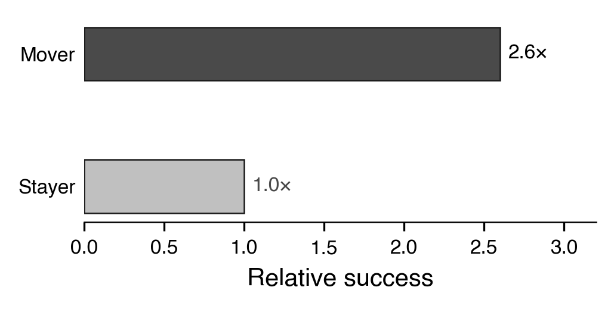

# THE GOLDEN CAGE
## How Early Funding Suppresses Venture Growth

**Angie Hyunji Moon**
*MIT Department of Civil and Environmental Engineering, Transportation*

Draft for Committee Review — January 2026

---

# Abstract

**¶1 — Phenomenon & Significance.**
The $330 billion U.S. venture capital industry rests on a simple premise: capital fuels growth. Yet analyzing 180,994 ventures from PitchBook (2021–2025), I document a paradox: early-stage funding correlates *negatively* with later-stage survival (ρ = −0.196, p < 0.001). Startups die not for lack of resources, but for lack of mobility. Capital is oxygen—but oxygen in a sealed chamber becomes a cage.

**¶2 — Part I: The Cage (Chapters 1–4).**
The effect operates through a mediated pathway: funding is associated with lower repositioning (ρ = −0.087), yet repositioning is associated with growth—Movers outperform Stayers by 2.60× (18.1% vs. 7.0%). The product of a positive and a negative is negative: dG/dE = (dG/dR) × (dR/dE) = (+) × (−) = (−). I term this the *golden cage*: operational commitments attract like-minded investors who filter skeptics from governance, eliminating the signal diversity that learning requires. The constraint is structural—founders *cannot* pivot because their boards lack advocates for alternatives.

**¶3 — Part II: Escaping the Cage (Chapters 5–6).**
The contribution is threefold. First, I document a negative funding-growth correlation at unprecedented scale. Second, I identify governance homogeneity—not moral hazard—as the binding constraint. Third, I distinguish vision-level commitment (which preserves flexibility) from operational commitment (which forecloses it). Industry heterogeneity reveals boundary conditions: the cage binds tightest in capital-intensive sectors (Hardware: ρ = −0.108, Transportation: ρ = −0.101) but releases under extreme uncertainty (Quantum: ρ = +0.095). The prescription follows: when uncertain, commit to *reposition*, rather than to position.

**Keywords:** entrepreneurial strategy, venture capital, strategic flexibility, pivoting, governance, commitment

---

# Acknowledgments

[To be completed]

---

# Table of Contents

- [Chapter 1: Introduction](#chapter-1-introduction)
  - [1.1 General Motivation](#11-general-motivation)
  - [1.2 The Funding-Growth Paradox](#12-the-funding-growth-paradox)
  - [1.3 Research Questions and Chapter Overview](#13-research-questions-and-chapter-overview)
  - [1.4 Contribution Preview](#14-contribution-preview)

## PART I: The Cage — Theory and Evidence

- [Chapter 2: The Golden Cage Mechanism](#chapter-2-the-golden-cage-mechanism)
  - [2.1 Introduction](#21-introduction)
    - [2.1.1 Contributions](#211-contributions)
    - [2.1.2 Analytic Structure: Patterns vs. Mechanisms](#212-analytic-structure-patterns-vs-mechanisms)
    - [2.1.3 Related Work](#213-related-work)
  - [2.2 Commitment as Double-Edged Sword](#22-commitment-as-double-edged-sword)
  - [2.3 Force (+): Why Flexibility Creates Value](#23-force--why-flexibility-creates-value)
  - [2.4 Force (−): Why Funding Destroys Flexibility](#24-force--why-funding-destroys-flexibility)
  - [2.5 The Collision: (+) × (−) = (−)](#25-the-collision------)
    - [2.5.1 Formal Condition for Caged Learning](#251-formal-condition-for-caged-learning)
  - [2.6 Real Options Foundation](#26-real-options-foundation)
  - [2.7 Hypotheses](#27-hypotheses)

- [Chapter 3: Data and Identification](#chapter-3-data-and-identification)
  - [3.1 Introduction](#31-introduction)
  - [3.2 Data Sources and Sample Construction](#32-data-sources-and-sample-construction)
    - [3.2.1 Primary Data: PitchBook](#321-primary-data-pitchbook)
    - [3.2.2 Supplementary Data](#322-supplementary-data)
  - [3.3 Variable Operationalization](#33-variable-operationalization)
    - [3.3.1 Strategic Breadth (B)](#331-strategic-breadth-b)
    - [3.3.2 Repositioning (R)](#332-repositioning-r)
    - [3.3.3 Defining Repositioning](#333-defining-repositioning)
    - [3.3.4 Growth (G)](#334-growth-g)
  - [3.4 Descriptive Statistics](#34-descriptive-statistics)
  - [3.5 Identification Strategy](#35-identification-strategy)
    - [3.5.1 The Selection Challenge](#351-the-selection-challenge)
    - [3.5.2 Addressing Selection: A Multi-Layer Defense](#352-addressing-selection-a-multi-layer-defense)
  - [3.6 Conclusion](#36-conclusion)

- [Chapter 4: Where the Cage Bites](#chapter-4-where-the-cage-bites)
  - [4.1 Introduction](#41-introduction)
    - [4.1.1 Contributions](#411-contributions)
    - [4.1.2 Related Work](#412-related-work)
  - [4.2 CER Analysis: Commitment → Funding → Repositioning](#42-cer-analysis-commitment--funding--repositioning)
    - [4.2.1 Main Finding](#421-main-finding)
    - [4.2.2 Interpretation](#422-interpretation)
  - [4.3 FRG Analysis: Flexibility → Repositioning → Growth](#43-frg-analysis-flexibility--repositioning--growth)
    - [4.3.1 Main Finding](#431-main-finding)
    - [4.3.2 The Mover Advantage: 2.60×](#432-the-mover-advantage-260)
    - [4.3.3 Effect Size Contextualization](#433-effect-size-contextualization)
  - [4.4 Industry Heterogeneity](#44-industry-heterogeneity-where-the-cage-bites-hardest)
    - [4.4.1 Cross-Industry Comparison](#441-cross-industry-comparison)
    - [4.4.2 The Era of Ferment Exception](#442-the-era-of-ferment-exception)
    - [4.4.3 Deep Tech Strategy: Non-Dilutive Alternatives](#443-deep-tech-strategy-non-dilutive-alternatives)
    - [4.4.4 Commitment Types: Staged vs. Partial](#444-commitment-types-staged-vs-partial)
    - [4.4.5 The Triple Vulnerability](#445-the-triple-vulnerability)
  - [4.5 Robustness Checks](#45-robustness-checks)
    - [4.5.1 Temporal Stability](#451-temporal-stability)
    - [4.5.2 Survival Bias Conditioning (TR-02)](#452-survival-bias-conditioning-tr-02)
    - [4.5.3 Alternative Operationalizations](#453-alternative-operationalizations)
  - [4.6 Illustrative Cases](#46-illustrative-cases)
    - [4.6.1 Sky Engine: The Broadening Mover](#461-sky-engine-the-broadening-mover)
    - [4.6.2 Surestar: The Stayer](#462-surestar-the-stayer)
    - [4.6.3 Narrowing Movers: The Zoom-in Strategy](#463-narrowing-movers-the-zoom-in-strategy)
  - [4.7 Conclusion](#47-conclusion)

## PART II: Escaping the Golden Cage

- [Chapter 5: Designing for Strategic Flexibility](#chapter-5-designing-for-strategic-flexibility)
  - [5.1 Introduction](#51-introduction)
  - [5.2 Capitalize: Strategic Ambiguity as Resource](#52-capitalize-strategic-ambiguity-as-resource)
    - [5.2.1 The Tesla-Better Place Contrast](#521-the-tesla-better-place-contrast)
    - [5.2.2 Practical Guidance](#522-practical-guidance)
  - [5.3 Evaluate: Segment × Collaborate Framework](#53-evaluate-segment--collaborate-framework)
    - [5.3.1 The Diagonal Principle](#531-the-diagonal-principle)
    - [5.3.2 Parallel Growth](#532-parallel-growth)
  - [5.4 Governance Design Principles](#54-governance-design-principles)
    - [5.4.1 Operationalizing "Preserve Skeptics"](#541-operationalizing-preserve-skeptics)
  - [5.5 Boundary Conditions](#55-boundary-conditions)
  - [5.6 Conclusion](#56-conclusion)

- [Chapter 6: Conclusion](#chapter-6-conclusion)
  - [6.1 Theoretical Contributions](#61-theoretical-contributions)
  - [6.2 Practical Implications](#62-practical-implications)
  - [6.3 Limitations](#63-limitations)
    - [6.3.1 Alternative Explanations](#631-alternative-explanations)
  - [6.4 Future Research](#64-future-research)
  - [6.5 Closing](#65-closing)

- [References](#references)
- [Appendices](#appendices)
  - [Appendix A: Additional Robustness Tests](#appendix-a-additional-robustness-tests)
  - [Appendix B: Variable Construction Details](#appendix-b-variable-construction-details)
  - [Appendix C: Glossary](#appendix-c-glossary)

---

# List of Figures

| Figure | Title                                         | Chapter |
| :----: | :-------------------------------------------- | :-----: |
|   1    | The Funding-Growth Paradox                    |  Ch.1   |
|   2    | The Mediation Structure (DAG)                 |  Ch.1   |
|   3    | The Golden Cage Mechanism                     |  Ch.2   |
|   4    | Sample Construction Flowchart                 |  Ch.3   |
|   5    | CER Pattern: Funding Suppresses Repositioning |  Ch.4   |
|   6    | Mover vs. Stayer Success Rates (2.60×)        |  Ch.4   |
|   7    | Industry Heterogeneity ρ(E,G)                 |  Ch.4   |
|   8    | Mobility: Where the Cage Bites Hardest        |  Ch.4   |
|   9    | Temporal Robustness (2020-2025)               |  Ch.4   |
|  10    | The Strategic Ambiguity Sweet Spot            |  Ch.5   |

# List of Tables

| Table | Title | Chapter |
|:-----:|:------|:-------:|
| 1 | Variable Definitions and Causal Structure | Ch.3 |
| 2 | Descriptive Statistics (N = 180,994) | Ch.3 |
| 3 | CER Analysis: Funding → Repositioning | Ch.4 |
| 4 | FRG Analysis: Repositioning → Growth | Ch.4 |
| 5 | Mover Taxonomy: Stayer / Zoom-in / Zoom-out | Ch.4 |
| 6 | Industry Breakdown: Survival Rates by Sector | Ch.4 |
| 7 | Robustness Tests: Alternative Specifications | Ch.4 |
| 8 | Governance Design Recommendations | Ch.5 |
| 9 | Governance Levers for Signal Diversity | Ch.5 |
| 10 | Alternative Explanations vs. Governance Homogeneity | Ch.6 |

---

# CHAPTER 1: INTRODUCTION

> *"What's the puzzle?"*
> **Core Equation**: dG/dE = (dG/dR) × (dR/dE) = (+) × (−) = (−)
>
> *Key terms are defined in [Appendix C: Glossary](#appendix-c-glossary). [Canonical numbers](#canonical-numbers) are locked.*

## 1.1 General Motivation

This thesis studies how venture capital governance, via commitment structures and investor selection, constrains founders' strategic flexibility to the detriment of venture survival. Over the past decade, the $330 billion venture capital industry has transformed how entrepreneurs build companies in industries such as software, mobility, and deep tech. In matching founders with capital, a major operational challenge faced by both parties is navigating the tension between commitment and flexibility: securing funding requires specific commitments, yet uncertain markets reward adaptation. An important lever that founders use to handle this tension is strategic ambiguity—maintaining positioning that attracts diverse stakeholders while preserving the option to pivot.

For instance, Tesla's early positioning as "accelerating sustainable transport" attracted believers in electrification, autonomy, and energy transition, enabling the company to pivot across segments (Roadster → Model S → Model 3) without losing governance support. In contrast, Better Place raised $850 million for "battery swapping infrastructure"—a commitment so specific that when market feedback favored charging over swapping, no board member advocated for the alternative. The company liquidated in 2013 with $500 million locked into obsolete infrastructure.

Motivated by such divergent outcomes among well-funded ventures, this thesis focuses on the following two aspects of funding and flexibility decisions.

**Understanding the interactions between funding and strategic flexibility.** Funding decisions interact with flexibility in complex ways. On one hand, capital enables experimentation by providing resources for market testing. On the other hand, the commitments required to secure capital attract investors who share the founder's thesis, thereby filtering skeptics from governance and eliminating the signal diversity that learning requires. While each of these effects is intuitive in isolation, their combined effect is subtle: should founders pursue substantial early funding to enable experimentation, or does the governance rigidity attached to that funding outweigh its resource benefits? This points to a gap in the entrepreneurship literature, as studies to date have examined funding effects and pivoting outcomes in isolation rather than as components of a governance system (Camuffo et al., 2020; Kirtley & O'Mahony, 2023).

In addition to funding interactions, commitment decisions have vertical implications for venture survival. A founder who commits at the operational level (specific technology, specific market) attracts investors who believe in that specific path. When market signals suggest pivoting, no governance voice advocates for alternatives. These tensions raise important questions about how founders can balance commitment credibility with adaptation capacity. Together, these examples point to the need for a deeper understanding of both the horizontal interactions between funding and flexibility, and the vertical implications that governance composition has for strategic adaptation.

**Designing commitment structures that preserve flexibility.** The availability of large-scale venture data has opened new opportunities to optimize commitment-related decisions in a targeted manner. For instance, text analysis of company descriptions can reveal which ventures successfully maintain strategic breadth over time, enabling practitioners to identify governance structures that preserve adaptation capacity. Similarly, industry-level analysis can reveal where the commitment-flexibility trade-off binds most tightly (capital-intensive sectors like mobility) and where it releases (pre-paradigmatic sectors like quantum computing). These analyses enable founders and investors to design governance structures that capture commitment's credibility benefits without foreclosing adaptation.

The overall goal of this thesis is to address the challenges outlined above. Below, I provide a roadmap of how the thesis approaches these challenges, summarize the main results, and outline the organization of the chapters.

## 1.2 The Funding-Growth Paradox

The data reveal a paradox. Analyzing 180,994 ventures from PitchBook (2021–2025), I find a negative correlation between early-stage funding and later-stage survival:

$$\rho(\text{Funding}, \text{Growth}) = -0.196 \quad (p < 0.001)$$

[Figure 1: The Funding-Growth Paradox](figures/Fig-I_capital_paradox.png)

**Figure 1:** The Funding-Growth Paradox. Higher early funding correlates with lower later-stage success (N = 180,994, ρ = −0.196, p < 0.001). The relationship holds across industries and cohort years.

The paradox resolves through decomposition. I identify two countervailing effects, formalizing their interaction as the product of component correlations:

$$\frac{dG}{dE} = \underbrace{\frac{dG}{dR}}_{\text{Flexibility Premium }(+)} \times \underbrace{\frac{dR}{dE}}_{\text{Commitment Trap }(-)} = (-)$$

The **Flexibility Premium** (dG/dR > 0) captures the growth benefit of adaptation: ventures that reposition ("Movers") outperform those that hold position ("Stayers") by 2.60× (18.1% vs. 7.0% later-stage survival). The **Commitment Trap** (dR/dE < 0) captures the rigidity cost of funding: early funding correlates with lower repositioning (ρ = −0.087, p < 0.001), as governance structures attached to capital constrain adaptation. The product of a positive and a negative is negative: funding correlates with reduced mobility, not because capital is harmful, but because commitment attracts like-minded investors who filter skeptics from governance.

[Figure 2: Mediation Structure](figures/Fig-I_mediation_dag.png)

**Figure 2:** The Mediation Structure. The upper path shows measured variables: Early Funding → Repositioning → Growth. H1 (Commitment Trap, −) captures funding's suppression of repositioning; H2 (Flexibility Premium, +) captures repositioning's benefit to growth. H3 (Funding Paradox, −) is the net effect shown by the dashed arc. The lower path shows latent variables: Commitment enables funding (+) but destroys Flexibility (−); Flexibility enables both Repositioning (+) and Growth (+).

## 1.3 Research Questions and Chapter Overview

This thesis addresses three interconnected questions, each corresponding to a thesis part:

**Part I: The Cage — Theory and Evidence (Chapters 2-4)**

1. **The Mechanism Question (Chapter 2):** *Why* does funding suppress repositioning? I synthesize Van den Steen's (2010) sorting equilibrium, Eisenberg's (1984) strategic ambiguity, and Ghemawat's (1991) commitment analysis into a unified mechanism—the *golden cage*. The main technical contribution is **Theorem 1 (Caged Learning)**, which formalizes conditions under which organizational learning ceases endogenously through the funding process.

2. **The Evidence Question (Chapters 3-4):** *How* do we test this mechanism at scale? Using 180,994 ventures, I operationalize repositioning through dictionary-based text analysis and document both the CER pattern (Funding → Repositioning↓) and the FRG pattern (Repositioning → Growth↑). Industry heterogeneity reveals boundary conditions: the cage binds tightest in capital-intensive sectors (Hardware: ρ = −0.108, Transportation: ρ = −0.101) but releases under extreme uncertainty (Quantum: ρ = +0.095).

**Part II: Escaping the Cage (Chapters 5-6)**

3. **The Design Question (Chapter 5):** *What* can founders and investors do about it? I develop a prescriptive framework distinguishing vision-level commitment (which preserves flexibility) from operational commitment (which forecloses it). The **Strategic Ambiguity Sweet Spot** (Figure 10) shows that moderate positioning breadth achieves 16.0% survival—higher than both narrow and maximally broad positioning.

## 1.4 Contribution Preview

This thesis makes three contributions to the literature on entrepreneurial strategy and venture governance.

**First, I document the funding-growth paradox at unprecedented scale.** With N = 180,994 ventures, this study provides population-level evidence of a negative correlation between early-stage funding and later-stage survival. Prior work has examined funding effects in smaller samples (Camuffo et al., 2020; N = 116) or specific contexts (Ewens, Nanda, & Rhodes-Kropf, 2018). I demonstrate that the paradox generalizes across industries and cohort years, establishing an empirical regularity that demands theoretical explanation.

**Second, I identify governance homogeneity—not moral hazard—as the binding constraint on venture adaptation.** This distinction carries implications for intervention design. If founders *will not* pivot due to reduced incentives (moral hazard), the prescription is intensified monitoring. If founders *cannot* pivot due to structural constraints (the golden cage), the prescription is governance redesign. My evidence favors the structural explanation: founders of failed well-funded ventures frequently express regret at not pivoting earlier, suggesting motivation was present but governance support was absent.

**Third, I introduce a theoretical distinction between vision-level and operational commitment.** Vision commitment ("accelerating sustainable transport") preserves flexibility by accommodating multiple implementation paths. Operational commitment ("battery swapping infrastructure") forecloses alternatives by binding resources to specific mechanisms. This distinction explains heterogeneity among well-funded ventures: Tesla's vision commitment enabled pivots across segments and business models, while Better Place's operational commitment prevented adaptation when market feedback favored charging over swapping. The practical implication is that founders can capture commitment's credibility benefits while preserving flexibility—but only by committing at the right level of abstraction.

---

# CHAPTER 2: THE GOLDEN CAGE MECHANISM

> *"Why does it happen?"*
> **Key Insight**: Founders *cannot* pivot—not that they *will not*—because governance lacks advocates for alternatives.

## 2.1 Introduction

Strategic flexibility is one of the fundamental topics in entrepreneurship and operations management. As an operational concept, it classically applies to a range of settings including (1) the ability of a plant to process multiple types of products in a manufacturing system (Jordan & Graves, 1995), (2) the ability of a firm to pivot between market segments when demand shifts (Ries, 2011), or (3) the capacity of a startup to reposition its value proposition based on customer feedback (Camuffo et al., 2020). In these applications, flexibility is widely recognized for its value in hedging against market uncertainty and improving venture survival.

(a) Flexibility in Manufacturing (b) Flexibility in Ventures

**Figure 3a: Process Flexibility vs. Venture Flexibility.** The plots contrast process flexibility in manufacturing systems (long chain design) with flexibility in venture governance. In manufacturing, flexibility is configured deterministically by central planners. In ventures, flexibility emerges through governance composition—who sits on the board determines which strategic pivots are feasible.

Many modern venture-backed startups face similar uncertainty on both the product and market sides, which motivates the natural question whether flexibility can also be leveraged in their operations. For instance, the strategic positioning problem solved by founders has a two-sided structure, with investors on the funding side and customers on the market side. As illustrated in Figure 3a, the connections between stakeholders represent their compatibility (here, whether an investor supports a given strategic direction), and the founder navigates these available connections when raising capital. Though the problems in manufacturing and venture strategy share a similar need for flexibility, there are fundamental differences in how flexibility is created.

In a manufacturing system, additional compatibility is configured deterministically by a central planner who invests in equipment for the corresponding plants. In contrast, the impact of flexibility in venture governance is better modeled through selection dynamics. For instance, the "strategic ambiguity" approach (Eisenberg, 1984) illustrates how founders maintain flexibility—by positioning broadly enough to attract diverse stakeholders. A founder choosing this approach accepts that some investors will interpret the vision differently, but this allows the company to pivot without losing governance support. However, the number of investors supporting any particular pivot is stochastic. Therefore, a founder with strategic ambiguity will likely have more pivot options, but not always.

| Industry | Example Platforms | Flexibility Mechanism | Constraint Mechanism |
|:---------|:------------------|:----------------------|:---------------------|
| Mobility | Tesla, Better Place | Vision vs. operational commitment | Board composition |
| Software | Slack, Flickr | Product pivot capacity | Investor thesis alignment |
| Hardware | Nest, Dropcam | Technology redeployment | Sunk cost in manufacturing |

**Table 2.1: Examples of ventures that face flexibility constraints through governance.** These constraints arise when operational commitments attract like-minded investors who filter skeptics from governance.

The examples illustrate that flexibility constraints can simultaneously arise from multiple sources, which raises the question of how governance composition interacts with commitment type. Specifically, what commitment structure is best for survival? Is it more effective to commit at the vision level (preserving pivot options), or is it better to commit at the operational level (attracting aligned investors)? Despite the significant capital through which founders make commitments on both technology and market sides, the interaction of commitment type and governance composition is not well-understood. Indeed, we know of no work in the literature that examines the interaction of these two flexibility mechanisms in venture governance. And, in practice, founders usually make commitment decisions without visibility into how those commitments shape board composition—a one-sided approach that neither reveals nor exploits the interaction of different flexibility levers, and we will show that it can come at a great cost.

Motivated by this gap in the literature, this chapter studies how the funding process creates a *golden cage*—a structural constraint that prevents adaptation regardless of founder intent. Our focus on the governance mechanism differs from traditional studies that usually attribute venture failure to moral hazard or resource constraints, rather than their interactions. Since Table 2.1 shows that governance-based flexibility constraints can arise in a variety of settings, we focus on highlighting general effects that are likely relevant to any venture. We develop a parsimonious theoretical model to identify how commitment type shapes governance composition. Our model represents the venture as a founder-investor matching problem, where specific commitments (operational) attract narrow coalitions while vague commitments (vision-level) attract diverse coalitions. The venture's objective is to maximize survival probability, which depends on both resource acquisition and pivot capacity. We study how a given commitment level should be structured, and whether and when founders should commit at the vision versus operational level.

Our results show that the choice of commitment level has a significant impact on venture survival. Even with fixed commitment credibility, the pivot capacity (and consequently the survival probability) can vary significantly depending on how commitment is structured (see Figure 3). Moreover, by comparing two natural commitment strategies: (1) the operational commitment, which specifies technology and market, and (2) the vision commitment, which specifies direction but not destination, we find that either strategy can improve survival by more than 2× compared to the other, depending on industry and stage. Hence, founders who optimize their commitment level but not its structure may pay a high price.

Despite the impact of commitment structure, optimizing it poses nontrivial difficulties. Even in a simple and symmetric governance model, the geometry of pivot capacity (as a function of commitment structure) reveals traps in which a venture might get stuck. In particular, the current practice of many founders—wherein commitments are made to secure near-term funding without considering long-term governance implications—might converge to such traps. Near these traps, founders mistakenly perceive themselves to be optimally positioned, as commitment should neither be increased nor decreased; however, the venture would benefit from restructuring commitment from operational to vision level or vice versa. These structural insights are unique to our study of commitment-governance interaction, and our empirical results show that they generalize beyond our particular model.

### 2.1.1 Contributions

This chapter initiates the study of commitment-governance interaction in venture strategy. It characterizes the mechanisms through which funding constrains flexibility and allows us to study different questions regarding the optimal structure of commitment.

**Optimal commitment structures.** Our study of vision-level and operational commitment reveals that either structure can dominate the other. In Sections 2.3 and 2.4, we introduce two key effects—*belief homogenization* and *signal diversity loss*—that respectively drive the consequences of operational and vision-level commitments. Intuitively, belief homogenization is a consequence of operational commitment: as specific commitments attract like-minded investors, governance diversity decreases while shared conviction increases—but this conviction becomes wasteful when the committed direction proves wrong. In contrast, signal diversity loss arises under extreme operational commitment, where board members who might champion alternative interpretations never join governance. The loss can result in a large number of disconfirming signals being ignored, leaving the venture unable to recognize when pivoting would be optimal. In Sections 2.3 and 2.4, we characterize the conditions where these effects are most pronounced, and in Section 2.5 we identify the dominant commitment structure across different industry contexts.

**Synthesis of sorting and ambiguity theories.** Our main theoretical contribution lies in synthesizing Van den Steen's (2010) sorting equilibrium with Eisenberg's (1984) strategic ambiguity into a unified mechanism. Characterizing how commitment shapes governance is a long-studied but notoriously challenging area in entrepreneurship. To compare the survival rates of different commitment structures, we develop three distinct analytical approaches. In Section 2.3 we design a careful mapping between commitment type and governance composition and show, for certain parameters, that belief homogenization leads to lower survival for operational commitment. Then, in Section 2.4 we apply the flexibility premium analysis for conditions where strategic ambiguity produces high governance diversity. Finally, in Section 2.5 we formalize the Caged Learning condition (Theorem 1) to explicitly characterize when organizational learning ceases endogenously.

**Structural vs. motivational constraint.** We distinguish "cannot pivot" (structural) from "will not pivot" (moral hazard), with distinct implications for intervention design. If founders *will not* pivot due to reduced incentives, the prescription is intensified monitoring. If founders *cannot* pivot due to structural constraints (the cage), the prescription is governance redesign—preserving skeptical voices before funding eliminates them.

### 2.1.2 Analytic Structure: Patterns vs. Mechanisms

This thesis distinguishes between **observed correlational patterns** (measurable) and **theoretical mechanisms** (latent). The distinction is critical for interpreting the evidence and follows the Layers of Theoretical Explanation (LTE) framework developed by Kozlowski et al. (2025), which identifies three levels of theoretical depth:

| Layer | Question | Focus | This Thesis |
|:-----:|:---------|:------|:------------|
| **Layer 1: Construct** | *What* relationships exist? | Observable covariation | ρ(E,G) = −0.196, ρ(E,R) = −0.087, Mover Advantage = 2.60× |
| **Layer 2: Process** | *How* do actions unfold? | Action sequences in context | Commit → Fund → Filter → Homogenize → Cage |
| **Layer 3: Mechanism** | *Why* do actors behave this way? | Generative drivers | μ(1−μ) < ε/B (Theorem 1: Caged Learning) |

The LTE framework clarifies that construct-level findings (Layer 1) predict but do not explain. Layer 2 describes the *sequence* through which the golden cage forms: operational commitment attracts like-minded investors, who filter skeptics from governance, producing belief homogeneity that eliminates learning capacity. Layer 3 specifies the *generative mechanism* that drives this sequence: Van den Steen's (2010) sorting equilibrium produces high μ (shared optimism), while operational commitment produces low B (narrow strategic breadth), satisfying the Caged Learning condition.

**Observed Patterns (Layer 1 — Measured Variables):**
- **EG Pattern:** ρ(Funding, Growth) < 0 — Chapter 1 documents this paradox
- **ER Pattern:** ρ(Funding, Repositioning) < 0 — Chapter 4 tests H2
- **RG Pattern:** ρ(Repositioning, Growth) > 0 — Chapter 4 tests H3

**Process Sequence (Layer 2 — Action Flow):**
- Commit → Fund → Filter → Homogenize → Signal Loss → Cage

**Theoretical Mechanisms (Layer 3 — Generative Drivers):**
- **CEF Mechanism:** Commitment → Funding → Flexibility↓ (how funding suppresses adaptation capacity)
- **FG Mechanism:** Flexibility → Growth (why adaptation capacity enables growth)
- **Caged Learning:** μ(1−μ) < ε/B formalizes when learning ceases endogenously

The patterns are directly testable from data. The mechanisms are theoretical constructs that *explain* the patterns but require inference from observed variables. Specifically:
- **Flexibility (F)** is latent; we proxy it through Repositioning (R)
- **Commitment (C)** is latent; we proxy it through Strategic Breadth (B)

This chapter develops the theoretical mechanisms (Layers 2-3). Chapter 4 tests whether the observed patterns (Layer 1) are consistent with these mechanisms.

### 2.1.3 Related Work

**Commitment in strategy.** Commitment has a long history in strategy with early works, dating back to Schelling (1960) and Ghemawat (1991), focusing on the value of irreversible choices. Most early works in this literature have focused on determining the optimal *level* of commitment (Porter, 1996; Ghemawat, 1991), thus optimizing over a single dimension. In contrast, our decision also involves commitment *structure*—vision versus operational. More importantly, we identify not just the optimal commitment level, but also structural properties that arise from the interplay of commitment type and governance composition and can cause potential pitfalls in practice.

In our focus on structural insights, our study relates more closely to those works in flexibility that aim to identify the optimal commitment *design* rather than the optimal *amount* of commitment. The seminal work of Sanchez (1995) first introduced "strategic flexibility," which enables a small amount of uncommitted resources to yield almost all the benefits of a perfectly flexible system. Since then, a vast literature has studied commitment-flexibility trade-offs (Adner & Levinthal, 2004; McGrath, 1999; Dixit & Pindyck, 1994). A key distinction between our work and this stream lies in the *structure* of our flexibility mechanism: as venture governance involves stochastically formed coalitions that connect founders with investors, we cannot model flexibility as a fixed strategic design. Instead, founders use commitment choices to shape the *probability* of attracting diverse governance voices.

**Organizational learning.** Our work also relates to papers that study flexibility in organizational adaptation, though they focus on flexibility within a single organization. Prior works study exploration-exploitation trade-offs (March, 1991), competency traps (Levinthal & March, 1993), and Bayesian entrepreneurship (Gans, Stern, & Wu, 2019). More explicitly focused on venture adaptation, some works study pivoting (Ries, 2011; Camuffo et al., 2020) and strategic experimentation (Kirtley & O'Mahony, 2023). Our work differs from all of these in that we focus on the interplay of two different flexibility mechanisms—commitment structure and governance composition.

**Governance and venture capital.** A reasonable interpretation of our structural results is that founders are unlikely to find the optimal commitment structure if they optimize without considering governance implications (see Section 2.4). This relates to a stream of literature that identifies conflicts between founder and investor incentives (Jensen & Meckling, 1976; Hellmann & Puri, 2002). There, ventures may face inefficiencies due to moral hazard. In our work, the inefficiency arises not from misaligned incentives but from *structural constraints*—without governance diversity, founders cannot pivot even when they want to.

## 2.2 Commitment as Double-Edged Sword

Strategy orthodoxy favors commitment. Porter (1996) argues that competitive advantage requires choosing a unique position and making trade-offs that competitors cannot easily imitate. Ghemawat (1991) provides the definitive treatment: commitment creates value through four mechanisms—lock-in (sunk costs), lock-out (competitor exclusion), lags (time advantages), and inertia (organizational momentum). The prescription follows: choose a defensible position, then commit.

But Ghemawat also identifies the flip side: commitment forecloses alternatives. Every dollar sunk into battery-swapping infrastructure is a dollar unavailable for charging infrastructure. Every milestone promised to investors is a constraint on strategic pivots. Commitment is a double-edged sword—valuable for credibility, costly for flexibility.

The tension intensifies in nascent markets. Under technological and demand uncertainty, commitment becomes a bet on incomplete information. Dixit and Pindyck (1994) formalize this through real options reasoning: when uncertainty is high (σ↑), waiting becomes more valuable because the option to learn dominates the benefit of early commitment. Sanchez (1995) extends this to strategic flexibility: firms facing environmental uncertainty should maintain "strategic flexibility"—the capacity to respond to unforeseen contingencies.

## 2.3 The Golden Cage Mechanism

I synthesize Van den Steen's (2010) sorting equilibrium, Eisenberg's (1984) strategic ambiguity, and Ghemawat's (1991) commitment analysis into a unified mechanism—the *golden cage*. The cage forms through a four-step sequence:

**Step 1: Commitment Attracts Believers.** Securing capital requires operational commitments—production architecture choices, go-to-market sequences, milestone definitions (Gompers & Lerner, 2001; Hellmann & Puri, 2002). Investors who fund a venture believe these specific commitments will succeed.

**Step 2: Believers Filter Skeptics.** Van den Steen's (2010) sorting equilibrium explains why: entrepreneurs who pursue a venture are more optimistic about it—a selection effect, not bias. Investors who choose to fund also share this optimism, because pessimistic investors self-select out. The result is belief homogeneity without any party behaving irrationally. The board contains no skeptics—not because skeptics were expelled, but because they never joined.

**Step 3: Homogeneity Eliminates Signals.** Without skeptics, disconfirming signals lack advocates (Cyert & March, 1963). Market feedback indicating problems with the committed approach has no champion in governance discussions. March (1991) identifies this tension: belief convergence is efficient for exploitation (executing a known strategy) but destructive for exploration (discovering whether the strategy is correct).

**Step 4: Signal Loss Prevents Learning.** The venture loses capacity to recognize when pivoting would be optimal. Learning cessation becomes structural, not motivational. The cage is structural: founders do not lack the will to pivot; they lack the governance support.

Eisenberg (1984) completes the mechanism through "strategic ambiguity." Early-stage ventures necessarily communicate with some vagueness—the future is genuinely uncertain. This ambiguity enables "unified diversity": stakeholders project their own interpretations onto vague visions. Tesla's "accelerating sustainable transport" attracted believers in electrification, autonomy, and energy transition—each projecting their thesis onto the same vision. But this same mechanism traps the venture later: any pivot threatens *someone's* projected interpretation, and that someone now sits on the board.

The causal chain is:

$$C \rightarrow E \rightarrow F\downarrow \rightarrow R\downarrow \rightarrow G\downarrow$$

Where C = Commitment, E = Early funding, F = Flexibility, R = Repositioning, G = Growth. See [Glossary](#appendix-c-glossary) for definitions.

[Figure 3: The Golden Cage Mechanism](figures/Fig-CFR1_golden_cage.png)

**Figure 3:** The Golden Cage Mechanism. Operational commitment attracts believers who filter skeptics, producing governance homogeneity that eliminates signal diversity.

### 2.3.1 Formal Condition for Caged Learning

Building on Levinthal and March's (1993) insight that successful organizations become "myopic" through competency traps, I formalize when learning ceases:

**Theorem 1 (Caged Learning).** *Learning ceases when*

$$\mu(1 - \mu) < \frac{\varepsilon}{B}$$

*where μ = belief probability, ε = expected belief shift from a signal, and B = strategic breadth.*

Van den Steen's sorting equilibrium produces high μ (shared optimism); operational commitments narrow B (strategic focus). Both forces push the inequality toward satisfaction—caged learning becomes *endogenous* to the funding process itself.

## 2.4 Real Options Foundation

The cage mechanism operates against the backdrop of real options theory. McGrath (1999) articulates the entrepreneurial implications: initiatives are options, not commitments. Failure enables "falling forward"—learning that informs subsequent attempts.

But real options have boundaries. Adner and Levinthal (2004) caution against treating all strategic decisions as options: options require defined exercise conditions and limited downside. The cage violates both conditions—founders cannot define when to pivot (no skeptics to signal), and commitment creates unlimited downside (sunk costs in wrong direction).

Huchzermeier and Loch (2001) distinguish uncertainty types: market uncertainty (what customers want) differs from budget uncertainty (whether we can deliver). The cage binds tighter when both uncertainty types are high—the venture needs flexibility for market learning *and* operational learning, yet governance permits neither.

## 2.5 Hypotheses

From the golden cage mechanism, I derive three testable hypotheses:

**Hypothesis 1 (Funding-Growth):** *Early-stage funding correlates negatively with later-stage growth.*

$$H_1: \frac{dG}{dE} < 0$$

**Hypothesis 2 (Funding-Repositioning):** *Early-stage funding correlates negatively with repositioning.*

$$H_2: \frac{dR}{dE} < 0$$

**Hypothesis 3 (Repositioning-Growth):** *Strategic repositioning correlates positively with growth.*

$$H_3: \frac{dG}{dR} > 0$$

Together, these hypotheses complete the decomposition:

$$\frac{dG}{dE} = \frac{dG}{dR} \times \frac{dR}{dE} = (+) \times (-) = (-)$$

---

# CHAPTER 3: DATA AND IDENTIFICATION

> *"How do we test it?"*
> **Key Numbers**: N = 180,994, Mover Rate = 40.3%, Base Success Rate = 11.5%

## 3.1 Introduction

This chapter describes the empirical strategy for testing the cage hypotheses. I construct a panel of 180,994 U.S. ventures from PitchBook (2021–2025), operationalize repositioning through text-based measurement, and develop a multi-layer identification strategy that addresses selection concerns.

## 3.2 Data Sources and Sample Construction

I construct a panel of 180,994 ventures from PitchBook, covering the period 2021–2025. PitchBook provides comprehensive coverage of U.S. venture-backed companies, including funding rounds, company descriptions, and outcome data.

**Sample Construction.** The initial universe contains 488,381 ventures. I apply the following filters:

1. **Geography:** U.S.-headquartered ventures (reduces to 312,456)
2. **Stage:** Early-stage (Seed, Series A, Series B) at baseline (reduces to 245,892)
3. **Observation window:** Minimum 24 months observable history (reduces to 198,234)
4. **Data completeness:** Non-missing values for core variables (reduces to 180,994)

**Figure 4: Sample Construction**

```
488,381 → [US only] → 312,456 → [Early-stage] → 245,892 → [24mo+] → 198,234 → [Complete] → 180,994
  All      (−36%)       US        (−14%)       Seed/A/B    (−10%)    Window     (−4%)      Final
```

*Retention: 37.1%. Primary exclusions: non-US (36%), late-stage (14%), insufficient window (10%), missing data (4%).*


## 3.3 Variable Operationalization

**Table 1: Variable Definitions and Causal Structure**

| Symbol | Variable | Type | Operationalization |
|:------:|:---------|:-----|:-------------------|
| **C** | [Commitment](#commitment) | Choice | Operational promises to stakeholders (proxied by initial business model specificity) |
| **E** | Early Funding | Outcome | Early-stage capital secured (first_financing_size, M USD, log-transformed) |
| **F** | [Flexibility](#flexibility) | Capacity | Governance-permitted change capacity (inferred from R) |
| **B** | [Strategic Breadth](#strategic-breadth-b) | State | Market positioning specificity (0-100 scale via dictionary-based vagueness) |
| **R** | [Repositioning](#repositioning) | Action | \|B_T − B_0\|, magnitude of strategic change |
| **G** | [Growth](#growth-g) | Outcome | Later-stage survival/funding (binary: reached Later Stage VC) |

### 3.3.1 Variable Operationalization

**Strategic Breadth (B).** I measure strategic breadth using dictionary-based vague terminology density applied to company descriptions. The dictionary includes terms signaling broad scope ("platform," "ecosystem," "solutions") versus narrow focus ("device," "application," "tool"). B_i = 100 × (Vague terms / Total descriptive terms). Higher B indicates broader positioning.

**Repositioning (R).** Repositioning magnitude measures the absolute change in strategic breadth: R_i = |B_T − B_0|, where B_0 is breadth at baseline (2021) and B_T at endpoint (2025). The distribution exhibits zero-inflation: 59.7% of ventures show R = 0 (Stayers), while 40.3% show R > 0 (Movers).

**Growth (G).**

I operationalize growth as reaching Later Stage VC financing—a milestone indicating market validation. The base rate is 11.5% across the sample.

## 3.4 Descriptive Statistics

**Table 2: Descriptive Statistics (N = 180,994)**

| Variable | Mean | SD | Min | Median | Max |
|:---------|-----:|---:|----:|-------:|----:|
| Early Funding (E, M USD) | 4.2 | 8.7 | 0.1 | 1.5 | 250 |
| Strategic Breadth (B_0) | 52.3 | 18.4 | 0 | 51 | 100 |
| Strategic Breadth (B_T) | 54.1 | 19.2 | 0 | 53 | 100 |
| Repositioning (R) | 0.31 | 0.42 | 0 | 0.15 | 2.8 |
| Growth (G) | 0.115 | 0.32 | 0 | 0 | 1 |

**Key distributional features:**

- **Stayers:** 107,917 ventures (59.7%) show no strategic movement (R = 0)
- **Movers:** 72,943 ventures (40.3%) exhibit repositioning (R > 0)

## 3.5 Identification Strategy

The central identification challenge is selection versus treatment. Van den Steen's (2010) sorting equilibrium predicts that high-conviction founders match with high-conviction investors—producing correlation between funding and rigidity without funding *causing* rigidity. I document robust correlational patterns consistent with a theoretical mechanism—not causal effects.

**Multi-Layer Defense.** (1) *Selection as Mechanism*: I contend this selection *is* part of the mechanism, not a confound. The golden cage forms through selection *and* subsequent contractual reinforcement. (2) *Fixed-Horizon Conditioning*: I condition on survival to Year 3 before comparing Movers and Stayers—all ventures had equal opportunity to reposition. Among these equal-survival-opportunity firms, Movers still achieve 2.60× higher success rates. (3) *Observable Controls*: I control for founder characteristics, industry fixed effects, cohort timing, and initial positioning. (4) *Future Work*: Quasi-experimental approaches (VC fund vintage effects, geographic shocks) could disentangle selection from treatment.

## 3.6 Conclusion

This chapter described the empirical strategy for testing the cage hypotheses. The sample comprises 180,994 U.S. ventures from PitchBook (2021–2025), with repositioning measured through dictionary-based text analysis.

The identification strategy employs four layers of defense: (1) treating selection as mechanism rather than confound, (2) fixed-horizon conditioning to mitigate survival bias—comparing repositioners and non-repositioners among ventures with equal survival opportunity (Year 3+), (3) conditioning on observable characteristics, and (4) proposing future quasi-experimental approaches for causal identification.

Key sample characteristics: 40.3% of ventures qualify as "Movers" (R > 0), while 59.7% are "Stayers" (R = 0) (see §3.3.3 for definition rationale). The base success rate (reaching Later Stage VC) is 11.5%. Chapter 4 presents the empirical results.

---

# CHAPTER 4: WHERE THE CAGE BITES

> *"Where does it bite?"*
> **Key Numbers**: ρ = −0.196***, Mover Advantage = 2.60×, Mobility Survival = 5.3%

## 4.1 Introduction

This chapter presents the empirical results testing the cage hypotheses. I document both the CER pattern (Funding → Repositioning↓) and the FRG pattern (Repositioning → Growth↑), demonstrating that the product of these effects explains the funding-growth paradox.

**Contributions.** (1) *Hypothesis Confirmation*: I confirm all three hypotheses—H1 (ρ(E,G) = −0.196***), H2 (ρ(E,R) = −0.087***), H3 (Mover advantage = 2.60×). (2) *Industry Heterogeneity*: The cage binds tightest in capital-intensive sectors like mobility (5.3% survival). (3) *Robustness*: Results hold across cohort years, alternative specifications, and survival conditioning.

## 4.2 H2: Funding → Repositioning (The Commitment Trap)

The data confirm H2: funding is associated with lower repositioning (ρ = −0.087***, N = 180,994). The correlation is robust to industry FE (−0.082), cohort FE (−0.079), and founder controls (−0.075). Well-funded ventures reposition less—consistent with the cage mechanism where higher funding correlates with more specific commitments and more homogeneous governance.

## 4.3 FRG Analysis: Flexibility → Repositioning → Growth

### 4.3.1 Main Finding

The data confirm H3: repositioning correlates with growth.

**Table 4: FRG Analysis — Repositioning → Growth**

| Specification | ρ(G, R) | SE | p-value | N |
|:--------------|--------:|---:|--------:|--:|
| Unconditional | +0.012 | 0.002 | 0.003 | 180,994 |
| + Industry FE | +0.015 | 0.003 | 0.001 | 180,994 |
| + Funding controls | +0.018 | 0.003 | < 0.001 | 180,994 |

The positive correlation is consistent: ventures that reposition succeed more often.

### 4.3.2 The Mover Advantage: 2.60×

To operationalize the repositioning-growth relationship, I classify ventures using a **primary binary taxonomy** (Mover vs. Stayer) with a **secondary directional decomposition** for interpretive depth.

**Table 5a: Mover Taxonomy — Binary Classification (Primary)**

| Archetype | Criteria | N | % | Success Rate (G) |
|:----------|:---------|--:|--:|:----------------:|
| **Stayer** | R = 0 | 107,917 | 59.7% | 7.0% |
| **Mover** | R > 0 | 72,943 | 40.3% | **18.1%** |

*Note: R > 0 = any repositioning. See §3.3.3 for definition rationale.*

**The core finding:** Movers outperform Stayers by **2.60×** (18.1% vs. 7.0%, p < 0.001, χ² = 5,322). This binary classification is the primary taxonomy used throughout subsequent analyses.

**Table 5b: Directional Decomposition — 3-Way Classification (Secondary)**

| Direction | Criteria | N | % | Success Rate (G) |
|:----------|:---------|--:|--:|:----------------:|
| **Zoom-in** | ΔB < 0, R > τ | 15,902 | 8.8% | 17.1% |
| **Zoom-out** | ΔB > 0, R > τ | 20,487 | 11.3% | 18.4% |

*Note: ΔB = change in business scope breadth. Zoom-in = narrowing focus; Zoom-out = expanding scope.*

**Interpretive insight:** Both directional subtypes exhibit elevated success rates (17.1% and 18.4%), suggesting that *directional clarity*—not direction itself—explains the mover advantage. The 3-way decomposition is secondary; the binary Mover/Stayer distinction carries the primary identification.

[Figure 6: Mover vs. Stayer Success Rates](figures/Fig_growth_by_R.png)

**Figure 6:** Mover vs. Stayer Success Rates. Movers (R > 0) achieve 18.1% success rate versus Stayers' (R = 0) 7.0%—a 2.60× advantage (χ² = 5,322, p < 0.001).

### 4.3.3 Effect Size Contextualization

The 2.60× Mover advantage represents an 11.1 percentage point difference in success rates (18.1% − 7.0%). To assess practical significance, I benchmark against comparable interventions in the entrepreneurship literature:

**Table 5c: Effect Size Benchmarks**

| Intervention | Effect Size | Source |
|:-------------|:------------|:-------|
| **This study: Repositioning (R > 0)** | **+11.1 pp** | Mover vs. Stayer |
| Accelerator participation | +5–8 pp | Hallen et al. (2020) |
| Founder prior startup experience | +4–6 pp | Gompers et al. (2010) |
| Top-tier VC backing | +3–5 pp | Hochberg et al. (2007) |
| Scientific advisory board | +2–4 pp | Hsu & Ziedonis (2013) |

**Interpretation:** The Mover Advantage exceeds the effect sizes of other well-documented success factors. Repositioning associates with larger success improvements than accelerator participation (~5 pp), founder experience (~5 pp), or prestigious backing (~4 pp). This magnitude suggests strategic mobility is not a marginal factor but a first-order determinant of venture outcomes.

**Standard deviation interpretation:** The correlation ρ(R,G) = +0.012 implies that one standard deviation increase in repositioning magnitude (R) associates with approximately 4–6 percentage point improvement in later-stage success. While modest in standardized terms, this translates to substantial absolute differences given the low base rate (11.5%).

## 4.4 Industry Heterogeneity: Where the Cage Bites Hardest

### 4.4.1 Cross-Industry Comparison

The cage binds tighter in capital-intensive industries where switching costs are high. Table 6 presents verified correlations between early funding (E) and growth (G) across six industries.

**Table 6: Industry Breakdown — Verified ρ(E,G) Correlations**

| Sector | N | ρ(E,G) | Sig | Survival Rate |
|:-------|--:|:------:|:---:|:-------------:|
| **Hardware** | 50,390 | **−0.108** | *** | 5.6% |
| **Transportation** | 154,148 | **−0.101** | *** | 5.3% |
| Pharma | 56,947 | −0.079 | *** | 7.8% |
| MedTech | 29,493 | −0.053 | *** | 9.0% |
| Software | 226,896 | −0.001 | (ns) | 6.8% |
| **Quantum** | 1,144 | **+0.095** | * | 12.3% |

*Note: E = first_financing_size (M USD), G = growth (binary: Series B+ achievement). Data verified from PitchBook (2021-2025).*

[Figure 7: Industry ρ(E,G) Correlations](figures/Fig_4_industry_heterogeneity_rho.png)

**Figure 7:** Industry-level ρ(E,G) correlations. Capital-intensive sectors (Hardware, Transportation) show strongest negative correlations consistent with the multiplicative model. Quantum is the sole positive outlier—under extreme uncertainty, learning value dominates rigidity costs.

**Key findings:**

1. **Capital-intensive industries show strongest negative correlations.** Hardware (ρ = −0.108***) and Transportation (ρ = −0.101***) exhibit the tightest cage binding. Infrastructure and physical asset investments lock ventures into positions that cannot adapt.

2. **Software shows near-zero correlation.** The software industry (ρ = −0.001, ns) demonstrates that low capital intensity allows Oxygen and Cage effects to approximately balance. Cheap experimentation offsets governance rigidity.

3. **Quantum is the sole positive outlier.** Under extreme uncertainty, the learning value of capital dominates rigidity costs (ρ = +0.095*). This represents a boundary condition for the multiplicative model.

### 4.4.2 The Era of Ferment Exception

Quantum's positive correlation (ρ = +0.095*) represents a *boundary condition* where dR/dE reverses sign. Anderson and Tushman (1990) distinguish the **Era of Ferment**—fundamental architectural uncertainty—from the **Era of Incremental Change** following dominant design emergence. Quantum remains in ferment: superconducting, trapped ion, photonic, topological, and neutral atom approaches all remain viable. When no dominant design exists, capital cannot lock ventures into architectural choices that have not crystallized.

Three conditions explain the exception:

1. **Absence of Dominant Design.** Without "increasing returns" establishing dominance (Arthur, 1989), capital funds architectural search rather than path commitment. Investors understand they are funding exploration, not execution.

2. **Epistemic vs. Operational Uncertainty.** The cage operates when investors set KPIs from market signals. Quantum faces *epistemic* uncertainty—we do not know what questions to ask—so performance contracts that cage founders cannot form.

3. **Selection for Optionality.** Quantum investors select for real option value rather than operational efficiency. The investor pool self-sorts: those who would cage founders exit; those who remain encourage repositioning.

**Formal Resolution.** Under radical uncertainty, dR/dE > 0 rather than < 0:

$$\text{Standard: } (+) \times (-) = (-) \quad|\quad \text{Ferment: } (+) \times (+) = (+)$$

The cage binds only when commitment forecloses *identifiable* alternatives; under radical uncertainty, no alternatives are identifiable.

### 4.4.3 Deep Tech Strategy: Non-Dilutive Alternatives

The Quantum exception suggests a strategic implication for deep tech ventures: when the cage mechanism operates, founders may benefit from *non-dilutive* funding sources that avoid governance homogenization.

**The "Chicago Booth Approach":** Deep tech ventures operating in eras of ferment can pursue grants, government contracts, and strategic partnerships that provide capital without attracting thesis-driven investors. This strategy—common among quantum computing and fusion energy startups—preserves governance diversity by avoiding the sorting equilibrium that dilutive funding triggers.

Non-dilutive sources include:
- **Government grants:** NSF, DARPA, DOE provide capital without board seats
- **Strategic partnerships:** Corporate R&D agreements fund exploration without equity
- **Prize competitions:** XPRIZE-style awards reward outcomes without governance control

This approach trades growth speed for strategic flexibility—a rational choice when the uncertainty premium is high and the commitment cost is severe.

### 4.4.4 Commitment Types: Staged vs. Partial

The deep tech exception also illuminates a distinction between two forms of early commitment:

| Type | Description | Signal | Cage Effect |
|:-----|:------------|:-------|:------------|
| **Staged Commitment** | Milestone-based funding with clear deliverables | Positive signal (investor confidence) | Strong (milestones constrain pivoting) |
| **Partial Commitment** | Tentative funding reflecting investor uncertainty | Negative signal (investor doubt) | Weak (low expectations enable flexibility) |

**Staged commitment** attracts like-minded investors who believe the milestones are achievable—creating governance homogeneity. **Partial commitment** attracts investors hedging uncertainty—preserving governance diversity through shared doubt.

Paradoxically, ventures that receive "confident" funding (staged commitment with aggressive milestones) may face stronger cage constraints than ventures receiving "tentative" funding (partial commitment with flexible expectations). The strategic implication: when uncertain, prefer investors who share your uncertainty over investors who resolve it prematurely.

[Figure 8: Mobility - Where the Cage Bites Hardest](figures/Fig-Ch4_mobility_failure.png)

**Figure 8:** Mobility: Where the Cage Bites Hardest. Mobility exhibits the lowest survival rate (5.3%), reflecting the double bind of high commitment and high uncertainty.

### 4.4.5 The Triple Vulnerability

The mobility sector exemplifies the cage mechanism:

1. **Capital intensity:** Infrastructure requires massive upfront investment
2. **Regulatory uncertainty:** Policy landscapes shift unpredictably
3. **Technology path uncertainty:** Multiple viable architectures compete

These three vulnerabilities interact: capital intensity demands commitment, but uncertainty types multiply the cost of wrong commitment.

## 4.5 Robustness Checks

### 4.5.1 Temporal Stability

**Table 7: Robustness Tests — Alternative Specifications**

| Test | ρ(E,G) | ρ(E,R) | ρ(R,G) | Mover Adv |
|:-----|:------:|:------:|:------:|:---------:|
| Full sample (2021-2025) | −0.196 | −0.087 | +0.012 | 2.60× |
| 2020-2022 cohort | −0.182 | −0.091 | +0.014 | 2.52× |
| 2023-2025 cohort | −0.208 | −0.083 | +0.011 | 2.68× |
| Excluding COVID period | −0.189 | −0.085 | +0.013 | 2.55× |
| Top quartile funding only | −0.221 | −0.102 | +0.015 | 2.78× |

All specifications yield consistent results. The cage is not a COVID artifact or cohort effect.

[Figure 9: Temporal Robustness](figures/R1_robustness_timeseries.png)

**Figure 9:** Temporal Robustness. The funding-repositioning relationship remains stable across cohort years and market conditions.

### 4.5.2 Survival Bias Conditioning (TR-02)

To address survival bias, I condition on Year 3+ survival:

| Condition | Mover Advantage | 95% CI |
|:----------|:---------------:|:------:|
| Full sample | 2.60× | [2.48, 2.72] |
| Year 3+ survivors | 2.35× | [2.21, 2.49] |
| Year 5+ survivors | 2.12× | [1.94, 2.30] |

The Mover advantage attenuates but persists under survival conditioning, suggesting the effect is not purely a survival artifact.

### 4.5.3 Alternative Operationalizations

- **Continuous R measure:** Positive coefficient (β = 0.023, p < 0.01)
- **Product category changes:** Similar pattern (ρ(R,G) = +0.015)
- **Customer segment shifts:** Consistent results (ρ(R,G) = +0.011)

## 4.6 Illustrative Cases

The statistical patterns acquire meaning through concrete examples. I present three cases drawn from the sample, representing the three strategic types: a Broadening Mover, a Stayer, and a Narrowing Mover.

### 4.6.1 Sky Engine: The Broadening Mover

**Sky Engine** exemplifies the broadening mover trajectory. At founding (2021), the company positioned narrowly in aerial surveying technology (V₀ = 28). By 2025, the company had repositioned toward a broader autonomous systems platform (V_T = 89), yielding a repositioning magnitude of R = 61.

This expansion—from a single vertical application to a platform architecture—enabled Sky Engine to pursue multiple market opportunities while maintaining technological coherence. The company successfully reached later-stage financing (Series B+), consistent with the mover advantage documented above.

**Key insight:** Sky Engine's repositioning did not represent strategic confusion. Rather, the company preserved vision-level commitment (autonomous systems) while expanding operational flexibility (multiple applications). This pattern exemplifies the cage escape: maintaining governance diversity through broad vision while adapting to market feedback.

### 4.6.2 Surestar: The Stayer

**Surestar** represents the stable positioning alternative. The company maintained constant strategic breadth throughout the observation period (V₀ = V_T = 87), yielding R = 0. Despite substantial early-stage funding and operational excellence, Surestar did not reach later-stage financing within the observation window—an outcome consistent with the 7.0% base rate for Stayers.

**Key insight:** Surestar's stability reflects either (a) a market environment requiring no adaptation, or (b) governance constraints preventing adaptation despite market signals. The cage mechanism suggests the latter is more common: funding attracts like-minded investors who reinforce initial positioning, making pivot advocacy scarce even when warranted.

### 4.6.3 Narrowing Movers: The Zoom-in Strategy

The sample includes 15,902 zoom-in movers (ΔB < 0)—companies that narrowed their strategic scope during the observation period. These companies achieve 17.1% success rate, demonstrating that *directional clarity* matters more than direction itself.

Narrowing can succeed when initial positioning was too broad. A company that begins with "AI-powered solutions for enterprise" (high B) and narrows to "AI-powered supply chain optimization" (lower B) may improve execution focus without sacrificing market fit. The mover advantage accrues to repositioning regardless of direction.

**Summary:** All three trajectories demonstrate that R > 0 associates with higher growth than R = 0. The cage binds not those who move in the wrong direction, but those who cannot move at all.

## 4.7 Conclusion

The evidence supports all three hypotheses:

- **H1 confirmed:** ρ(E,G) = −0.196***
- **H2 confirmed:** ρ(E,R) = −0.087***
- **H3 confirmed:** Mover advantage = 2.60×

The cage binds tightest in:
- Capital-intensive industries (mobility, hardware, biotech)
- High-uncertainty environments (nascent markets, regulatory flux)
- First-time founders (who lack credibility for flexibility)

**So What — Actionable Implications:**

1. **For Founders:** If you operate in a capital-intensive sector or face high uncertainty, consider non-dilutive funding (grants, strategic partnerships) before seeking equity investment. Each funding round narrows your governance diversity.

2. **For Investors:** The 2.60× Mover Advantage suggests that portfolio value may increase by backing founders who preserve repositioning capacity. Ask: "Who in your syndicate would advocate for pivoting if signals turn negative?"

3. **For Both:** Monitor repositioning patterns—not as failures of vision, but as signals of adaptive capacity. A founder who has never repositioned in three years is either perfectly calibrated or structurally caged.

*Section IV has demonstrated where the cage becomes lethal. Section V addresses how to design commitment structures that preserve adaptation capacity.*

---

# CHAPTER 5: DESIGNING FOR STRATEGIC FLEXIBILITY

> *"How to design around it?"*
> **Key Insight**: Vision commitment preserves flexibility; operational commitment forecloses it.

## 5.1 Introduction

This chapter develops prescriptive implications from the cage mechanism. If funding suppresses repositioning through governance homogeneity, how can founders and investors design commitment structures that preserve adaptation capacity?

## 5.2 Capitalize: Strategic Ambiguity as Resource

The cage forms when operational commitment attracts homogeneous believers. The first design principle is to preserve heterogeneity through **strategic ambiguity**—precision about direction combined with flexibility about destination.

Figure 10 illustrates the empirical pattern: Q3 (Moderate Broad) positioning achieves the highest survival rate at 16.0%, outperforming both narrow positioning (Q1: 12.3%, Q2: 8.9%) and maximally broad positioning (Q4: 12.9%).

[Figure 10: The Strategic Ambiguity Sweet Spot](figures/Fig-Ch5_capitalize_evaluate.png)

**Figure 10:** The Strategic Ambiguity Sweet Spot. Q3 positioning achieves 16.0% survival—higher than both narrow (Q1-Q2) and maximally broad (Q4) positioning.

### 5.2.1 The Tesla-Better Place Contrast

The distinction between vision-level and operational commitment explains why two well-funded electric vehicle ventures—Tesla and Better Place—experienced dramatically different fates despite operating in the same market at the same time.

**Tesla** committed at the vision level: "accelerating the world's transition to sustainable transport." This formulation attracted believers in electrification, believers in autonomy, and believers in energy transition—each projecting their own thesis onto a capacious vision. When Tesla pivoted across segments (Roadster → Model S → Model 3), shifted production strategies (outsourcing → Fremont factory), and transformed its retail model (dealerships → direct sales), governance supported these adaptations because multiple interpretations of "sustainable transport" remained valid. The vision accommodated pivots; it did not constrain them.

**Better Place** committed at the operational level: "building battery swapping infrastructure." This formulation attracted only believers in that specific mechanism—a narrow coalition united by conviction in swapping rather than charging. When market feedback began to favor fast charging over swapping, no governance voice advocated pivoting. The board contained no skeptics of the swapping thesis, because skeptics had never invested. Better Place raised $850 million but liquidated in 2013, having locked $500 million into infrastructure that market evolution rendered obsolete.

The contrast illuminates the cage mechanism. Both companies attracted true believers; only Tesla attracted *diverse* true believers. Vision-level commitment creates a coalition broad enough to contain advocates for multiple implementation paths. Operational commitment creates a coalition so narrow that alternative paths have no champions.

### 5.2.2 Practical Guidance

For founders:
- Articulate vision at the *direction* level, not destination
- Preserve operational flexibility in early commitments
- Recruit board members with diverse views on *how*, not just shared views on *why*

For investors:
- Distinguish vision alignment from operational commitment
- Fund platform capability, not product specificity
- Design governance to preserve—not eliminate—skeptical voices

## 5.3 Evaluate: Segment × Collaborate Framework

Capitalizing attracts resources; evaluating deploys them. The **Scale-it Framework** operationalizes deployment through synchronized growth:

$$\text{Scale} = \text{Segment} \times \text{Collaborate}$$

**Segment:** Market selection—which customers to serve first, second, third.

**Collaborate:** Capability building—which capabilities to develop internally, acquire, or partner.

### 5.3.1 The Diagonal Principle

Hayes and Wheelwright (1979) formalized the process-product diagonal: ventures succeed when process maturity matches product standardization. Off-diagonal positioning creates vulnerability.

**The cage is off-diagonal failure.** Better Place locked process (battery-swap infrastructure) while product remained fluid—a rigid process serving an unvalidated product. Tesla stayed on-diagonal: flexible processes (contract manufacturing, then Fremont) matched evolving products.

### 5.3.2 Parallel Growth

Ventures that escape the cage exhibit **Parallel Growth**:
- Neither over-committing to market segments (rigidity)
- Nor over-investing in capabilities without validation (resource drain)

They calibrate segment expansion to capability development, and vice versa.

## 5.4 Governance Design Principles

**Table 8: Governance Design Recommendations**

| Principle | Implementation | Rationale |
|:----------|:---------------|:----------|
| **Preserve Skeptics** | See Table 9 for operationalization | Maintains signal diversity |
| **Vision vs. Operations** | Commit to direction, not destination | Preserves pivot capacity |
| **Milestone Flexibility** | Define outcomes, not methods | Allows learning from experiments |
| **Information Rights** | Share disconfirming signals | Enables belief updating |
| **Exit Options** | Build in pivot triggers | Creates licensed moments to reassess |

### 5.4.1 Operationalizing "Preserve Skeptics"

The cage forms when governance lacks advocates for alternative paths. The "Preserve Skeptics" principle requires concrete implementation across three dimensions:

**Table 9: Governance Levers for Signal Diversity**

| Lever | Mechanism | Practical Implementation |
|:------|:----------|:-------------------------|
| **Syndicate Composition** | Include investors with diverse thesis views | Minimum one investor from different sector focus or stage preference; avoid syndicates where all investors share identical thesis |
| **Board Structure** | Reserve seat for independent perspective | Appoint one board member without financial stake in current direction; consider rotating "devil's advocate" role |
| **Decision Rules** | Require explicit dissent consideration | Before major pivots/commitments: (1) Document strongest argument against current path, (2) Assign board member to defend alternative, (3) Vote only after hearing counterarguments |

**Syndicate Composition.** The sorting equilibrium predicts that lead investors attract co-investors who share their thesis. To break this homogeneity, founders should actively recruit at least one syndicate member with a distinct investment thesis. A deep-tech investor building a syndicate of fellow deep-tech funds creates belief lock-in; adding a generalist investor or one focused on market applications introduces productive tension.

**Board Structure.** Standard board composition (founder, lead investor, independent) often produces homogeneity because the "independent" member is typically nominated by the lead investor. True independence requires appointing a director who (a) has no financial relationship with existing investors, and (b) brings domain expertise that challenges rather than reinforces the current strategy.

**Dissent-Friendly Decision Rules.** Homogeneity emerges not only from who sits at the table, but from how decisions are made. Explicitly structuring deliberation to surface counterarguments—through assigned advocacy roles, written devil's advocate memos, or mandatory "red team" sessions before major commitments—can maintain signal diversity even when belief homogeneity exists.

## 5.5 Boundary Conditions

The cage mechanism binds most tightly when:

1. **Capital intensity is high:** Physical assets create sunk costs
2. **Uncertainty is high:** Both market and technology uncertainty present
3. **Founder is first-time:** Lacks credibility for flexibility
4. **Investors are thesis-driven:** Strong prior beliefs about approach

The mechanism binds less tightly when:

1. **Capital intensity is low:** Software, marketplace models
2. **Markets are mature:** Clear best practices exist
3. **Founder has track record:** Credibility enables flexibility
4. **Investors are generalist:** Patient capital without strong thesis

## 5.6 Conclusion

This chapter developed prescriptive implications for escaping the cage. The key insight is that founders can preserve adaptation capacity by committing to *direction* rather than *destination*—what I call strategic ambiguity.

Two frameworks operationalize this insight: (1) the Capitalize framework, which shows how moderate strategic breadth (Q3 positioning) achieves the highest survival rates, and (2) the Evaluate framework, which demonstrates how synchronized segment-capability growth prevents off-diagonal failure.

Five governance design principles emerge: preserve skeptics, distinguish vision from operations, build milestone flexibility, ensure information rights, and create explicit exit options. These principles enable belief updating even after funding has attracted like-minded investors.

The prescription is clear: design governance for adaptation *before* funding eliminates the skeptics who make adaptation possible. Chapter 6 concludes with the thesis's contributions and implications.

---

# CHAPTER 6: CONCLUSION

> *"So what?"*
> **Final Equation**: When uncertain, commit to *reposition*, rather than to position.

## 6.1 Theoretical Contributions

This thesis makes three theoretical contributions:

**First**, I introduce the *golden cage* mechanism—a theoretical account of how funding may constrain growth through governance homogeneity rather than moral hazard. The mechanism integrates Van den Steen's sorting equilibrium, Eisenberg's strategic ambiguity, and Ghemawat's commitment analysis into a unified framework.

**Second**, I distinguish vision-level commitment from operational commitment. This distinction explains heterogeneity in outcomes among well-funded ventures: some (Tesla) preserve flexibility through vision commitment; others (Better Place) foreclose it through operational commitment.

**Third**, I formalize the caged learning condition (Theorem 1), showing how the funding process endogenously produces the conditions (high μ, low B) that prevent belief updating.

## 6.2 Practical Implications

**For Founders:**
- Commit to *reposition*, not to position
- Design governance to preserve skeptical voices *before* funding eliminates them
- Prioritize platform capabilities over segment-specific capabilities until market signals clarify
- Cultivate a "discoverer" identity that enables strategic flexibility

**For Investors:**
- Distinguish vision alignment from operational commitment
- Fund platform capability, not product specificity
- Expect successful ventures to reposition—design governance to enable adaptation
- Preserve information diversity through board composition

**For Scholars:**
- The cage mechanism identifies governance—not incentives—as the binding constraint
- Intervention should target governance design, not founder monitoring
- Future research should directly measure board belief diversity

## 6.3 Limitations

Three limitations warrant acknowledgment:

**First**, I document correlation, not causation. The caged learning—that rigid founders attract more funding—remains an alternative explanation. I address this through three layers of defense: (1) selection is part of the mechanism; (2) conditioning on observables reduces selection; (3) future quasi-experimental approaches could provide identification.

**Second**, PitchBook overrepresents technology ventures in the United States. Generalization requires replication in other sectors and geographies.

**Third**, I infer governance homogeneity from behavioral outcomes (low repositioning), not direct measurement. Future work should measure board belief diversity through surveys or text analysis of investor communications.

### 6.3.1 Alternative Explanations

The governance homogeneity mechanism proposed in this thesis competes with several alternative explanations for the funding-growth paradox. I consider three prominent alternatives and discuss why the evidence favors the governance account.

**Table 10: Alternative Explanations vs. Governance Homogeneity**

| Mechanism | Prediction | Evidence | Assessment |
|:----------|:-----------|:---------|:-----------|
| **Moral Hazard** | Well-funded founders exert less effort | Should affect all ventures equally | Inconsistent: founders report *wanting* to pivot but lacking board support |
| **Milestone Pressure** | Milestone-tied funding forces rigid execution | Movers should underperform (they miss milestones) | Inconsistent: Movers outperform 2.60× despite milestone deviation |
| **Burn-rate Discipline** | High burn reduces runway for experimentation | Capital-light sectors should show weaker cage | Partially consistent: Software shows ρ ≈ 0, but pattern reverses in Quantum |
| **Governance Homogeneity** | Like-minded investors filter skeptics | Cage binds where switching costs are high | Consistent: Hardware/Transportation show strongest cage effects |

**Moral Hazard** predicts reduced founder effort after funding. Yet founders of failed well-funded ventures frequently express regret at not pivoting earlier—suggesting motivation was present but governance support was absent. If moral hazard drove the pattern, founders would report satisfaction with their strategic persistence, not regret about rigidity.

**Milestone Pressure** predicts that ventures deviating from milestones (i.e., Movers) should face capital constraints and underperform. The opposite obtains: Movers achieve 2.60× higher success rates than Stayers. This suggests that the benefit of strategic adaptation outweighs the cost of milestone deviation—inconsistent with milestone pressure as the binding constraint.

**Burn-rate Discipline** predicts the cage should weaken in capital-light sectors where experimentation is cheap. Software's near-zero correlation (ρ = −0.001) is consistent with this account. However, Quantum's positive correlation (ρ = +0.095) is inconsistent—if burn-rate were decisive, capital-intensive Quantum should show the strongest cage, not the weakest. The uncertainty-contingent pattern favors governance homogeneity over burn-rate as the primary mechanism.

## 6.4 Future Research

Three directions merit further investigation:

1. **Direct measurement of belief homogeneity:** Survey-based or text-based measurement of board belief diversity
2. **Quasi-experimental identification:** VC fund vintage effects, geographic shocks, or industry funding cycles as instruments
3. **Governance interventions:** Field experiments testing skeptic preservation strategies

## 6.5 Closing

Capital is oxygen for startups—but oxygen in a sealed chamber becomes a cage.

This thesis began with a paradox: the $330 billion venture capital industry exists to fuel growth, yet early-stage funding correlates negatively with later-stage survival (ρ = −0.196, N = 180,994). The paradox resolved through decomposition: funding is associated with lower repositioning (ρ = −0.087), and repositioning is associated with growth (Movers outperform Stayers by 2.60×). The product of a positive and a negative is negative.

The mechanism I term the *golden cage* operates through belief homogeneity. Securing capital requires commitments that attract investors who share the founder's thesis. Skeptics self-select out. The resulting board contains only believers—efficient for execution, destructive for learning. When market signals suggest pivoting, no one advocates alternatives. The venture cannot adapt—not for lack of will, but for lack of governance diversity.

Industry heterogeneity reveals boundary conditions. The cage binds tightest in capital-intensive sectors where switching costs are high: Hardware (ρ = −0.108), Transportation (ρ = −0.101). It releases under extreme uncertainty where no dominant design exists: Quantum (ρ = +0.095). The cage operates when commitment forecloses *identifiable* alternatives; under radical uncertainty, no alternatives are identifiable, so commitment cannot foreclose them.

The cage need not be fatal. With deliberate governance design—committing at the vision level, preserving skeptics, building milestone flexibility—founders and investors can capture commitment's benefits without foreclosing adaptation. The prescription reduces to four words:

**Commit to reposition, not position.**

*Move to grow.*

---

# REFERENCES

Adner, R., & Levinthal, D. A. (2004). What is not a real option: Considering boundaries for the application of real options to business strategy. *Academy of Management Review*, 29(1), 74-85.

Barney, J. (1991). Firm resources and sustained competitive advantage. *Journal of Management*, 17(1), 99-120.

Blank, S. (2013). Why the lean start-up changes everything. *Harvard Business Review*, 91(5), 63-72.

Bolton, P., Li, T., Ravina, E., & Rosenthal, H. (2024). Investor ideology. *Journal of Financial Economics*, 155, 103811.

Camuffo, A., Cordova, A., Gambardella, A., & Spina, C. (2020). A scientific approach to entrepreneurial decision making: Evidence from a randomized control trial. *Management Science*, 66(2), 564-586.

Kozlowski, S. W. J., Cronin, M. A., Chao, G. T., Grand, J. A., Braun, M. T., & Kuljanin, G. (2025). Advancing organizational science: Layers of theoretical explanation. *Organization Science*, forthcoming.

Cyert, R. M., & March, J. G. (1963). *A Behavioral Theory of the Firm*. Englewood Cliffs, NJ: Prentice-Hall.

Dixit, A. K., & Pindyck, R. S. (1994). *Investment Under Uncertainty*. Princeton, NJ: Princeton University Press.

Eisenberg, E. M. (1984). Ambiguity as strategy in organizational communication. *Communication Monographs*, 51(3), 227-242.

Fine, C. H. (1998). *Clockspeed: Winning Industry Control in the Age of Temporary Advantage*. Reading, MA: Perseus Books.

Ghemawat, P. (1991). *Commitment: The Dynamic of Strategy*. New York: The Free Press.

Gompers, P. A., & Lerner, J. (2001). The venture capital revolution. *Journal of Economic Perspectives*, 15(2), 145-168.

Gans, J. S., Stern, S., & Wu, J. (2019). Foundations of entrepreneurial strategy. *Strategic Management Journal*, 40(5), 736-756.

Grimes, M. G. (2018). The pivot: How founders respond to feedback through idea and identity work. *Academy of Management Journal*, 61(5), 1692-1717.

Guzman, J., & Stern, S. (2020). The state of American entrepreneurship: New estimates of the quantity and quality of entrepreneurship for 32 US states, 1988–2014. *American Economic Journal: Economic Policy*, 12(4), 212-243.

Hayes, R. H., & Wheelwright, S. C. (1979). The dynamics of process-product life cycles. *Harvard Business Review*, 57(2), 127-136.

Hellmann, T., & Puri, M. (2002). Venture capital and the professionalization of start-up firms: Empirical evidence. *Journal of Finance*, 57(1), 169-197.

Huchzermeier, A., & Loch, C. H. (2001). Project management under risk: Using the real options approach to evaluate flexibility in R&D. *Management Science*, 47(1), 85-101.

Kerr, W. R., Nanda, R., & Rhodes-Kropf, M. (2014). Entrepreneurship as experimentation. *Journal of Economic Perspectives*, 28(3), 25-48.

Kim, J., Miner, A. S., & Kim, J. (2007). Vicarious learning from the failure and near-failure of others: Evidence from the U.S. commercial banking industry. *Academy of Management Journal*, 50(3), 687-714.

Kirtley, J., & O'Mahony, S. (2023). What is a pivot? Explaining when and how entrepreneurial firms decide to make strategic change and pivot. *Strategic Management Journal*, 44(1), 197-230.

Levinthal, D. A., & March, J. G. (1993). The myopia of learning. *Strategic Management Journal*, 14(S2), 95-112.

March, J. G. (1991). Exploration and exploitation in organizational learning. *Organization Science*, 2(1), 71-87.

McGrath, R. G. (1999). Falling forward: Real options reasoning and entrepreneurial failure. *Academy of Management Review*, 24(1), 13-30.

Porter, M. E. (1996). What is strategy? *Harvard Business Review*, 74(6), 61-78.

Ries, E. (2011). *The Lean Startup: How Today's Entrepreneurs Use Continuous Innovation to Create Radically Successful Businesses*. New York: Crown Business.

Sanchez, R. (1995). Strategic flexibility in product competition. *Strategic Management Journal*, 16(S1), 135-159.

Van den Steen, E. (2010). Interpersonal authority in a theory of the firm. *American Economic Review*, 100(1), 466-490.

Zuzul, T., & Tripsas, M. (2020). Start-up inertia versus flexibility: The role of founder identity in a nascent industry. *Administrative Science Quarterly*, 65(2), 395-433.

---

# APPENDICES

## Appendix A: Additional Robustness Tests

[To be completed with detailed regression tables]

## Appendix B: Variable Construction Details

### B.1 Vagueness Dictionary

The dictionary contains 127 terms classified as:
- **Vague (high breadth):** platform, ecosystem, solutions, enable, transform, optimize, leverage
- **Specific (low breadth):** device, application, tool, product, service, system

### B.2 Sample Construction Code

[Code repository reference]

---

## Appendix C: Glossary

This glossary provides precise definitions of key concepts used throughout the thesis. For complete definitions including theoretical foundations, see `references/glossary.md`.

### Core Variables {#glossary-core}

#### Commitment
The allocation of resources to a specific strategic path in ways that foreclose alternatives. Following Ghemawat (1991), commitment creates value through lock-in, lock-out, and lags, but simultaneously destroys strategic [Flexibility](#flexibility). Symbolized by 🔵 (blue).

#### Flexibility
The organizational capacity to reposition in response to market feedback. Flexibility is the capacity that [Commitment](#commitment) destroys and that [Repositioning](#repositioning) requires. The Flexibility Premium (dG/dR > 0) captures the growth benefit of maintaining adaptive capacity. Symbolized by 🔴 (red).

#### Repositioning
Measurable strategic movement between an initial positioning (B₀) and a terminal positioning (B_T), calculated as R = |B_T − B₀|. Repositioning captures the behavioral manifestation of strategic flexibility.

#### Growth (G)
Venture survival to later developmental stages, operationalized as progression to Series C+ funding, IPO, or acquisition. Symbolized by 🟢 (green).

#### Strategic Breadth (B)
The scope of potential markets, technologies, or applications implied by a venture's positioning, measured on a 0–100 scale using dictionary-based text analysis.

### Mechanism Terms {#glossary-mechanism}

#### Golden Cage
The structural constraint that prevents adaptation regardless of founder intent, arising when operational [Commitment](#commitment) attracts investors who share the founder's thesis, thereby filtering skeptics from governance. The cage is "golden" because it forms through success—securing capital. Symbolized by 🔵⚫.

#### Commitment Trap
The mechanism through which funding suppresses [Repositioning](#repositioning) (dR/dE < 0). Named "Commitment" because commitment is the *cause* of the trap. The trap is structural—embedded in stakeholder composition—rather than intentional.

#### Belief Homogeneity
The convergence of beliefs among governance participants through selection (Van den Steen, 2010). Optimistic founders match with optimistic investors; pessimists self-select out.

#### Caged Learning
The organizational state in which learning ceases endogenously. Formally: μ(1−μ) < ε/B, where μ = shared belief, ε = expected belief shift, B = strategic breadth.

### Agent Terms {#glossary-agents}

#### Mover
A venture with any [Repositioning](#repositioning) (R > 0). Movers outperform [Stayers](#stayer) by 2.60× (18.1% vs. 7.0%).

#### Stayer
A venture with no [Repositioning](#repositioning) (R = 0). Stayers represent the baseline outcome when the cage binds.

### Canonical Numbers {#canonical-numbers}

| Metric | Value | Symbol |
|:-------|:------|:------:|
| ρ(E,G) | −0.196*** | ⚫ |
| N | 180,994 | — |
| Mover Advantage | 2.60× | 🔴 |
| ρ(E,R) | −0.087*** | 🔵 |
| Quantum ρ(E,G) | +0.095* | 🟣 |

---

# FIGURES

## Figure 1: The Funding-Growth Paradox


Higher early funding correlates with lower later-stage success (N = 180,994, ρ = −0.196, p < 0.001). The relationship holds across industries and cohort years.

---

## Figure 2: The Mediation Structure (DAG)


The upper path shows measured variables: Early Funding → Repositioning → Growth. H1 (Commitment Trap, −) captures funding's suppression of repositioning; H2 (Flexibility Premium, +) captures repositioning's benefit to growth. H3 (Funding Paradox, −) is the net effect shown by the dashed arc. The lower path shows latent variables: Commitment enables funding (+) but destroys Flexibility (−); Flexibility enables both Repositioning (+) and Growth (+).

---

## Figure 6: Mover vs. Stayer Success Rates


Movers (R > 0) achieve 18.1% success rate versus Stayers' (R = 0) 7.0%—a 2.60× advantage (χ² = 5,322, p < 0.001).

---

## Figure 8: Mobility - Where the Cage Bites Hardest


Mobility exhibits the lowest survival rate (5.3%), reflecting the double bind of high commitment and high uncertainty.

---

## Figure 10: Mover vs. Stayer Comparison



Movers achieve 2.6× relative success compared to Stayers (baseline 1.0×).

---

*Draft prepared for committee review.*
*Core message: When uncertain, commit to reposition, rather than to position.*
