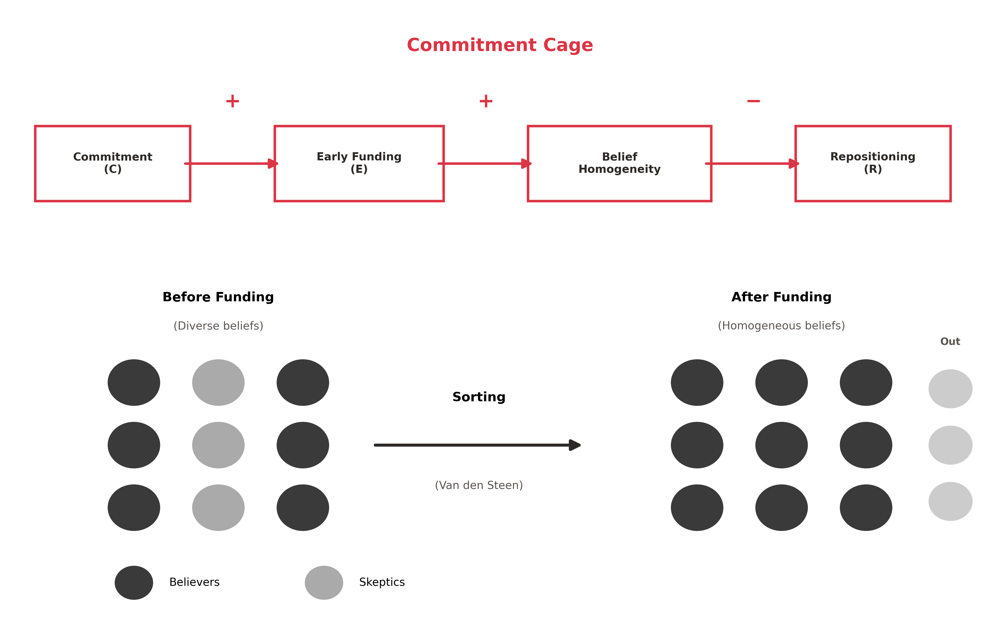

::: {#ch:theory}
# Theory: The Golden Cage {#ch:theory}
:::

## Introduction {#sec:ch2-introduction}

Strategic flexibility enables ventures to pursue the best available
alternative as circumstances change [@gans2021entrepreneurship]. This
capacity requires maintaining multiple viable paths. New ventures
possess this capacity naturally: unlike established firms burdened by
legacy commitments, startups can reposition freely. Yet the funding
process systematically erodes this flexibility precisely when ventures
need it most to navigate uncertainty.

**The Strategy Orthodoxy.** Traditional strategy literature views
commitment as an asset, not a liability. @porter1996what argues that
competitive advantage requires choosing a unique position and making
trade-offs that competitors cannot easily imitate.
@ghemawat1991commitment provides the definitive treatment: commitment
creates value through lock-in (sunk costs), lock-out (competitor
exclusion), and inertia (organizational momentum). The prescription
follows: choose a defensible position, then commit. However, under the
high uncertainty of nascent markets, @dixit1994investment and
@sanchez1995strategic argue that the option value of waiting (retaining
the capacity to respond to unforeseen contingencies) often dominates the
benefits of early commitment.

**The Funding-Growth Paradox.** This chapter resolves a fundamental
tension in the data: early-stage funding correlates negatively with
later-stage success. At the individual firm level, this correlation is
modest ($\rho = -0.04$), but at the industry level, capital-intensive
sectors show systematically lower success rates ($\rho = -0.11$ for
Hardware, $-0.10$ for Transportation). This presents a structural
paradox: acquiring resources to learn reduces the governance diversity
necessary to act on learning.

**Definitions.** To resolve this paradox, I distinguish between latent
capability and observable behavior. *Flexibility* ($F$) is the latent
governance capacity to keep multiple paths viable under uncertainty; it
lives in the composition of the board and the diversity of perspectives
represented there. *Repositioning* ($R$) is the observable manifestation
of flexibility: changes in a venture's strategic breadth over time. I
measure repositioning as $R = |B_T - B_0|$, where $B$ is strategic
breadth computed from company descriptions
(Chapter [\[ch:data\]](#ch:data){reference-type="ref"
reference="ch:data"}).

The core argument: funding creates a *golden cage*. As founders trade
equity for resources, they import a governance sorting effect that
homogenizes beliefs. Unlike a machine that remains flexible regardless
of usage, a board loses its capacity to advocate for alternatives as it
becomes populated solely by believers.

**Chapter Roadmap.**
Section [1.2](#sec:commitment-cage){reference-type="ref"
reference="sec:commitment-cage"} develops the *Commitment Cage*: how
funding suppresses flexibility through belief homogenization.
Section [1.3](#sec:flexibility-flex){reference-type="ref"
reference="sec:flexibility-flex"} establishes the *Flexibility Flex*:
why flexibility enables growth.
Section [1.4](#sec:conclusion-hypotheses){reference-type="ref"
reference="sec:conclusion-hypotheses"} synthesizes these into the
Funding-Growth Paradox.

### Contributions

This chapter makes three theoretical contributions. The first is a
synthesis of two established theories. Van den Steen's sorting
equilibrium explains *who* joins a venture's governance: investors who
believe in the current strategy fund it, while skeptics stay away.
Eisenberg's strategic ambiguity explains *how many* join: broader
visions attract more diverse believers. Neither theory alone predicts
the funding-flexibility relationship; their synthesis does.

The second contribution is a formalization of when learning ceases.
Theorem 1 specifies the boundary condition under which a venture can no
longer recognize signals to pivot. The key insight is that as funding
increases, belief homogeneity rises and strategic breadth narrows; both
forces push the venture toward the cage.

The third contribution distinguishes structural from motivational
constraints. The cage is structural: founders *cannot* pivot because
governance lacks advocates for alternatives. This differs from moral
hazard, where founders *will not* pivot due to misaligned incentives.
The distinction matters for intervention: moral hazard requires
monitoring; structural constraint requires governance redesign.

## Commitment Cage {#sec:commitment-cage}

The "Golden Cage" is not a result of moral hazard or founder
incompetence; it is a structural inevitability of the funding process.
This section explains **how funding suppresses flexibility** through a
specific sequence of belief sorting and signal loss.

### The Sorting Mechanism

The cage forms through a four-step sequence grounded in
@vandensteen2010interpersonal's [-@vandensteen2010interpersonal] sorting
equilibrium (Figure [1.1](#fig:sorting-mechanism){reference-type="ref"
reference="fig:sorting-mechanism"}).

<figure id="fig:sorting-mechanism" data-latex-placement="htbp">

<figcaption>The Sorting Mechanism. Funding triggers belief
homogenization: investors who share the founder’s thesis fund the
venture; skeptics self-select out. The resulting governance lacks
advocates for alternatives.</figcaption>
</figure>

The sequence proceeds in four steps. First, securing capital requires
operational commitments (production architecture choices, go-to-market
sequences, milestone definitions
[@gompers2001the; @hellmann2002venture]), and investors who fund a
venture do so because they believe these specific commitments will
succeed. Second, people with different beliefs naturally sort into
different organizations: @vandensteen2010interpersonal shows that
entrepreneurs who pursue a venture are more optimistic about it
(selection, not bias), and investors who fund share this optimism
because pessimists self-select out, producing belief homogeneity without
any party behaving irrationally. Third, without skeptics, disconfirming
signals lack advocates [@cyert1963a]: market feedback indicating
problems with the committed approach has no champion in governance
discussions, and as @march1991exploration notes, belief convergence is
efficient for exploitation but destructive for exploration. Fourth, the
venture cannot recognize when it should pivot: learning stops not
because founders lack motivation, but because the structure prevents it.
The cage is structural: founders want to pivot but lack governance
support.

### Hypothesis 1: The Commitment Cage

This mechanism implies that funding itself suppresses the venture's
ability to reposition. While traditional operations management views
flexibility as a purchased asset [@jordan1995principles], venture
governance presents a fundamental asymmetry: capital does not "buy"
flexibility; it often erodes it.

**Hypothesis 1 ():** *Early-stage funding correlates negatively with
repositioning.*

$$H_1: \frac{dR}{dE} < 0$$

Empirical preview
(Chapter [\[ch:results\]](#ch:results){reference-type="ref"
reference="ch:results"}): $\rho(E,R) = -0.133^{***}$ ($N = 168{,}011$).

## Flexibility Flex {#sec:flexibility-flex}

If the Commitment Cage explains why ventures get stuck, the Flexibility
Flex explains **why getting stuck is fatal**---and conversely, why
dancing with the cage enables survival. This section establishes that
when ventures preserve flexibility, they can reposition in response to
uncertainty, and this repositioning predicts success.

### Strategic Ambiguity as Flexibility Enabler

Strategic ambiguity [@eisenberg1984ambiguity] enables flexibility by
attracting diverse believers. Founders who articulate broad
visions--rather than narrow operational commitments--attract
stakeholders who project their own interpretations onto the vision. This
diversity becomes the governance fuel for pivots: when market signals
suggest changing direction, at least some board members will advocate
for alternatives.

Tesla's "accelerating sustainable transport" attracted believers in
electrification, autonomy, and energy transition--each projecting their
thesis onto the same vision. When market signals suggested changing
direction, this diversity ensured that at least some governance voices
advocated for alternatives. In contrast, Better Place's commitment to
"battery swapping infrastructure" attracted only believers in that
specific mechanism. When market feedback favored charging over swapping,
no governance voice advocated pivoting. The company liquidated in 2013,
its assets sold for less than \$1 million.

### Theorem 1: When Learning Ceases

Building on @levinthal1993the's [-@levinthal1993the] insight that
successful organizations become "myopic" through competency traps, I
formalize the boundary condition where the cage snaps shut.

**Theorem 1 (Caged Learning).** *Learning ceases when*

$$\mu(1 - \mu) < \frac{\varepsilon}{B}$$

*where $\mu$ = belief probability (shared conviction), $\varepsilon$ =
expected belief shift from a signal, and $B$ = strategic breadth.
(Proof: Appendix [\[app:b\]](#app:b){reference-type="ref"
reference="app:b"}.)*

In plain language: the theorem says that learning stops when everyone
agrees too strongly ($\mu$ near 1) on a narrow path ($B$ small). Van den
Steen's sorting produces high agreement (investors who fund share the
founder's optimism); operational commitments narrow the path. Both
forces are consequences of raising capital. Thus, the cage is not an
accident--it is built into the funding process itself.

### Hypothesis 2: The Flexibility Flex

If flexibility allows ventures to escape the cage, and repositioning is
the behavior of escaping, then repositioning should predict success.

**Hypothesis 2 ():** *Strategic repositioning correlates positively with
later-stage growth.*

$$H_2: \frac{dG}{dR} > 0$$

where $G$ denotes binary growth (1 if reached Later Stage VC, Series
C+). Empirical preview
(Chapter [\[ch:results\]](#ch:results){reference-type="ref"
reference="ch:results"}): Movers outperform Stayers by $2.60\times$
($P(G=1)$: 17.6% vs. 6.7%).

## Conclusion: The Paradox {#sec:conclusion-hypotheses}

The Golden Cage theory synthesizes two established theories into a
unified mechanism: Van den Steen's sorting equilibrium explains *who*
joins (homogenization), and Eisenberg's strategic ambiguity explains
*how many* join (coalition diversity).

### The Funding-Growth Paradox (H3)

We can now resolve the Funding-Growth Paradox through formal
decomposition. The observed negative relationship between funding and
growth is the product of two forces:

$$\frac{dG}{dE} = \underbrace{\frac{dG}{dR}}_{\textcolor{FlexColor}{\text{H2: Flex }(+)}} \times \underbrace{\frac{dR}{dE}}_{\textcolor{CageColor}{\text{H1: Cage }(-)}} = (+) \times (-) = (-)$$

**Hypothesis 3 ():** *Early-stage funding correlates negatively with
later-stage growth, mediated by lost flexibility.*

$$H_3: \frac{dG}{dE} < 0$$

Empirical preview
(Chapter [\[ch:results\]](#ch:results){reference-type="ref"
reference="ch:results"}): At the individual level, $\rho(E,G) = -0.04$
($N = 168{,}011$); at the industry level, the pattern is sharper
(Hardware: $-0.11$, Transportation: $-0.10$, Software: $-0.00$).

### Structural vs. Motivational Constraint

A key distinction: founders *cannot* pivot (structural constraint), not
that they *will not* pivot (moral hazard). This has intervention
implications: if founders will not pivot due to reduced incentives, the
prescription is intensified monitoring; if founders cannot pivot due to
structural constraints, the prescription is governance redesign,
preserving skeptical voices before funding eliminates them.
Chapters [\[ch:data\]](#ch:data){reference-type="ref"
reference="ch:data"}--[\[ch:results\]](#ch:results){reference-type="ref"
reference="ch:results"} test these hypotheses using 168,011 ventures
from PitchBook (2021--2025), revealing boundary conditions: the cage
binds tightest in capital-intensive sectors (Hardware: $\rho = -0.108$,
Transportation: $\rho = -0.101$) but releases under extreme uncertainty
(Quantum: $\rho = +0.095$).
Chapter [\[ch:data\]](#ch:data){reference-type="ref"
reference="ch:data"} operationalizes the theory by developing measures
for strategic breadth and repositioning from company descriptions.
