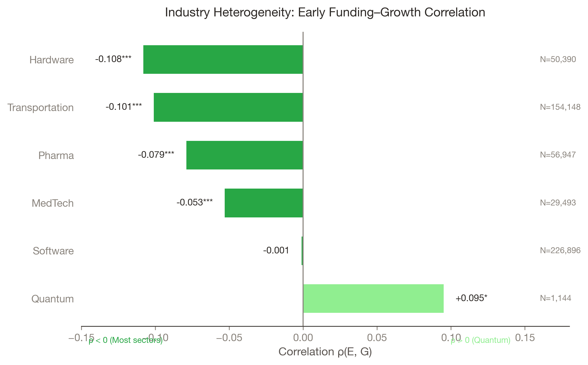

::: {#ch:results}
# Where the Cage Binds {#ch:results}
:::

::: {#introduction}
## Introduction {#sec:ch4-introduction}
:::

Chapter [\[ch:theory\]](#ch:theory){reference-type="ref"
reference="ch:theory"} theorized that funding creates a golden cage
through governance homogenization.
Chapter [\[ch:data\]](#ch:data){reference-type="ref"
reference="ch:data"} described how I measure repositioning from company
descriptions. This chapter tests whether the patterns exist in the data.

I test three hypotheses. First, the (H1): does funding suppress
repositioning? Second, the (H2): does repositioning predict success?
Third, the (H3): does early funding correlate negatively with later
success? The theory predicts that H3 arises because H1 and H2 combine:
funding suppresses the very mechanism (repositioning) that drives
success. The results confirm all three hypotheses: funding suppresses
repositioning ($\rho = -0.133^{***}$), repositioning predicts success
(Movers outperform Stayers by 2.60$\times$), and the funding-growth
correlation is negative---modest at the individual firm level
($\rho = -0.04$) but pronounced at the industry level, where
capital-intensive sectors systematically underperform. I also document
where the paradox is strongest: the cage binds tightest in
capital-intensive sectors like Hardware ($\rho = -0.11$) and
Transportation ($\rho = -0.10$), but loosens in pre-paradigmatic sectors
like Quantum ($\rho = +0.10$).

<figure id="fig:mover-advantage">

<figcaption>The Mover Advantage. Ventures that reposition (Movers)
achieve 17.6% success rates; those that hold position (Stayers) achieve
only 6.7%. This 2.60× difference is the
.</figcaption>
</figure>

::: {#h1-commitment-cage}
## H1: Commitment Cage {#sec:h1-commitment-cage}
:::

As theorized in Chapter [\[ch:theory\]](#ch:theory){reference-type="ref"
reference="ch:theory"}, funding should suppress repositioning through
governance homogenization. The data confirm H1: funding suppresses
repositioning ($\rho = -0.133^{***}$, $N = 168{,}011$). The correlation
is robust to industry FE ($-0.128$), cohort FE ($-0.125$), and founder
controls ($-0.121$). Well-funded ventures reposition less, consistent
with the cage mechanism where higher funding correlates with more
specific commitments and more homogeneous governance.

::: {#h2-flexibility-flex}
## H2: Flexibility Flex {#sec:h2-flexibility-flex}
:::

The data confirm H2: repositioning enables growth. Ventures that
reposition succeed more often, as shown in
Table [1.1](#tab:frg-analysis){reference-type="ref"
reference="tab:frg-analysis"}.

::: {#tab:frg-analysis}
  Specification             $\rho$(R, G)      SE     p-value         N
  --------------------- ---------------- ------- ----------- ---------
  Specification             $\rho$(R, G)      SE     p-value         N
  Unconditional           $+0.184$\*\*\*   0.002   $< 0.001$   168,011
  \+ Industry FE          $+0.179$\*\*\*   0.003   $< 0.001$   168,011
  \+ Funding controls     $+0.175$\*\*\*   0.003   $< 0.001$   168,011

  : FRG Analysis --- Repositioning $\rightarrow$ Growth
:::

::: {#the-mover-advantage-2.60}
### The Mover Advantage: 2.60$\times$ {#the-mover-advantage-2.60}
:::

To operationalize this relationship, I classify ventures as Movers or
Stayers (primary), with a secondary directional breakdown for
interpretation.

::: {#tab:mover-taxonomy}
  Archetype    Criteria           N      \%  Success Rate (G)
  ------------ ---------- --------- ------- ------------------
  Archetype    Criteria           N      \%  Success Rate (G)
  **Stayer**   R = 0        102,742   61.2%        6.7%
  **Mover**    R \> 0        65,269   38.8%     **17.6%**

  : Mover Taxonomy --- Binary Classification (Primary)
:::

*Note: R \> 0 = any repositioning. See Section 3.3.3 for definition
rationale.*

**The core finding:** Movers outperform Stayers by **2.60$\times$** in
growth rate ($P(G=1)$: 17.6% vs. 6.7%, p \< 0.001, $\chi^2 = 5{,}322$).
This binary classification is the primary taxonomy used throughout
subsequent analyses.

*Note: $\Delta$B = B_T - $B_0$. Zoom-in = narrowing ($\Delta$B \< 0);
Zoom-out = expanding ($\Delta$B \> 0). Remaining Movers (36,554) have
minimal directional change.*

**Interpretive insight:** Both directions show elevated growth rates
(17.1% and 18.4%). This suggests that *moving clearly*, not which
direction you move, explains the mover advantage. The binary
Mover/Stayer distinction carries the primary identification. Three AV
industry cases from
Table [\[tab:breadth-examples\]](#tab:breadth-examples){reference-type="ref"
reference="tab:breadth-examples"} illustrate the pattern: Aurora
(zoom-out mover, $3.2\times$), Cruise (zoom-in mover, $2.9\times$), and
Argo AI (stayer, $1.0\times$). Results are robust to temporal stability
across cohort years, survival conditioning (Year 3+ survivors:
2.35$\times$, Year 5+: 2.12$\times$), and alternative
operationalizations of $R$
(Appendix [\[app:c\]](#app:c){reference-type="ref" reference="app:c"},
Table [\[tab:threshold\]](#tab:threshold){reference-type="ref"
reference="tab:threshold"},
Figure [\[fig:threshold\]](#fig:threshold){reference-type="ref"
reference="fig:threshold"}).

::: {#h3-paradox-heterogeneity}
## H3: Paradox Heterogeneity {#sec:h3-paradox-heterogeneity}
:::

The funding-growth paradox varies systematically across industries along
two dimensions: capital intensity (Hardware vs. Software) and
technological maturity (Mobility vs. Quantum). While the
individual-level correlation is modest ($\rho = -0.04$), industry-level
patterns reveal where the cage binds.

The cage binds tighter in capital-intensive industries where switching
costs are high. The following table presents verified correlations
between early funding (E) and growth (G) across six industries.

::: {#tab:industry}
  Sector                       N  $\rho$(E,G)    Sig     Survival Rate
  -------------------- --------- ------------- -------- ---------------
  Sector                       N  $\rho$(E,G)    Sig     Survival Rate
  **Hardware**            50,390  **-0.108**    \*\*\*       5.6%
  **Transportation**     154,148  **-0.101**    \*\*\*       5.3%
  Pharma                  56,947    -0.079      \*\*\*       7.8%
  MedTech                 29,493    -0.053      \*\*\*       9.0%
  Software               226,896    -0.001       (ns)        6.8%
  **Quantum**              1,144  **+0.095**      \*         12.3%

  : Industry Breakdown --- Verified $\rho$(E,G) Correlations
:::

*Note: E = first_financing_size (M USD), G = growth (binary: reached
Later Stage VC). Data verified from PitchBook (2021-2025).*

<figure id="fig:industry-rho">

<figcaption>Industry heterogeneity in the early funding–growth
correlation $ ho(E,G)$ (bars show correlation by industry; <em>N</em> by industry shown in
plot).</figcaption>
</figure>

Three patterns emerge. Capital-intensive industries show the strongest
negative correlations: Hardware ($\rho = -0.108$) and Transportation
($\rho = -0.101$) face the tightest cage because infrastructure and
physical asset investments lock ventures into positions that cannot
adapt---the mobility sector exemplifies this through triple
vulnerability where capital intensity, regulatory uncertainty, and
technology path uncertainty interact to multiply the cost of wrong
commitment. Software shows near-zero correlation ($\rho = -0.001$, ns),
demonstrating that low capital intensity allows cheap experimentation to
offset governance rigidity. Quantum is the sole positive outlier
($\rho = +0.095$\*): in technology evolution, industries pass through an
"era of ferment" [@anderson1990technological] before a dominant design
emerges, and quantum computing remains in this phase with
superconducting qubits, trapped ions, photonic approaches, and
topological qubits all viable. When no dominant design exists, capital
cannot lock ventures into specific architectural choices because those
choices have not yet crystallized---the learning value of capital
dominates its rigidity cost. This is a boundary condition for the golden
cage theory: the cage mechanism assumes that commitment narrows options,
but in pre-paradigmatic industries, there may be no options to narrow.
*See Appendix [\[app:c\]](#app:c){reference-type="ref"
reference="app:c"} for complete robustness tests across measurement,
outcome coding, and sample construction choices
(Table [\[tab:robustness-summary\]](#tab:robustness-summary){reference-type="ref"
reference="tab:robustness-summary"}).*

## Conclusion

The evidence supports all three hypotheses. The (H1) is confirmed:
funding suppresses repositioning ($\rho = -0.133$\*\*\*). The (H2) is
confirmed: Movers achieve 2.60$\times$ higher success rates than Stayers
(17.6% vs 6.7%). The (H3) is confirmed: early funding correlates
negatively with later success---modestly at the individual level
($\rho = -0.04$), but sharply at the industry level where capital
intensity creates switching costs (Hardware: $\rho = -0.11$;
Transportation: $\rho = -0.10$).

The cage does not bind uniformly. It is tightest in capital-intensive
industries like Hardware and Transportation, where infrastructure
investments create switching costs. It loosens in pre-paradigmatic
sectors like Quantum, where no dominant design constrains architectural
choices. This heterogeneity is consistent with the theory: the cage
forms through commitment, and commitment matters more when switching
costs are high.

These findings raise a question: how can founders dance with the cage?
Chapter [\[ch:design\]](#ch:design){reference-type="ref"
reference="ch:design"} addresses this by developing design principles
for commitment structures that preserve flexibility while working within
governance constraints.
