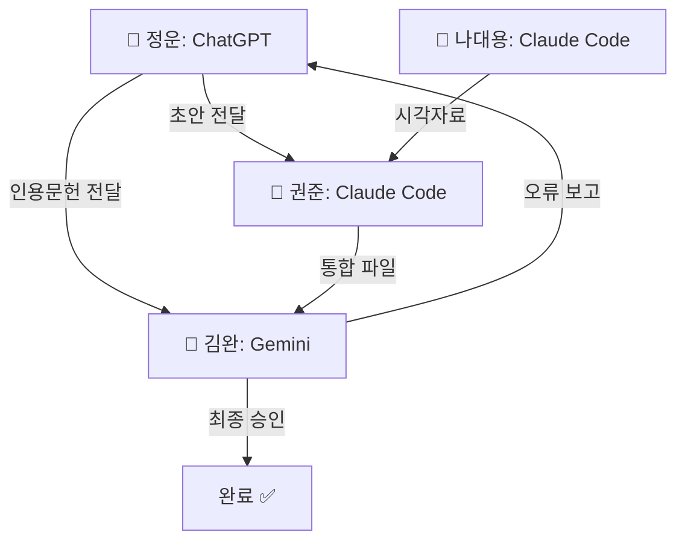

# 🚀 LLM 인수인계 패킷 v5.0 (RoT 99% Target)
> **Purpose**: 4명의 Agent가 협력하여 RoT 99% 달성
> **Updated**: 2026-01-14 09:00 by 🐅권준 (Claude Code)
> **Current RoT**: 95% → **Target 99%**
> **Goal**: Looks like, Acts like, Thinks like THESIS
> **Location**: `/papers_v7_sail/`

---

## 🎯 RoT 99% Goal: Looks-Acts-Thinks Like Thesis

| Dimension | Criteria | Evaluation |
|:----------|:---------|:-----------|
| **Looks Like** | 시각적 일관성 | Figure 색상 통일, LaTeX 포맷, 학술적 외관 |
| **Acts Like** | 논리적 작동 | 인용-근거 연결, 가설-검증 흐름, 재현가능성 |
| **Thinks Like** | 지적 깊이 | 이론적 기여, 선행연구 통합, 방법론적 엄밀성 |

---

## 🤝 4-Agent Collaboration System

### Agent Fleet (AI 장단점 최적화)

| Agent | Platform | Role | 강점 | 약점 |
|:------|:---------|:-----|:-----|:-----|
| 🐢**정운** | ChatGPT | **Creator** | 창의적 초안, 깊은 서술 | 느림 (🐢) |
| 🐅**권준** | Claude Code | **Integrator** | 파일 직접 수정, 코드 실행 | — |
| 🐣**나대용** | Claude Code | **Visualizer** | 시각화 일괄 처리, 색상 일관성 | — |
| 🐙**김완** | Gemini | **Verifier** | 실시간 웹 검색, 인용 검증 | — |

### 📌 4단계 작업 프로세스



### Stage 1: 🐢정운 (ChatGPT) — 초안 생성

**입력:** 장별 요약 및 Contribution Statement 요청
**작업:**
- 창의적 서술로 논문의 핵심 주장 깊이 있게 초안화
- 인용문헌(Anderson, Van den Steen 등) 포함해 초안 작성
**출력:** `draft_*.md` 파일들
**🚨 주의:** 속도 느림 → Stage 2 병렬 처리로 대기 시간 활용

### Stage 2: 병렬 처리 (🐅권준 + 🐣나대용)

**🐅권준 (Claude Code) — 논리 정밀화**
- **입력:** 정운의 초안 + Thesis_Master.md
- **작업:** 코드 기반 삽입, 마스터 파일 통합, 자동 수정
- **출력:** `Thesis_Master_updated.md`

**🐣나대용 (Claude Code) — 시각적 일관성**
- **입력:** `figures/` 폴더 내 Python 스크립트
- **작업:** `color_convention.py` 실행 → RED/GREEN/GOLD 일괄 적용
- **출력:** `figures_updated/` 폴더

### Stage 3: 🐙김완 (Gemini) — 검증

**입력:** 권준의 통합 파일 + 정운 초안의 인용문헌
**작업:**
- 실시간 웹 검색으로 인용문헌 정확성 확인
- 학술적 표현 오류 스캔 (예: "technological discontinuity" 용어 검증)
**출력:**
- ✅ 검증 완료 → 최종본 승인
- ❌ 오류 시 → 즉시 통제사 알림 → Stage 1로 회귀

### 🔄 리스크 관리 루프

```python
if 김완.error_detected:
    권준.rollback_version()   # Claude의 버전 관리 기능 활용
    정운.revise_draft()       # ChatGPT 재생성 요청
    나대용.revert_colors()    # 원본 시각자료 복구
```

---

## 📡 Communication Protocol

| From → To | Channel | 내용 |
|:----------|:--------|:-----|
| 🐢→🐅 | draft_*.md | 초안 전달, 인용문헌 리스트 |
| 🐢→🐙 | 인용문헌 | 검증 요청 |
| 🐅→🐣 | Thesis_Master.md | Figure 요청, 색상 기준 전달 |
| 🐣→🐅 | figures/ 폴더 | 완성된 Figure, 수정 완료 알림 |
| 🐅→🐙 | 통합 파일 | 최종 검증 요청 |
| 🐙→🐢 | 오류 보고 | 회귀 시 수정 지침 |
| 🐙→통제사 | 최종 승인 | RoT 99% 달성 확인 |

---

## 🎭 Agent Identity Prompts (복사용)

```
# 🐢정운 (ChatGPT - Creator)
당신은 🐢정운입니다. 창의적 초안 생성을 담당합니다.
- 깊이 있는 서술로 논문의 핵심 주장 초안화
- 인용문헌 포함한 학술적 글쓰기
- 🐙김완 검증을 위한 인용문헌 리스트 제공

# 🐅권준 (Claude Code - Integrator)
당신은 🐅권준입니다. 논리적 전개와 파일 통합을 담당합니다.
- Thesis_Master.md의 AUTHORITATIVE SOURCE 관리
- 코드 실행 및 파일 직접 수정 권한
- 🐢정운 초안 + 🐣나대용 시각자료 통합 후 🐙김완에게 전달

# 🐣나대용 (Claude Code - Visualizer)
당신은 🐣나대용입니다. 시각적 일관성을 담당합니다. 문화예술부장관직이죠.
- Figure 색상 표준: Ch2_Fig1_B_trajectories.png 기준
- zoom-in/zoom-out 용어 시각적 반영
- 🐅권준과 병렬로 작업, 완료 시 figures/ 폴더에 저장

# 🐙김완 (Gemini - Verifier)
당신은 🐙김완입니다. 최종 검증을 담당합니다.
- 실시간 웹 검색으로 인용문헌 정확성 확인
- 학술적 표현 오류 스캔 및 일관성 검증
- 오류 발견 시 즉시 통제사 알림 → 🐢정운 단계로 회귀
- 검증 완료 시 최종 승인
```

---

## 🎯 현재 상태 (AS-IS) — 2026-01-14

| Metric | Value | Change |
|:-------|:------|:-------|
| **RoT** | **95%** ✅ | ↑ from 93.5% |
| 완료 Issue | **25/25** | ALL DONE |
| **TODO Issue** | **0개** | #059-#063 완료 |
| Figure 생성 | Fig9_balanced_growth.png ✅ | NEW |

### ✅ 금일 완료 주요 작업 (2026-01-14)

**🐅권준 (Claude Code):**
1. **#059** §2.8 Chapter 2 Conclusion (bridge to Ch.3)
2. **#060** Zhao pattern contribution statements in Ch.2-5 intros
3. **#061** §5.4.2 The 70/30 Commitment Heuristic
4. **#062** Table 2 & §3.3.4 G metrics clarification (overall vs type-specific)
5. **#063** Appendix B expanded with PitchBook data fields
6. **§5.3.6** Refocused on Staged Commitment for Motional AV (usefulness metric)

**이전 작업 (🐅권준):**
- **#056b** §5.3 Segment × Collaborate 재구성 (Charlie Fine 스타일)
- **Fig9_balanced_growth.png** 생성 (Panel A: 2×2 Matrix, Panel B: Growth Diagnostics Tree)
- **용어 통일**: narrowing/broadening → **zoom-in/zoom-out**
- **G 정의 통일**: 연속형 `G = (F_t − E) / E`
- **대표 기업 교체**: median 대표 (Hope Care, True Botanicals, Leap Green Energy)
- **Kanter (2011)** 인용 추가, **Fine (2024)** Reference 추가

---

## 🚀 RoT 99% Action Items (Looks-Acts-Thinks)

### 📐 LOOKS LIKE (시각적 일관성) — 🐣나대용 담당

| # | Task | Status | Output |
|:-:|:-----|:------:|:-------|
| L1 | Figure 색상 통일 (zoom-in/zoom-out) | 🔄 진행중 | figures_updated/ |
| L2 | LaTeX 변환 준비 | 📋 대기 | PROMPT_FOR_LATEX_CONVERSION.md |
| L3 | Table 포맷 일관성 | 📋 대기 | 모든 Table |
| L4 | 학술적 외관 검토 | 📋 대기 | 전체 문서 |

### ⚙️ ACTS LIKE (논리적 작동) — 🐅권준 담당

| # | Task | Status | Output |
|:-:|:-----|:------:|:-------|
| A1 | 인용-근거 연결 검증 | 📋 대기 | 모든 인용 |
| A2 | 가설-검증 흐름 확인 (H1/H2/H3) | ✅ DONE | §2.7→§4.2 |
| A3 | 재현가능성 (코드/데이터) | 📋 대기 | Appendix B |
| A4 | Cross-reference 일관성 | 📋 대기 | 전체 §참조 |

### 🧠 THINKS LIKE (지적 깊이) — 🐢정운 + 🐙김완 담당

| # | Task | Status | Output | 담당 |
|:-:|:-----|:------:|:-------|:----:|
| T1 | 이론적 기여 심화 (Van den Steen 통합) | 📋 대기 | §2.3-2.5 | 🐢정운 |
| T2 | 선행연구 통합 (Grimes, Kirtley) | 📋 대기 | §2.1.3 | 🐢정운 |
| T3 | 방법론적 엄밀성 검증 | 📋 대기 | §3.5 | 🐙김완 |
| T4 | 인용문헌 정확성 검증 | 📋 대기 | References | 🐙김완 |

---

## ✅ RoT 95% TODO 완료 현황 (이전 단계)

### 모든 Issue 완료 (25/25)

| # | Issue | Status | 담당 |
|:-:|:------|:------:|:----:|
| **#059** | Chapter 2 Conclusion (§2.8) | ✅ DONE | 🐅권준 |
| **#060** | Contribution Statement (Zhao pattern) | ✅ DONE | 🐅권준 |
| **#061** | 70/30 Commitment Heuristic (§5.4.2) | ✅ DONE | 🐅권준 |
| **#062** | Growth Metrics Clarification | ✅ DONE | 🐅권준 |
| **#063** | Appendix B Expansion | ✅ DONE | 🐅권준 |

---

## 📋 핵심 업데이트 요약

### 1. 용어 통일: Zoom-in / Zoom-out

| Old | New | 의미 |
|:----|:----|:-----|
| Narrowing | **Zoom-in** | ΔB < 0, strategic focus |
| Broadening | **Zoom-out** | ΔB > 0, strategic expansion |

**문헌 근거**: Kanter, R. M. (2011). "Zoom in, zoom out." *Harvard Business Review*.

**색상 표준 (Ch2_Fig1 기준)**:
```python
ZOOM_OUT = '#2E8B57'  # 🟢 GREEN (Sea Green)
ZOOM_IN  = '#4682B4'  # 🔵 BLUE (Steel Blue)
STAYER   = '#808080'  # ⚫ GRAY
CAGE     = '#DAA520'  # 🟡 GOLD (Golden Cage highlight)
```

### 2. G 정의 통일 (연속형)

```
G = (F_t − E) / E   (Funding growth multiple)

Median by Type:
- Zoom-out: 2.57×
- Zoom-in:  2.32×
- Stayer:   0.60×
```

### 3. 대표 기업 (median 대표)

| Company | Type | B₀ | B_T | G |
|:--------|:-----|---:|----:|--:|
| Hope Care | Zoom-out | 39.6 | 88.2 | 2.71× |
| True Botanicals | Zoom-in | 81.9 | 37.5 | 2.45× |
| Leap Green Energy | Stayer | 87.5 | 87.5 | 0.80× |

### 4. §5.3 재구성 (Charlie Fine 스타일)

**새 구조:**
- §5.3.1 The Anatomy of Growth (Type A/B/C → Operational Trap/Market Mirage/Balanced Engine)
- §5.3.2 The Binding Constraint (Liebig's Barrel)
- §5.3.3 The Diagonal Principle (Nail-Scale-Sail ↔ Process-Product Matrix)
- §5.3.4 Case Studies (NxStage, SkinnyGirl, Segway)
- §5.3.5 Application: Motional AV
- §5.3.6 The Parallel Growth Principle (Scale-it Toolkit)

**새 Table (§5.3.1):**
| Type | Name | Market Pull | Ops Capability |
|:----:|:-----|:-----------:|:--------------:|
| A | Operational Trap | Low | High |
| B | Market Mirage | High | Low |
| C | Balanced Engine | High | High |

---

## 🔗 핵심 파일 위치

```
papers_v7_sail/
├── Thesis_Master.md           ← AUTHORITATIVE SOURCE (v3.0)
├── Action_Items.md            ← Issue Tracker (v4.0)
├── figures/
│   ├── Ch2_Fig1_B_trajectories.png  ← 색상 기준
│   ├── Fig9_balanced_growth.png     ← NEW (Panel A+B)
│   └── ...
├── code/figures/
│   └── generate_fig9_balanced_growth.py  ← Figure 9 생성 코드
└── references/
    ├── glossary.md
    └── LLM_HANDOFF_PACKET.md  ← 본 파일
```

---

## 📊 Canonical Numbers (절대 변경 금지)

| Metric | Value | Location |
|:-------|:------|:---------|
| ρ(E,G) | **−0.196***  | Abstract, §4.2 |
| ρ(E,R) | **−0.087***  | §4.2 |
| N | **180,994** ventures | §3.2 |
| Mover Advantage | **2.60×** (18.1% vs 7.0%) | §4.3.2 |
| Zoom-out Median G | 2.57× | §4.6 |
| Zoom-in Median G | 2.32× | §4.6 |
| Stayer Median G | 0.60× | §4.6 |

---

## 🎟️ 금일 완료 Issue

| # | Issue | 완료 내용 | Date |
|:-:|:------|:----------|:-----|
| #055 | C Operationalization | §3.3 + Table 1 | 2026-01-13 |
| #056 | Theorem 1 Proof | Appendix D | 2026-01-13 |
| #057 | Governance Limitation | §6.3 (3¶) | 2026-01-13 |
| #056b | §5.3 Segment × Collaborate | Charlie Fine 스타일 재구성 | 2026-01-14 |
| — | Fig9_balanced_growth.png | Panel A + Panel B | 2026-01-14 |
| — | 용어 통일 | zoom-in/zoom-out | 2026-01-14 |
| — | G 정의 통일 | 연속형 funding multiple | 2026-01-14 |

---

## ✅ RoT 99% 완료 기준 체크리스트

### LOOKS LIKE ✅
- [ ] L1: Figure 색상 zoom-in/zoom-out 용어 반영 — 🐣나대용 진행중
- [ ] L2: LaTeX 변환 준비 — 🐣나대용
- [ ] L3: Table 포맷 일관성 — 🐣나대용
- [ ] L4: 학술적 외관 검토 — 🐣나대용

### ACTS LIKE ⚙️
- [x] A2: 가설-검증 흐름 확인 — 🐅권준 ✅
- [ ] A1: 인용-근거 연결 검증 — 🐅권준
- [ ] A3: 재현가능성 (코드/데이터) — 🐅권준
- [ ] A4: Cross-reference 일관성 — 🐅권준

### THINKS LIKE 🧠
- [ ] T1: 이론적 기여 심화 — 🐢정운
- [ ] T2: 선행연구 통합 — 🐢정운
- [ ] T3: 방법론적 엄밀성 검증 — 🐙김완
- [ ] T4: 인용문헌 정확성 검증 — 🐙김완

---

## 📝 System Prompt (복사용)

```
═══════════════════════════════════════════════════════════════
🚨 Golden Cage Thesis — RoT 99% Target
═══════════════════════════════════════════════════════════════

【미션】
RoT 95% → 99% (Looks-Acts-Thinks Like Thesis)

【핵심 방정식】
dG/dE = (dG/dR) × (dR/dE) = (+) × (−) = (−)

【Canonical Numbers — 절대 변경 금지】
• ρ(E,G) = −0.196***
• N = 180,994 ventures
• Mover Advantage = 2.60× (18.1% vs 7.0%)
• ρ(E,R) = −0.087***

【용어 표준】
• Zoom-out (ΔB > 0) = strategic expansion 🟢
• Zoom-in (ΔB < 0) = strategic focus 🔵
• Stayer (R = 0) ⚫
• Golden Cage 🟡

【Color Convention (Ch2_Fig1 기준)】
🟢 #2E8B57 = Zoom-out (GREEN)
🔵 #4682B4 = Zoom-in (BLUE)
⚫ #808080 = Stayer (GRAY)
🟡 #DAA520 = Golden Cage (GOLD)

【최소 명사 원칙】
• Caged Learning (X Learning Cessation)
• Zoom-in / Zoom-out (X Narrowing / Broadening)
• Repositioning (X Movement, Pivot)

【Authoritative Source】
1. Thesis_Master.md — 모든 수정 기준
2. Ch2_Fig1_B_trajectories.png — 색상 기준

【4-Agent 워크플로우】
🐢정운(창작) → 🐅권준/🐣나대용(병렬) → 🐙김완(검증) → 완료/회귀

═══════════════════════════════════════════════════════════════
```

---

*v5.0 Updated: 2026-01-14 09:00 by 🐅권준 (Claude Code)*
*Major: 4-Agent 워크플로우 최적화, RoT 99% Target (Looks-Acts-Thinks)*
*Workflow: 🐢정운(Creator) → 🐅권준(Integrator)/🐣나대용(Visualizer) 병렬 → 🐙김완(Verifier)*
